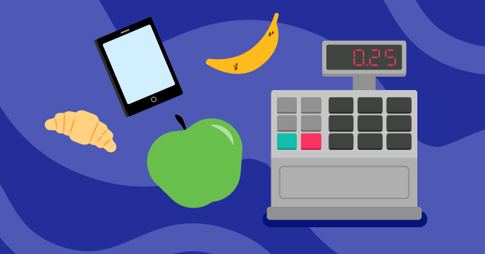

# Next customer please

Find the project online at [projects.raspberrypi.org/en/projects/next-customer-please](https://projects.raspberrypi.org/en/projects/next-customer-please)

## Resources
For project solutions, see [en/solutions](https://github.com/raspberrypilearning/next-customer-please/tree/master/en/solutions).

## Contributing
See [CONTRIBUTING.md](CONTRIBUTING.md)

## Licence
 See [LICENCE.md](LICENCE.md)