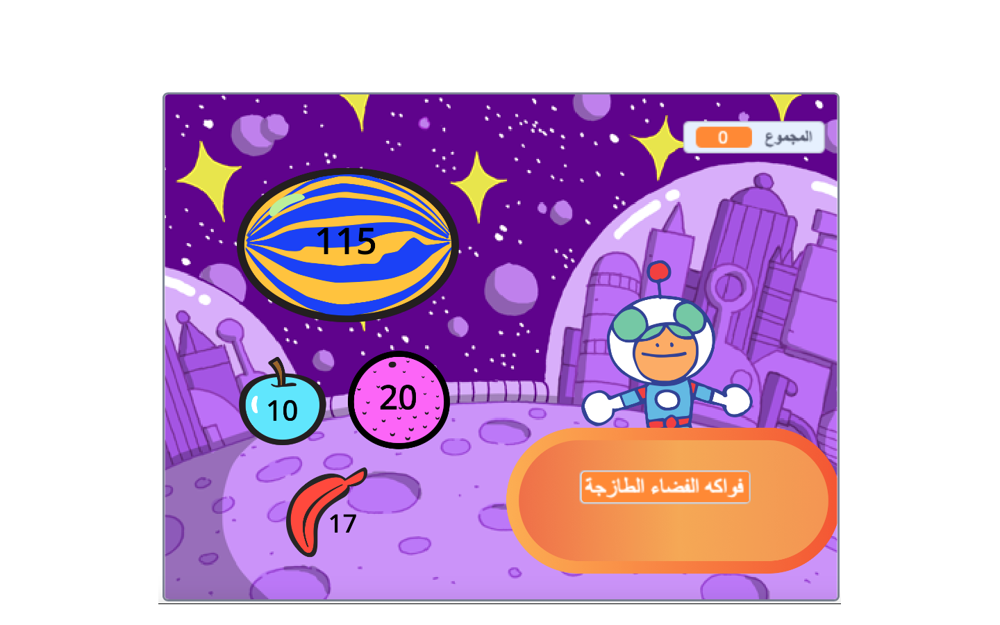
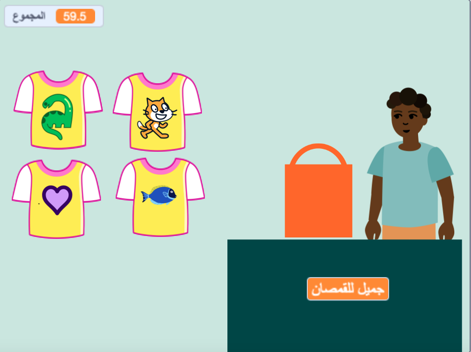
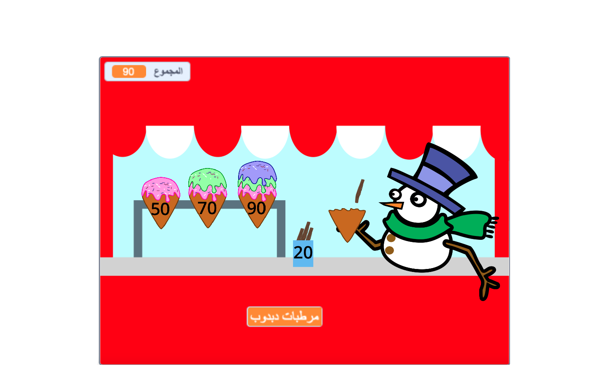
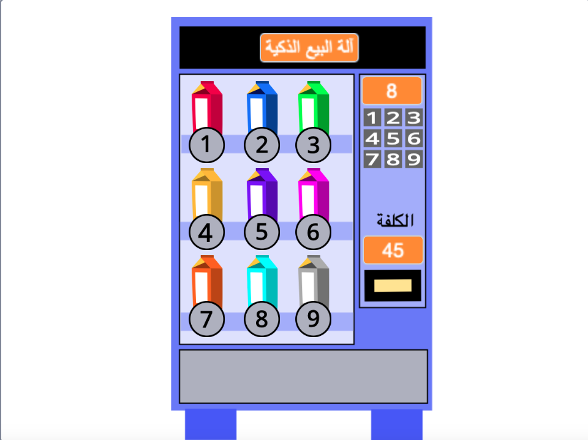

## You will make

أنشئ تطبيق متجر حيث يمكن للعميل شراء سلع من متجرك. سيكون المشروع من منظور الشخص الأول حيث يكون اللاعب عميلاً.

**First-person view** means that you don't see your character on the screen, instead you see what they see.

سوف تفعلها:
+ Create a shop app with items to buy and a checkout
+ Plan your time to get a simple version working quickly
+ Try shops made by others and share your shop so others can try it

--- no-print ---

--- task ---

  

### Play ▶️ 

Click on Space Fruit to buy them and watch the total go up. When you're ready, click on Kiran to check out. 

+ What happens if you try to checkout before you have chosen any fruit? 
+ How do you think the project knows that you haven't added any fruit yet?

  <iframe allowtransparency="true" width="485" height="402" src="" frameborder="0"></iframe>

--- /task ---

### Get ideas 💭

You are going to make some design decisions to choose what items your business will offer and how the customer will check out.

--- task ---

Explore these example shops to get more ideas.

⭐ Share your finished Next customer please project for a chance of it being featured here.

Which projects allow you to buy multiple items at once? Which allow you to buy items one at a time?

Click on the **seller** sprites to buy items:

  <iframe allowtransparency="true" width="485" height="402" src="" frameborder="0"></iframe>

  <iframe allowtransparency="true" width="485" height="402" src="" frameborder="0"></iframe>

**⭐ Pride pins** (featured community project)

Click on the pride pin badges to add them to your shopping bag:

  <iframe allowtransparency="true" width="485" height="402" src="https://scratch.mit.edu/projects/embed/750787529/?autostart=false" frameborder="0"></iframe>

--- /task ---

--- /no-print ---

--- print-only ---

### Get ideas 💭

You are going to make some design decisions to create your character. See inside example projects in [Scratch 2: Next customer please! - Examples](https://scratch.mit.edu/studios/29611454/){:target="_blank"} Scratch studio.

   

--- /print-only ---

