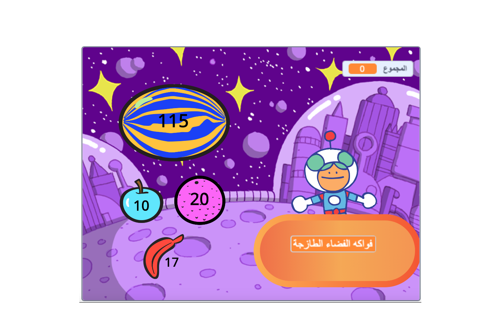
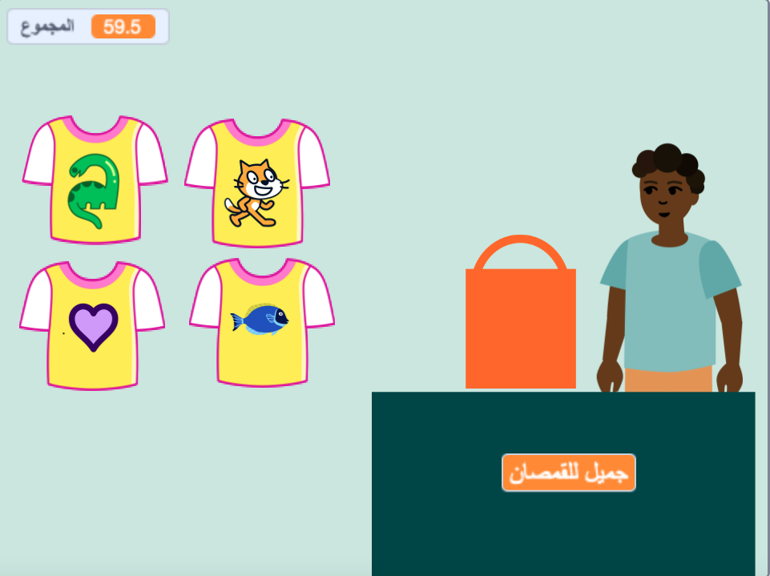
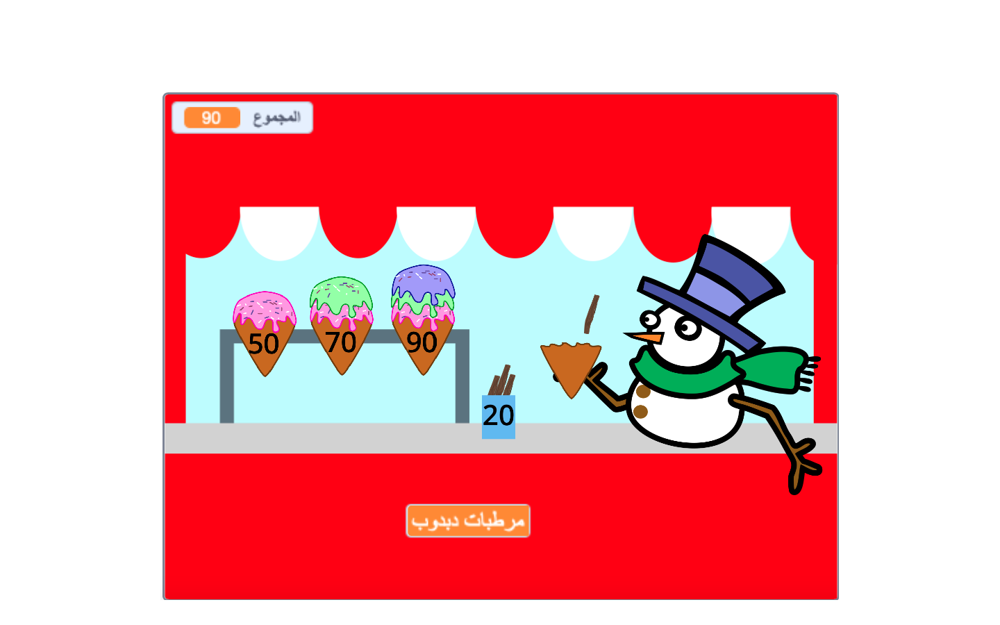
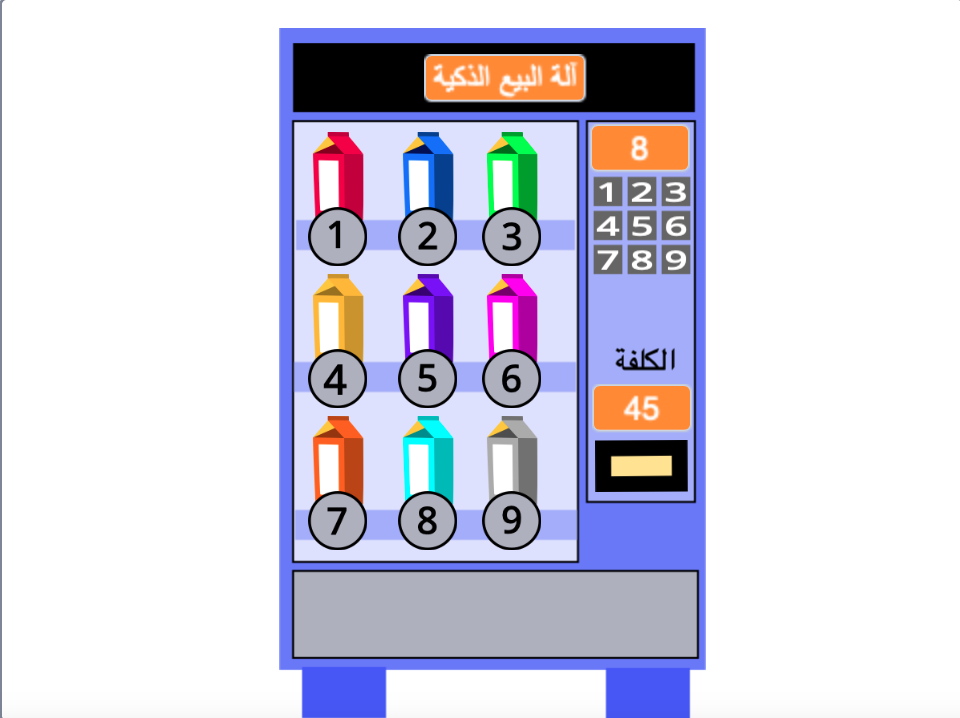

## سوف تصنع

أنشئ تطبيق متجر حيث يمكن للعميل شراء سلع من متجرك. سيكون المشروع من منظور الشخص الأول حيث يكون اللاعب عميلاً.

--- no-print ---

Click on Space Fruit to buy them and watch the total go up. عندما تكون جاهزًا ، انقر فوق شخصية كيرن للمغادرة.

+ What happens if you try to checkout before you have chosen any fruit?
+ How do you think the project knows that you haven't added any fruit yet?

** فواكه الفضاء الطازجة **: [راجع الداخل] (https://scratch.mit.edu/projects/528696418/editor) {: target = "_blank"}

  <iframe allowtransparency="true" width="485" height="402" src="https://scratch.mit.edu/projects/embed/528696418/?autostart=false" frameborder="0"></iframe>

### احصل على أفكار 💭

انقر فوق ايقونة **البائع** في قائمة الكائنات:

**Cool Shirts**: [See inside](https://scratch.mit.edu/projects/528697069/editor){:target="_blank"}

  <iframe allowtransparency="true" width="485" height="402" src="https://scratch.mit.edu/projects/embed/528697069/?autostart=false" frameborder="0"></iframe>

**Ice cream shop**: [See inside](https://scratch.mit.edu/projects/525972748/editor){:target="_blank"}

  <iframe allowtransparency="true" width="485" height="402" src="https://scratch.mit.edu/projects/embed/525972748/?autostart=false" frameborder="0"></iframe>

**، دبابيس برايد** (مشروع مجتمعي مميز)

انقر على شارات دبوس برايد لإضافتها إلى حقيبة التسوق الخاصة بك:

  <iframe allowtransparency="true" width="485" height="402" src="https://scratch.mit.edu/projects/embed/750787529/?autostart=false" frameborder="0"></iframe>

--- /no-print ---

--- print-only ---

### احصل على أفكار 💭

سوف تتخذ بعض قرارات التصميم لإنشاء شخصيتك. See inside example projects in the Scratch 2: Next customer please! Scratch studio at https://scratch.mit.edu/studios/29611454

   

--- /print-only ---

