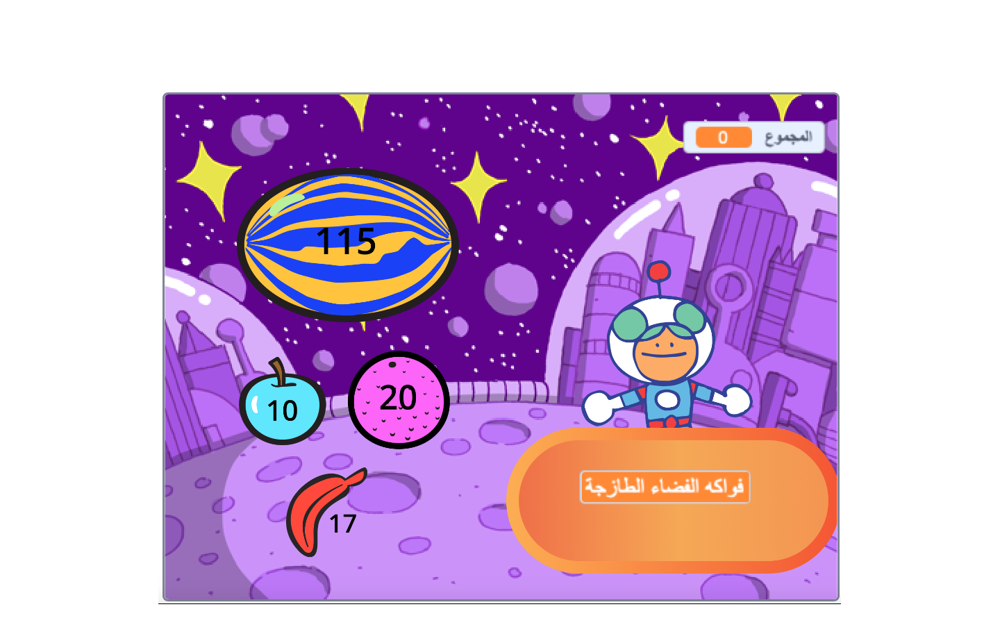
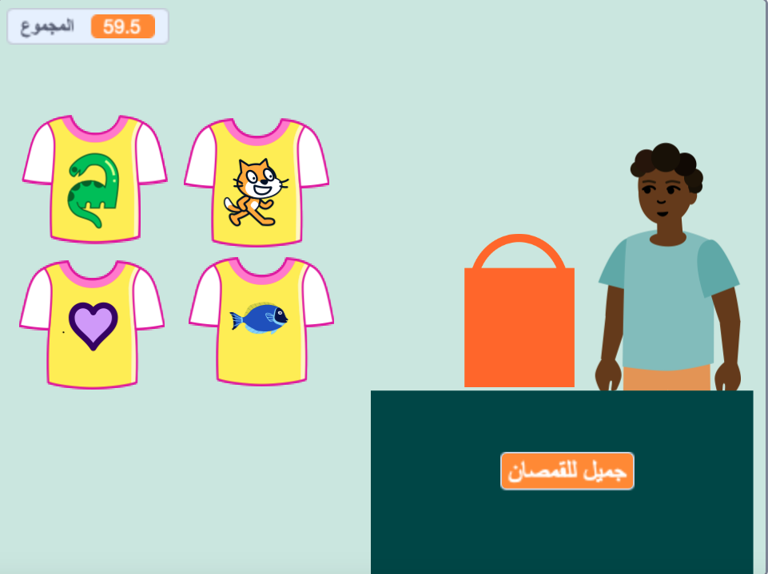
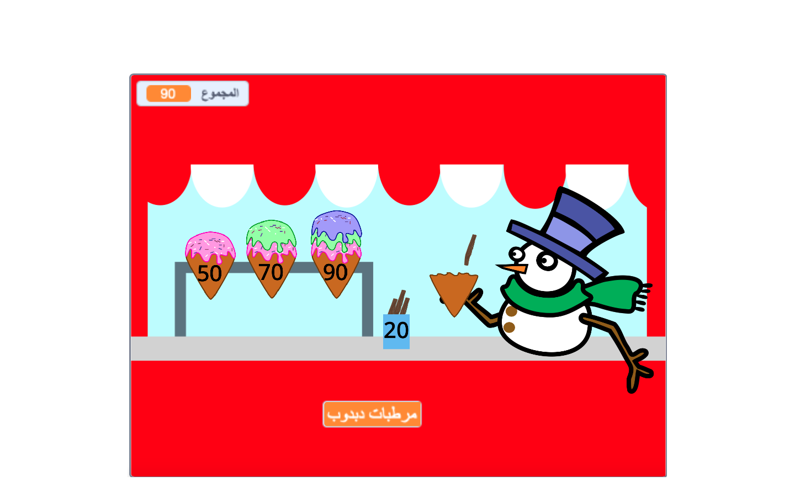
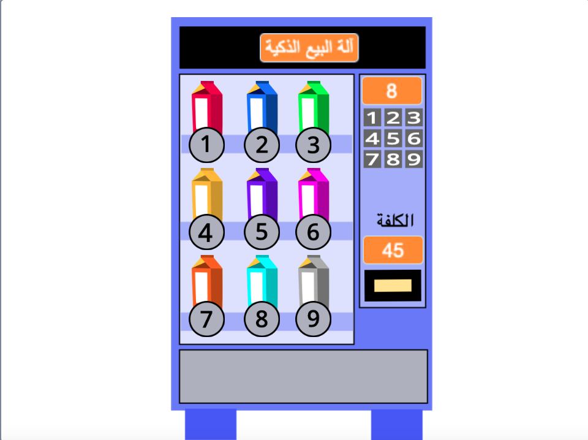

## سوف تصنع

أنشئ تطبيق متجر حيث يمكن للعميل شراء سلع من متجرك. سيكون المشروع من منظور الشخص الأول حيث يكون اللاعب عميلاً.

--- no-print ---

انقر على الفواكه لشرائها ومشاهدة السعر الاجمالي يرتفع. عندما تكون جاهزًا ، انقر فوق شخصية كيرن للمغادرة.

+ + ماذا يحدث إذا حاولت الدفع قبل اختيار أي فاكهة؟
+ كيف تعتقد أن المشروع يعرف أنك لم تضف أي فاكهة بعد؟

** فواكه الفضاء الطازجة **: [راجع الداخل] (https://scratch.mit.edu/projects/528696418/editor) {: target = "_blank"}

  <iframe allowtransparency="true" width="485" height="402" src="https://scratch.mit.edu/projects/embed/528696418/?autostart=false" frameborder="0"></iframe>

### احصل على أفكار 💭

انقر فوق ايقونة **البائع** في قائمة الكائنات:

**قمصان رائعة**: [الق نظرة](https://scratch.mit.edu/projects/528697069/editor){:target="_blank"}

  <iframe allowtransparency="true" width="485" height="402" src="https://scratch.mit.edu/projects/embed/528697069/?autostart=false" frameborder="0"></iframe>

**محل آيس كريم**: [الق نظرة](https://scratch.mit.edu/projects/525972748/editor){:target="_blank"}

  <iframe allowtransparency="true" width="485" height="402" src="https://scratch.mit.edu/projects/embed/525972748/?autostart=false" frameborder="0"></iframe>

**، دبابيس برايد** (مشروع مجتمعي مميز)

انقر على شارات دبوس برايد لإضافتها إلى حقيبة التسوق الخاصة بك:

  <iframe allowtransparency="true" width="485" height="402" src="https://scratch.mit.edu/projects/embed/750787529/?autostart=false" frameborder="0"></iframe>

--- /no-print ---

--- print-only ---

### احصل على أفكار 💭

سوف تتخذ بعض قرارات التصميم لإنشاء شخصيتك. انظر داخل أمثلة المشاريع في

Scratch 2: العميل التالي من فضلك! استوديو سكراتش على الرابط التالي: https://scratch.mit.edu/studios/29611454
 

   

--- /print-only ---

