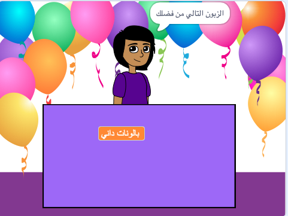
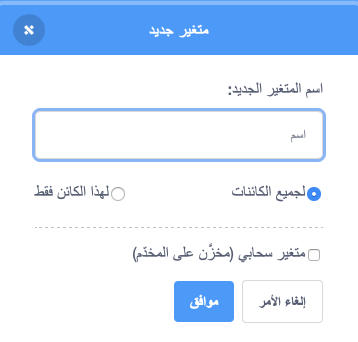
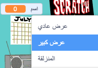

## فكرة عملك

<div style="display: flex; flex-wrap: wrap">
<div style="flex-basis: 200px; flex-grow: 1; margin-right: 15px;">
ما هي فكرة عملك؟ يمكن أن يكون شيئًا واقعيًا ، أو شيئًا من كتاب أو فيلم تحبه ، أو شيئًا سخيفًا تمامًا.
</div>
<div>
{:width="300px"}
</div>
</div>

--- task ---

Open a [new Scratch project](http://rpf.io/scratch-new){:target="_blank"} and look at the range of sprites and backdrops that you can use. اقض بعض الوقت في التفكير في فكرة عملك.

[[[working-offline]]]

--- /task ---

What backdrop and extra scenery sprites will you need?
+ خلفية من مكتبة Scratch ، أو خلفية ملونة عادية؟
+ مكتب أو عداد أو نافذة للبيع منها؟
+ رف أو خزانة كتب لوضع الأشياء عليها - يمكنك رسم هذا على الخلفية

--- task ---

Click **Choose a Backdrop** or paint your own backdrop.


Click **Choose a Sprite** and add or paint extra scenery sprites.


يمكنك دائمًا إضافة المزيد من المشاهد لاحقًا إذا وجدت أنك بحاجة إليها.

--- /task ---

What will the **seller** sprite look like?
+ A person or non-player character such as a shopkeeper, farmer, or librarian?
+ A machine such as a vending machine, jukebox, or cash register?

<p style="border-left: solid; border-width:10px; border-color: #0faeb0; background-color: aliceblue; padding: 10px;">
An <span style="color: #0faeb0">**NPC**</span> is a non-player character that you can interact with in a game or interactive story. Can you think of games you have played that have NPCs? Next time you play, think about how it was someone's job to make that character.
</p>

--- task ---

Add a sprite to represent the seller.


--- /task ---

What is the name of your business?

--- task ---

Create a `variable`{:class="block3variables"} called `name`:

--- collapse ---

---

title: Create a variable

---

From the `Variables`{:class="block3variables"} blocks menu click the **Make a Variable** button.

Call your new variable `name`:



**Notice:** The new `name` variable appears on the Stage and can now be used in the `Variable`{:class="block3variables"} blocks.

--- /collapse ---

Click on your **seller** sprite and add code to set the variable to the name of your business:

```blocks3
when flag clicked
set [name v] to () //type the name of your business
```

Create a sign on the Stage with your variable:

--- collapse ---

---

title: Change the appearance and position of variables

---

Right-click on the `variable`{:class="block3variables"} on the Stage and choose large readout:



Drag your `variable`{:class="block3variables"} to position it on the Stage as part of the shop scenery.

--- /collapse ---

--- /task ---

--- task ---

**Test:** Make sure you can see your business name as the value of the variable on the Stage.

--- /task ---

Get ready to welcome your first customer.

--- task ---

Click on your **seller** sprite and add a `broadcast`{:class="block3control"} block. Creat a new message called `next customer`.

```blocks3
when flag clicked
set [name v] to [my shop] // your business name
+ broadcast (next customer v)
```

--- /task ---

--- task ---

Create a new script for your **seller** sprite to `say`{:class="block3looks"} `Next customer please` when they receive the `broadcast`{:class="block3control"} `next customer`{:class="block3control"}.

```blocks3
when I receive [next customer v] 
say [Next customer please!] for (2) seconds
```

--- /task ---

--- task ---

**Debug:** You might find some bugs in your project that you need to fix. Here is a common bug.

--- collapse ---

---

title: Variable shows `0`

---

You should use the `set [name v] to ()`{:class="block3variables"} block to set the variable to your name. If you have already added a script, check that you have typed your business name into the value and clicked the green flag.

```blocks3
when flag clicked
set [name v] to [my shop] // your business name
```

--- /collapse ---

--- /task ---

--- save ---
