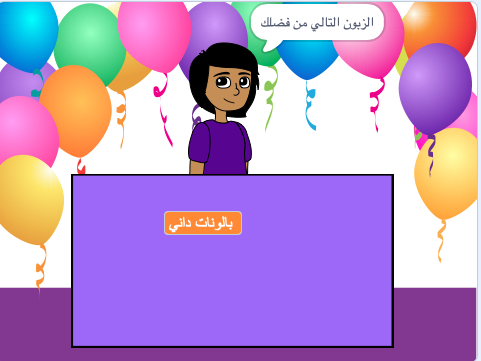

## متجرك

<div style="display: flex; flex-wrap: wrap">
<div style="flex-basis: 200px; flex-grow: 1; margin-right: 15px;">
ما هي فكرة متجرك؟ يمكن أن يكون شيئًا واقعيًا ، أو شيئًا من كتاب أو فيلم تحبه ، أو شيئًا سخيفًا تمامًا.
</div>
<div>
{:width="300px"}
</div>
</div>

--- task ---

افتح [مشروع Scratch جديد](http://rpf.io/scratch-new){: target = "_ blank"} وانظر إلى مجموعة الكائنات والخلفيات التي يمكنك استخدامها. اقضِ بعض الوقت في التفكير في فكرة متجرك.

--- /task ---

--- task ---

انقر فوق **اختر خلفية** أو ارسم الخلفية الخاصة بك.


+ خلفية من مكتبة سكراتش، أو خلفية بلون سادة

--- /task ---

--- task ---

انقر فوق **اختر كائن** وقم بإضافة أو رسم كائنات إضافية.


--- /task ---

--- task ---

أضف المزيد من المناظر الطبيعية.
+ مكتب أو منضدة أو نافذة للبيع منها
+ رف أو خزانة كتب لوضع الأشياء عليها - يمكنك رسم هذا على الخلفية

--- /task ---

--- task ---

أضف كائنًا لتمثيل البائع.

يمكنك الاختيار:
+ شخص أو شخصية لا تلعب/بوت مثل صاحب متجر أو مزارع أو أمين مكتبة
+ آلة مثل آلة البيع أو صندوق الموسيقي أو آلة تسجيل المدفوعات النقدية


--- /task ---

### رحب بأول عميل لك.

--- task ---

انقر فوق كائن ** البائع ** الخاص بك واضف مقطع البرمجة `بث: class = "`"}. قم بإنشاء رسالة جديدة تسمى `العميل التالي`.

```blocks3
when flag clicked
+ broadcast (next customer v)
```

--- /task ---

--- task ---

قم بإنشاء نص جديد لكائن ** البائع** لــ `يقول`{: class = "block3looks"} `العميل التالي من فضلك` عندما يتلقون البث ``{: class = "block3control"} `العميل التالي`{: class = "block3control"}.

```blocks3
when I receive [next customer v] 
say [Next customer please!] for (2) seconds
```

--- /task ---

--- save ---
