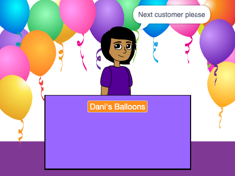

## Your shop

<div style="display: flex; flex-wrap: wrap">
<div style="flex-basis: 200px; flex-grow: 1; margin-right: 15px;">
What is your shop idea? يمكن أن يكون شيئًا واقعيًا ، أو شيئًا من كتاب أو فيلم تحبه ، أو شيئًا سخيفًا تمامًا.
</div>
<div>
{:width="300px"}
</div>
</div>

--- task ---

Open a [new Scratch project](http://rpf.io/scratch-new){:target="_blank"} and look at the range of sprites and backdrops that you can use. Spend some time thinking about your shop idea.

--- /task ---

--- task ---

**Choose a Backdrop** or paint your own backdrop.


+ A backdrop from the Scratch library, or a plain coloured backdrop

--- /task ---

--- task ---

**Choose a Sprite** and add or paint extra scenery sprites.


--- /task ---

--- task ---

Add more scenery.
+ A desk, counter, or window to sell from
+ رف أو خزانة كتب لوضع الأشياء عليها - يمكنك رسم هذا على الخلفية

--- /task ---

--- task ---

Add a sprite to represent the seller.

You could choose:
+ A person or non-player character such as a shopkeeper, farmer, or librarian
+ A machine such as a vending machine, jukebox, or cash register


--- /task ---

### Welcome your first customer.

--- task ---

Click on your **seller** sprite and add a `broadcast`{:class="block3events"} block. Create a new message called `next customer`.

```blocks3
when flag clicked
+ broadcast (next customer v)
```

--- /task ---

--- task ---

Create a new script for your **seller** sprite to `say`{:class="block3looks"} `Next customer please` when they receive the `broadcast`{:class="block3events"} `next customer`{:class="block3events"}.

```blocks3
when I receive [next customer v] 
say [Next customer please!] for (2) seconds
```

--- /task ---

--- save ---
