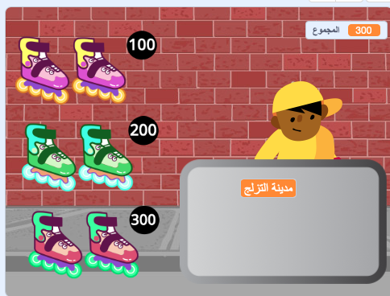
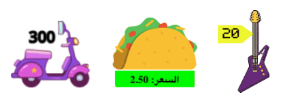

## بضاعه للبيع

<div style="display: flex; flex-wrap: wrap">
<div style="flex-basis: 200px; flex-grow: 1; margin-right: 15px;">
متجرك يحتاج إلى عناصر او مواد للبيع للبيع. سيكون لكل عنصر سعر سيتم إضافته إلى متغير `مجموع` {: class =" block3variables "}.
</div>
<div>
{:width="300px"}
</div>
</div>

ستحتاج الى متابعة مقدار ما ينفقه عميلك او زبونك.

--- task ---

أضف متغيرًا جديدًا يسمى `مجموع`{: class = "block3variables"} لجميع الكائنات.

انقر على الكائن **البائع** وأضف مقطع برمجي إلى `اجعل`{: class = "block3variables"} `مجموع`{: class = "block3variables"} إلى `0` عند بدء المشروع.

[[[scratch3-create-set-variable]]]

--- /task ---

ما ** العناصر ** سيشتريها عميلك (عملاؤك)؟
+ نوع من الطعام أو الشراب
+ المعدات الرياضية ، الألعاب أو الأدوات
+ العصي السحرية ، عبوات أو الكتب الإملائية
+ الملابس أو عناصر الموضة الأخرى
+ Your own idea

--- task ---

أضف كائنًا لأول ** عنصر ** ستبيعه في متجرك.

إذا أردت ، يمكنك إضافة سعر إلى المظهر باستخدام أداة النص في محرر الرسام. أو أضف سعرًا للخلفية وضع العنصر بجواره.



--- /task ---

--- task ---

أضف نصًا إلى `غير`{: class = "block3variables"} `مجموع`{: class = "block3variables"} حسب سعر العنصر الخاص بك عندما ينقر العميل على الكائن.

--- collapse ---
---
title: Click to add an item
---

```blocks3
when this sprite clicked
start sound (Coin v)
change [total v] by [10]
```

--- /collapse ---

إنها فكرة جيدة أيضًا أن `بتشغيل صوت`{: class = "block3sound"} لإعطاء ملاحظات العملاء بأنهم قد أضافوا عنصرًا.


[[[scratch3-add-sound]]]

--- /task ---

--- task ---

**اختبار:** انقر فوق العنصر الخاص بك وتحقق من أن قيمة متغير `مجموع`{: class = "block3variables"} تزداد حسب سعر العنصر ، وستسمع المؤثر الصوتي. انقر فوق مرات أكثر لرؤية المجموع يرتفع.

انقر فوق العلم الأخضر لبدء مشروعك وتأكد من أن `مجموع`{: class = "block3variables"} يبدأ عند `0`.

--- /task ---

--- task ---

أضف المزيد من العناصر إلى متجرك.

يمكنك ايضاً:
+ قم بتكرار العنصر الأول ثم قم بإضافة مظهر جديد في محرر الرسام
+ أضف كائنًا ثم اسحب `عند النقر على العلم `مقطع برمجي {: class = "block3events"} من العنصر الأول إلى العنصر الجديد

أضف ملصق سعر إلى المظهر أو الخلفية إذا كنت تستخدمها.

--- /task ---

--- task ---

انقر فوق الكائن الجديد **عنصر** في قائمة الكائن ثم انقر فوق علامة التبويب **المقاطع البرمجية**.

غيّر المبلغ الذي يتغير `مجموع`{: class = "block3variables"} حسب سعر العنصر الجديد.

--- /task ---

--- task ---

**اختبار:** انقر فوق العلم الأخضر لبدء مشروعك وانقر فوق العناصر لإضافتها. تأكد من أن المجموع يزيد بالمبلغ الصحيح في كل مرة تنقر فيها على عنصر.

إذا كنت قد أضفت تسميات أسعار ، فتأكد من أنها تتطابق مع المبلغ الذي تمت إضافته إلى `مجموع ` وإلا الزبون يصبح حائر {: class = "block3variables"}.

--- /task ---

--- task ---

**تصحيح:** قد تجد بعض الأخطاء في مشروعك والتي تحتاج إلى إصلاحها. فيما يلي بعض الأخطاء الشائعة.

--- collapse ---
---
title: The total doesn't go to 0 when I click the green flag
---

تأكد من أنك قمت بتعيين قيمة البداية للمتغير `المجموع`{: class = "block3variables"} في `عند النقر على العلم`{: class = "block3events"} البرنامج النصي على كائن **البائع**.

--- /collapse ---

--- collapse ---
---
title: The total doesn't increase by the correct amount when I click on an item
---

تحقق من أن كل عنصر يحتوي على `عندما ينقر هذا الكائن على نص برمجي`{: class = "block3events"} يغير `مجموع`{: class = "block3variables"} بالمبلغ الصحيح لهذا العنصر - ربما تكون قد غيّرت سعر الكائن الخطأ.

تأكد من أنك استخدمت المقطع البرمجي `change`{: class = "block3variables"} وليس المقطع البرمجي المجموعة `{: class = "block3variables"} لتغيير <code>المجموع`{: class</code>"block3variables"}. تحتاج إلى استخدام `غير`{: class = "block3variables"} لإضافة السعر إلى الإجمالي ، ولا تريد تعيين الإجمالي على سعر العنصر الذي تمت إضافته للتو.

--- /collapse ---

--- /task ---

--- save ---
