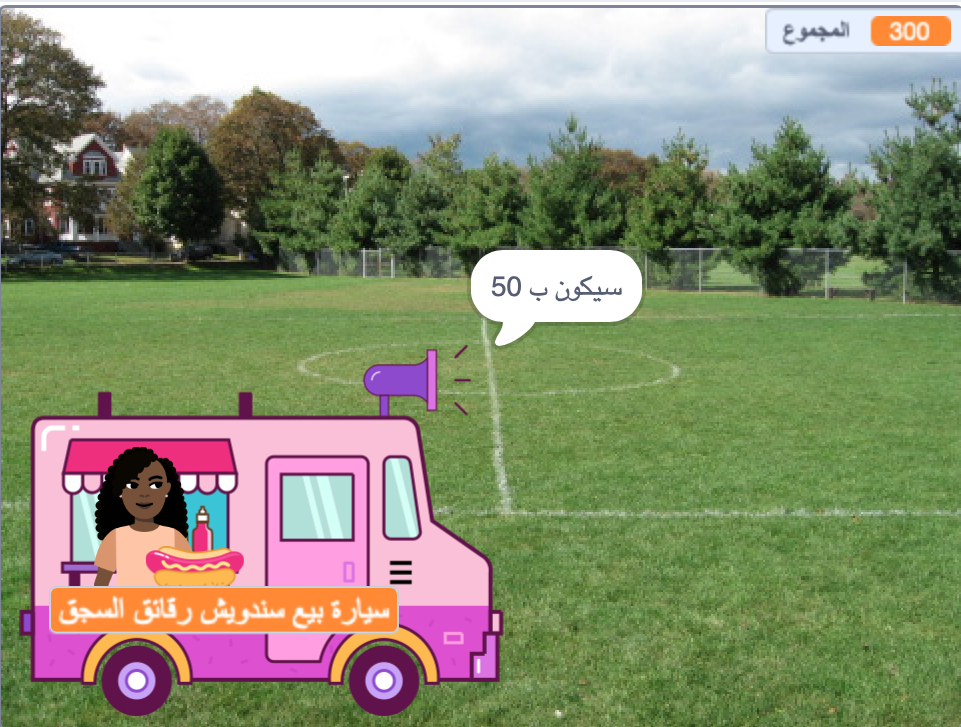

## المشتريات

<div style="display: flex; flex-wrap: wrap">
<div style="flex-basis: 200px; flex-grow: 1; margin-right: 15px;">

يحتاج ** البائع ** sprite إلى:
- السؤال عما إذا كان العميل مستعدًا للدفع مقابل العناصر
- أخذ المبلغ
- الاستعداد للعميل التالي
</div>
<div>
{:width="300px"}
</div>
</div>

عندما ينتهون من اختيار العناصر ، سينقر العميل على الكائن **بائع** للدفع.

--- task ---

 أخبر العميل كم ستكلف عناصره.

```blocks3
when this sprite clicked
say (join [That will be ] (total)) for (2) seconds 
```

--- /task ---

--- task ---

أضف صوت دفع إلى كائن البائع **البائع** حتى يعرف العميل أن الدفع جار.


[[[scratch3-add-sound]]]

أضف `صوت التشغيل حتى انتهاءه`{: class = "block3sound"} إلى المقطع البرمجي الخاص بك.

```blocks3
when this sprite clicked
say (join [That will be ] (total)) for (2) seconds
+ play sound [machine v] until done 
```

--- /task ---

--- task ---

قم بإنهاء البيع. قم بتعيين `مجموع`{: class = "block3variables"} مرة أخرى إلى `0` بعد الدفع ، و `قل`{: class = "block3looks"} وداعًا و `بث`{: class = "block3control"} `العميل التالي`{: class = "block3control"}.

```blocks3
when this sprite clicked
say (join [That will be ] (total)) for (2) seconds
play sound [machine v] until done 
+ set [total v] to (0)
+ say (join [Thanks for shopping at ] (name)) for (2) seconds
+ broadcast (next customer v)
```

--- /task ---

--- task ---

**اختبار:** اختبر مشروعك وتأكد من:
- يمكن الزبون التحقق من المؤثرات الصوتية الصحيحة
- يتم إرجاع `مجموع`{: class = "block3variables"} إلى `0` بعد أن يدفع العميل أو يلغي.

--- /task ---


--- task ---

**تصحيح:** قد تجد بعض الأخطاء في مشروعك والتي تحتاج إلى إصلاحها.

فيما يلي بعض الأخطاء الشائعة:

--- collapse ---
---
title: The seller doesn't do anything when I click on them
---

لديك الكثير من الكائنات في مشروعك. تأكد من أن `عند نقر هذا الكائن على`{: class = "block3events"} المقطع البرمجي موجود على **بائع** sprite.

**نصيحة:** إذا قمت بإضافته إلى الكائن الخطأ ، يمكنك سحب المقطع البرمجي إلى الكائن **البائع** ، ثم حذفه من الكائن الآخر.

--- /collapse ---

--- collapse ---
---
title: The words in the say blocks merge together
---

عندما ` تنضم `{: class = "block3operators"} الى قطعتين معًا ، فإنك تحتاج إلى إضافة مسافة في نهاية الجزء الأول من النص أو في بداية الجزء الثاني من النص.

تحتوي هذه على مسافة في نهاية الجزء الأول من الصلة:

```blocks3
say {join [That will be ](total)} for (2) seconds

say {join [Thanks for shopping at ](name)} for (2) seconds
```

--- /collapse ---

--- collapse ---
---
title: The total doesn't reset after a sale
---

تأكد من أنك قد استخدمت:

```blocks3
set [total v] to (0)
```

**وليس**:

```blocks3
change [total v] by (0)
```

--- /collapse ---

--- collapse ---
---
title: The seller isn't responding
---

تأكد من أن `العمليات`{: class = "block3operators"} في الشرط `if`{: class = "block3control"} هو أكبر من الرمز `>`{: class = "block3operators"}.

```blocks3
if <(total) > [0]> then
```

--- /collapse ---

**نصيحة:** قارن المقطع البرمجي الخاص بك بأمثلة مقاطع اخرى. هل هناك اختلافات لا ينبغي أن تكون موجودة؟

--- /task ---

--- save ---
