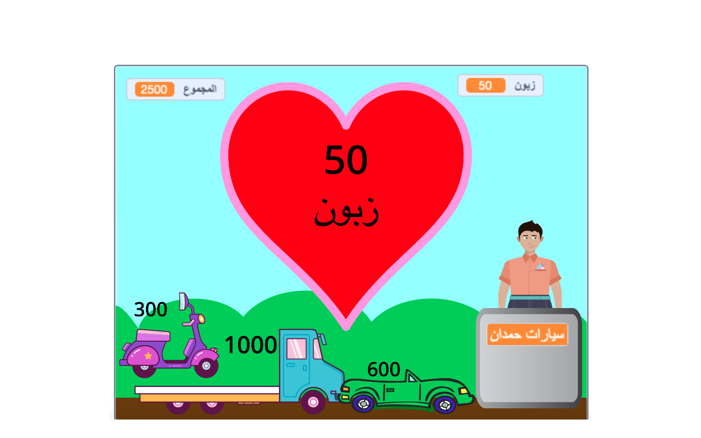

## تحدي

<div style="display: flex; flex-wrap: wrap">
<div style="flex-basis: 200px; flex-grow: 1; margin-right: 15px;">
هناك الكثير من الميزات التي يمكنك إضافتها لتحسين تجربة التسوق لعملائك. لا تحتاج إلى إضافة كل شيء. فقط أضف التحسينات التي تعتقد أنها مهمة.
</div>
<div>
{:width="300px"}
</div>
</div>

--- task ---

أضف المزيد من العناصر للبيع.

--- /task ---

--- task ---

أضف المزيد من المؤثرات الصوتية والرسومات.

--- /task ---

--- task ---

ارسم المشهد الخاص بك والأزياء الأخرى.

--- /task ---

--- task ---

قم بعمل نشاط تجاري آخر واسمح للاعبين بزيارتهم على حد سواء.

--- /task ---

يحتوي كل مشروع مثال في [مقدمة](.) على رابط انظر داخل لكي تفتح المشروع وتنظر إلى الرمز للحصول على أفكار ومعرفة كيفية عملها. يمكنك "رؤية ما بداخل" أمثلة المشاريع للنظر في كيفية عملها.

أمثلة على المشاريع: **فاكهة فضائية طازجة**: [الق نظرة](https://scratch.mit.edu/projects/528696418/editor){:target="_blank"}
**قمصان رائعة**: [الق نظرة](https://scratch.mit.edu/projects/528697069/editor){:target="_blank"}
**محل آيس كريم**: [الق نظرة](https://scratch.mit.edu/projects/525972748/editor){:target="_blank"}
**آلة بيع**: [الق نظرة](https://scratch.mit.edu/projects/526051796/editor){:target="_blank"}

**نصيحة:** إذا قمت بتسجيل الدخول إلى حساب سكراتش، فيمكنك استخدام **Backpack** لنسخ البرامج النصية أو الكائنات إلى مشروعك.

[[[scratch-backpack]]]

### عملية دفع سريعة وثرثارة!

يمكن لموظف الدفع (أو الجهاز) أن يسأل عما إذا كانت الخدمة جيدة، أو ما إذا كان العميل يقضي يومًا سعيدًا.

--- task ---

أضف مجموعة `اسأله`{:class="block3sensing"} إلى **البائع** `عندما يتم النقر على هذا الكائن`{:class="block3events"} نص و `يقول`{:class="block3looks"} أشياء مختلفة بناءً على رد العميل.

--- collapse ---

---
title: اطرح الأسئلة وأجب عنها
---

```blocks3
ask [Did you find everything you wanted today?] and wait
if <(answer) = [yes]> then
say [That's fantastic!] for [2] seconds
else
say [Maybe I should add more items to my shop] for [2] seconds
end
```

**تصحيح الأخطاء:** تحقق من كتابة الخيارات بشكل صحيح في التعليمات البرمجية وفي إجابتك. لا بأس إذا كنت تستخدم الأحرف الكبيرة في اللغة الانكليزية، لذا فإن "Yes" و "YES" سيتطابقان مع "yes".

أضف أسئلة متعددة لإنشاء روبوت محادثة يمكنك التحدث إليها.

--- /collapse ---

--- /task ---

### ضع الأغراض في أكياس

--- task ---

مشروع "القمصان الرائعة" يضم قمصاناً تنزلق بسهولة في الحقيبة.

--- collapse ---

---
title: اجعل العناصر تنزلق داخل الحاوية
---

أضف كائن **حاوية**. يمكنك استخدام صورة متحركة موجودة مثل **هدية** أو **إخراج** ، أو رسم صورتك الخاصة بأشكال بسيطة.

أضف نصًا برمجيًا لجعل **الحاوية** تظهر دائمًا في المقدمة:

```blocks3
when flag clicked
forever
go to [front v] layer
end
```

بعد ذلك، ستحتاج إلى إضافة رمز إلى كل **عنصر ** لديك للبيع لجعلها تنزلق إلى الحاوية عند النقر عليها:

```blocks3
when this sprite clicked
+go to [front v] layer
+glide [1] secs to (Bag v) // use the name of your Container sprite
+hide
change [total v] by [12]
+go to x: [-180] y: [68] // start position
+show
```

إذا كنت لا تريد أن يكون الحاوية موجودة طوال الوقت، يمكنك إضافة برامج نصية لإظهارها وإخفائها في الوقت المناسب:

```blocks3
when I receive [next customer v]
hide // previous customer takes the bag
wait [1] seconds
show
```

**اختبار:** جرب مشروعك وتأكد من أن العناصر تنزلق إلى الحاوية وتختفي.

**التحقق من الأخطاء:** تحقق من نصوصك بعناية وتأكد من تحديث جميع **عناصر**. كائناتك. يمكنك إلقاء نظرة على [قمصان جميلة](https://scratch.mit.edu/projects/528697069/editor){: target = "_ blank"} إذا كنت تريد مشاهدة مثال عملي.

--- /collapse ---

--- /task ---

###  توقف عن إضافة المنتجات عندما يكون العميل عند نقطة الدفع

--- task ---

أضف متغيرًا من نوع `متجر`{:class="block3variables"} واستخدمه للتحكم في وقت إضافة العناصر.

--- collapse ---

---
title: توقف عن إضافة المنتجات عندما يكون العميل عند نقطة الدفع
---

أضف ` متغير `{: class = "block3variables"} يسمى `متجر` لجميع الكائنات. ستقوم بتعيين هذا إلى `صحيح` عندما يكون العميل في المتجر و `خطأ` عندما يكونون عند نقطة الدفع.

حدد كائن **البائع** الخاص بك. قم بتحديث `عند النقر فوق العلم`{: class = "block3events"} النص للسماح بالتسوق عند بدء مشروعك:

```blocks3
+set [shop v] to [true]
```

أضف الآن مقطع برمجي لتغيير ` المتجر `{: class = "block3variables"} إلى `خطا` في بداية **بائع** `عندما نقر هذا الكائن يظهر النص d/iv `{: class = "block3events"}:

```blocks3 
+set [shop v] to [false]
```

ومقطع برمجي لإعادة تعيين متغير المتجر ``{:class="block3variables"} إلى `صحيح` في نهاية نفس النص:

```blocks3 
+set [shop v] to [true]
```

أنت الآن بحاجة إلى تحديث العناصر التي تبيعها للتحقق من متغير`متجر`{: class = "block3variables"}:

```blocks3
when this sprite clicked
+if <(shop) = [true]> then
start sound (Coin v)
change [total v] by [10]
end
```
ستحتاج إلى القيام بذلك لكل سلعة تبيعها في متجرك.

**اختبار:** انقر فوق العلم الأخضر ثم حاول التسوق. تأكد من أنه لا يزال بإمكانك إضافة عناصر وإتمام عملية الشراء، ولكن لا يمكنك إضافة عناصر بمجرد بدء عملية الشراء.

**تصحيح الأخطاء:** تحقق من التعليمات البرمجية الخاصة بك بعناية فائقة. يمكنك إلقاء نظرة على [قفواكه طازجه](https://scratch.mit.edu/projects/528697069/editor){: target = "_ blank"} إذا كنت تريد مشاهدة مثال عملي.

--- /collapse ---

--- /task ---

--- task ---

### امنح العميل خِيار إلغاء عملية الشراء.

--- collapse ---

---
title: إعداد خيارات الدفع والإلغاء
---

`اسأل`{: class = "block3sensing"} `هل ترغب في الدفع أم الإلغاء؟`. أضف كتلة `إذا`{:class="block3control"} لـ `الإجابة`{:class="block3sensing"} `=`{:class="block3operators"} `ادفع` وضع بداخلها كتل الدفع الموجودة لديك.

```blocks3
when this sprite clicked
say (join [That will be ] (total)) for (2) seconds
+ ask [Would you like to pay or cancel?] and wait
+ if {(answer) = [pay]} then
play sound [machine v] until done 
set [total v] to (0)
say (join [Thanks for shopping at ] (name)) for (2) seconds
broadcast [next customer v]
end
```

أضف مقطع برمجي ثاني `إذا`{:class="block3control"} `للإجابة`{:class="block3sensing"} `=`{:class="block3operators"} `cancel` وأضف داخلها رمزًا لإلغاء الطلب.

```blocks3
when this sprite clicked
say (join [That will be ] (total)) for (2) seconds
ask [Would you like to pay or cancel?] and wait
if {(answer) = [pay]} then
play sound [machine v] until done 
set [total v] to (0)
say (join [Thanks for shopping at ] (name)) for (2) seconds
broadcast [next customer v]
end
+ if {(answer) = [cancel]} then
set [total v] to (0)
say [Ok. No problem] for (2) seconds
broadcast [next customer v]
end
```

--- /collapse ---

--- /task ---

ألق نظرة على ['Silly eyes - Community' Scratch studio](https://scratch.mit.edu/studios/29662180){: target = "_ blank"} لمشاهدة المشروعات التي أنشأها أعضاء المجتمع.

--- save ---
