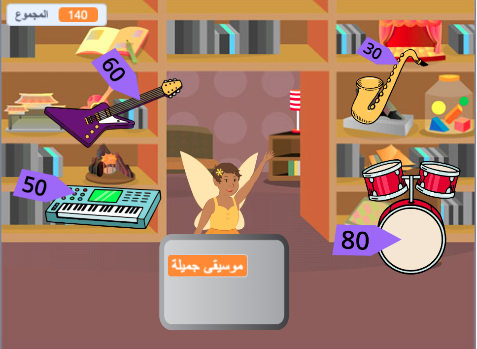

## قم بتطوير مشروعك

إذا كان لديك الوقت ، يمكنك تطوير مشروعك.

{:width="300px"}

إليك بعض الأفكار التي يمكنك تجربتها:
- أضف المزيد من العناصر للبيع
- أضف المزيد من المؤثرات الصوتية والرسومات
- ارسم المشهد الخاص بك والأزياء الأخرى
- قم بعمل نشاط تجاري آخر واسمح للاعبين بزيارتهم على حد سواء

يحتوي كل مشروع مثال في [مقدمة](.) على رابط انظر داخل لكي تفتح المشروع وتنظر إلى الرمز للحصول على أفكار ومعرفة كيفية عملها.

ألق نظرة على ['Silly eyes - Community' Scratch studio](https://scratch.mit.edu/studios/29662180){: target = "_ blank"} لمشاهدة المشروعات التي أنشأها أعضاء المجتمع.

--- save ---
