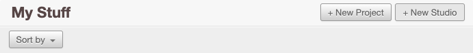
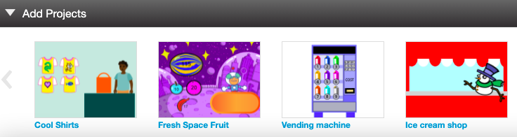
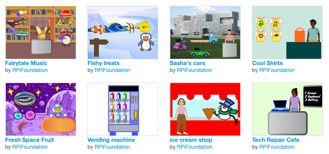

## شارك

إذا كنت في نادٍ ، فلماذا لا تشارك مشروعك مع الأصدقاء؟

إذا قمت بتسجيل الدخول إلى Scratch ، يمكنك إنشاء استوديو وإضافة **عميلك التالي برجاء مشروع**. يمكنك أيضًا إضافة **عميل تالي لأصدقائك ، برجاء إنشاء مشروع** لإنشاء مركز تجاري يضم متاجر وشركات مختلفة.

--- collapse ---

---

العنوان: بناء سوق تسوق

---

أحفظ مشروعك ثم أنقر على اسم المستخدم وحدد

من صفحة **My Stuff** الخاصة بك ، انقر فوق الزر **+ New Studio**.

امنح الاستوديو الجديد اسمًا ووصفًا.

انقر فوق الزر **إضافة مشاريع **. يمكنك إضافة مشروعك الخاص عن طريق تحديده من القائمة الموجودة أسفل الصفحة.

يمكنك أيضًا إضافة مشاريع أنشأها أصدقاؤك. اطلب منهم مشاركة مشروعهم وإعطائك الرابط. اكتب الرابط أو الصقه في مربع عنوان url ، ثم انقر فوق الزر **Add by url**.

--- /collapse ---

شارك مشروعك وأرسل رابط إلى الأشخاص الذين تعرفهم. سيتمكن مجتمع Scratch بأكمله أيضًا من العثور على مشروعك وتجربته.

[[[share-scratch]]]

لماذا لا تدعو أصدقائك لإنشاء مشروع؟ دعهم يعرفون كيف استمتعت

إذا كان لديك حساب Scratch ، وشاركت مشروعك ** **، ترقب التعليقات التي قد يدلي بها الآخرون حول إبداعك. التعليقات هي طريقة رائعة للتفكير في عملك. تجاهل أي تعليقات غير مفيدة سلبية أو غير ذات صلة.

[[[comments-feedback-scratch]]]

--- task ---

ألهم مجتمع Raspberry Pi Foundation بمشروعك!

لإرسال مشروعك إلى ['Intergalactic shopping market'](https://scratch.mit.edu/studios/29662180){: target = "_ blank"} استوديو Scratch ، يُرجى إكمال [هذا النموذج](https://form.raspberrypi.org/f/community-project-submissions){: target = "_ blank"}.

--- /task ---
