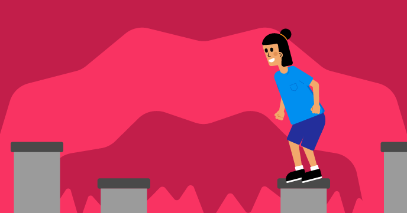

## ماذا يمكنك أن تفعل الآن؟

إذا كنت تتبع مسار [مقدمة الى Python](https://projects.raspberrypi.org/en/raspberrypi/python-intro)، يمكنك الانتقال إلى مشروع [التدريب على الهدف](https://projects.raspberrypi.org/en/projects/target-practice). في هذا المشروع ، ستنشئ لعبة من أعلى إلى أسفل حيث يتعين عليك القفز من منصة إلى أخرى وعدم الوقوع فيها.

--- print-only ---

--- /print-only ---

--- no-print ---

  <iframe allowtransparency="true" width="485" height="402" src="https://scratch.mit.edu/projects/embed/525202210/?autostart=false" frameborder="0"></iframe>

**تعليمات:** اضغط <kbd>مسافة</kbd> أو انقر على المنصة للقفز.

--- /no-print ---

إذا كنت ترغب في الحصول على مزيد من المتعة في استكشاف سكراتش، فيمكنك تجربة أي من [هذه المشاريع](https://projects.raspberrypi.org/ar-SA/projects?software%5B%5D=python).
