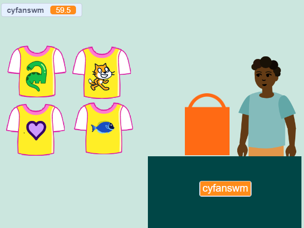
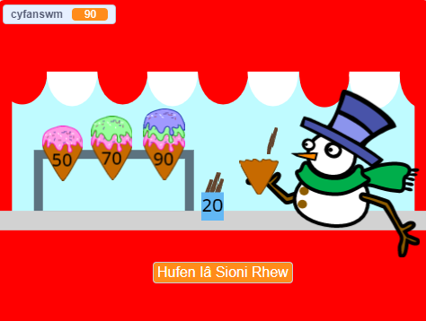
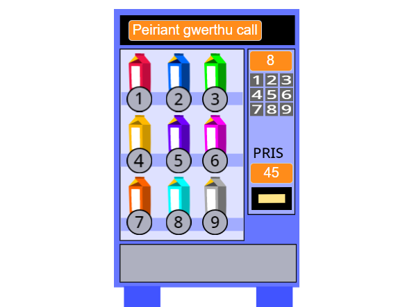

## Byddi di'n creu

Byddi di'n creu ap siop lle gall y cwsmer brynu eitemau o dy siop. Bydd y prosiect o berspectif person cyntaf lle mae'r chwaraewr yn gwsmer.

Mae **Perspectif person cyntaf** yn golygu nad wyt ti'n gweld dy gymeriad ar y sgrin, yn lle hynny rwyt ti'n gweld yr hyn mae'n ei weld.

Byddi di'n:
+ Creu ap siop gydag eitemau i'w prynu a desg dalu
+ Trefnu dy amser i gael fersiwn syml yn gweithio'n gyflym
+ Rhoi cynnig ar siopau a wnaed gan bobl eraill a rhannu dy siop di fel y gall pobl eraill roi cynnig arni

--- no-print ---

--- task ---

  

### Chwarae ▶️ 

Clicia ar y Ffrwyth Gofod i'w prynu a gweld y cyfanswm yn codi. Pan fyddi di'n barod, clicia ar Kiran i dalu. 

+ Beth sy'n digwydd os wyt ti'n ceisio talu cyn i ti ddewis unrhyw ffrwyth? 
+ Sut wyt ti'n meddwl mae'r prosiect yn gwybod nad wyt ti wedi ychwanegu unrhyw ffrwyth eto?

**Ffrwyth Gofod Ffres**: [Gweler y tu mewn](https://scratch.mit.edu/projects/528696418/editor){:target="_blank"}

  <iframe allowtransparency="true" width="485" height="402" src="https://scratch.mit.edu/projects/embed/528696418/?autostart=false" frameborder="0"></iframe>

--- /task ---

### Cael ysbrydoliaeth 💭

Rwyt ti'n mynd i wneud rhai penderfyniadau dylunio i ddewis pa eitemau bydd dy fusnes yn eu cynnig a sut bydd y cwsmer yn talu.

--- task ---

Cymer olwg ar y siopau enghreifftiol hyn i gael mwy o syniadau.

⭐ Rhannwch eich prosiect “Cwsmer Nesaf Os Gwelwch Yn Dda” am gyfle i’w gynnwys yma.

Pa brosiectau sy'n caniatáu i ti brynu sawl eitem ar unwaith? Pa rai sy'n caniatáu i ti brynu un eitem ar y tro?

Clicia ar y corlun **Gwerthwr** i brynu eitemau:

**Crysau Cŵl**: [Gweld tu mewn](https://scratch.mit.edu/projects/528697069/editor){:target="_blank"}

  <iframe allowtransparency="true" width="485" height="402" src="https://scratch.mit.edu/projects/embed/528697069/?autostart=false" frameborder="0"></iframe>

**Siop hufen iâ**: [Gweld tu mewn](https://scratch.mit.edu/projects/525972748/editor){:target="_blank"}

  <iframe allowtransparency="true" width="485" height="402" src="https://scratch.mit.edu/projects/embed/525972748/?autostart=false" frameborder="0"></iframe>

**⭐ Piniau balchder** (prosiect cymunedol dan sylw)

Cliciwch ar y piniau balchder i’w hychwanegu i’ch bag siopa:

  <iframe allowtransparency="true" width="485" height="402" src="https://scratch.mit.edu/projects/embed/750787529/?autostart=false" frameborder="0"></iframe>

--- /task ---

--- /no-print ---

--- print-only ---

### Cael ysbrydoliaeth

Rwyt ti'n mynd i wneud rhai penderfyniadau dylunio i greu dy gymeriad. Cymer olwg tu mewn i brosiectau enghreifftiol yn [Scratch 2: Cwsmer nesaf plîs! - Enghreifftiau](https://scratch.mit.edu/studios/29611454/){:target="_blank"} Scratch studio.

 
 
 

--- /print-only ---

