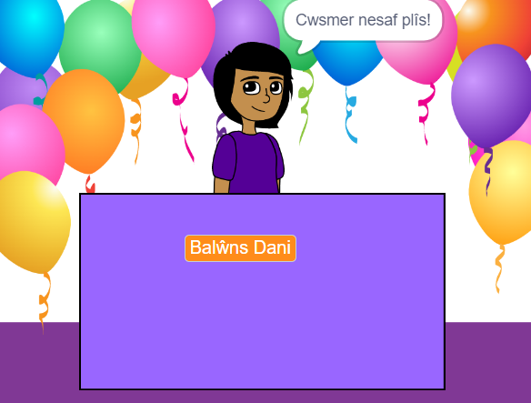
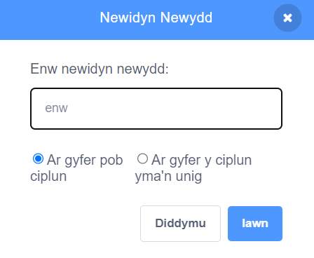
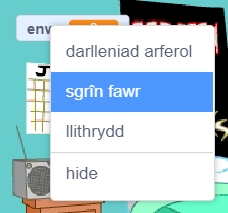

## Dy syniad busnes

<div style="display: flex; flex-wrap: wrap">
<div style="flex-basis: 200px; flex-grow: 1; margin-right: 15px;">
Beth yw dy syniad busnes? Gallai fod yn rhywbeth realistig, fel rhywbeth o lyfr neu ffilm rwyt ti'n ei hoffi, neu'n rhywbeth hollol wirion.
</div>
<div>
{:width="300px"}
</div>
</div>

--- task ---

Agora [brosiect Scratch newydd](http://rpf.io/scratch-new){:target="_blank"} a tharo golwg ar yr amrywiaeth o gorluniau a chefnlenni y galli di eu defnyddio. Treulia ychydig o amser yn meddwl am dy syniad busnes.

[[[working-offline]]]

--- /task ---

Pa gefnlen a chorluniau golygfeydd ychwanegol bydd eu hangen arnat ti?
+ Cefnlen o lyfrgell Scratch, neu gefnlen lliw plaen?
+ Desg, cownter, neu ffenestr i werthu ohoni?
+ Silff neu gwpwrdd llyfrau i roi eitemau arno - fe allech chi Beintio hwn ar y gefnlen

--- task ---

Cliciwch **Dewiswch Gefnlen** neu beintio dy gefndir dy hun.


Clicia **Dewiswch Gorlun** ac ychwanegu neu beintio corluniau golygfeydd ychwanegol.


Galli di bob amser ychwanegu mwy o olygfeydd yn ddiweddarach os byddi di'n gweld bod angen gwneud hynny.

--- /task ---

Sut fydd corlun y **gwerthwr** yn edrych?
+ Person neu gymeriad sydd ddim yn chwaraewr (NPC) fel siopwr, ffermwr, neu lyfrgellydd?
+ Peiriant fel peiriant gwerthu, jiwcbocs, neu gofrestr arian?

<p style="border-left: solid; border-width:10px; border-color: #0faeb0; background-color: aliceblue; padding: 10px;">
Mae <span style="color: #0faeb0">**NPC**</span> yn gymeriad sydd ddim yn chwaraewr y galli di ryngweithio ag ef mewn gêm neu stori ryngweithiol. Alli di feddwl am gemau rwyt ti wedi'u chwarae sydd â NPCs? Tro nesaf byddi di'n chwarae, ystyria mai gwaith rhywun oedd creu'r cymeriad hwnnw.
</p>

--- task ---

Ychwanega gorlun i gynrychioli'r gwerthwr.


--- /task ---

Beth ydy enw dy fusnes?

--- task ---

Crea `newidyn`{:class="block3variables"} o'r enw `enw`:

--- collapse ---

---

title: Creu newidyn

---

O'r ddewislen blociau `Newidynnau`{:class="block3variables"} clicia'r botwm **Creu Newidyn**.

Rho'r enw `enw` i dy newidyn newydd:



**Nodyn:** Bydd y newidyn `enw` newydd yn ymddangos ar y Llwyfan a bydd modd ei ddefnyddio nawr yn y blociau `Newidyn`{:class="block3variables"}.

--- /collapse ---

Clicia ar dy gorlun **gwerthwr** ac ychwanega god i osod y newidyn i enw dy fusnes:

```blocks3
when flag clicked
set [name v] to () //type the name of your business
```

Crea arwydd ar y Llwyfan gyda dy newidyn:

--- collapse ---

---

title: Newid ymddangosiad a lleoliad newidynnau

---

De-glicia ar y `newidyn`{:class="block3variables"} ar y Llwyfan a dewis sgrîn fawr:



Llusga dy `newidyn`{:class="block3variables"} i'w osod ar y Llwyfan fel rhan o olygfa'r siop.

--- /collapse ---

--- /task ---

--- task ---

**Prawf:** Gwna'n siŵr dy fod yn gallu gweld enw dy fusnes fel gwerth y newidyn ar y Llwyfan.

--- /task ---

Bydd yn barod i groesawu dy gwsmer cyntaf.

--- task ---

Clicia ar dy gorlun **gwerthwr** ac ychwanega floc `darlledu`{:class="block3control"}. Crea neges newydd o'r enw `cwsmer nesaf`.

```blocks3
when flag clicked
set [name v] to [my shop] // your business name
+ broadcast (next customer v)
```

--- /task ---

--- task ---

Crea sgript newydd ar gyfer dy gorlun **gwerthwr** i `ddweud`{:class="block3looks"} `Cwsmer nesaf plîs` pan fyddan nhw'n derbyn y `darllediad`{:class="block3control"} `cwsmer nesaf`{:class="block3control"}.

```blocks3
when I receive [next customer v] 
say [Next customer please!] for (2) seconds
```

--- /task ---

--- task ---

**Difa chwilod:** Efallai bydd angen i ti ddifa chwilod yn dy brosiect. Dyma chwilen gyffredin.

--- collapse ---

---

title: Newidyn yn dangos `0`

---

Dylet ti ddefnyddio'r bloc `gosod [enw v] i ()`{:class="block3variables"} er mwyn gosod y newidyn i dy enw di. Os wyt ti eisoes wedi ychwanegu sgript, gwna'n siŵr dy fod wedi teipio enw dy fusnes i mewn i'r gwerth ac wedi clicio ar y faner werdd.

```blocks3
when flag clicked
set [name v] to [my shop] // your business name
```

--- /collapse ---

--- /task ---

--- save ---
