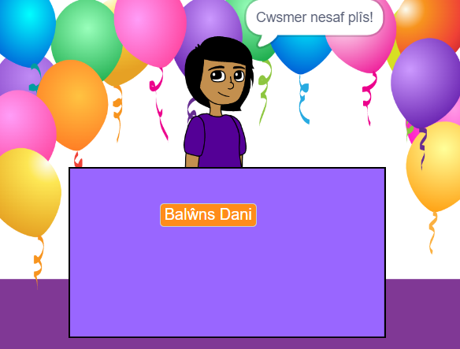

## Dy syniad busnes

<div style="display: flex; flex-wrap: wrap">
<div style="flex-basis: 200px; flex-grow: 1; margin-right: 15px;">
What is your shop idea? Gallai fod yn rhywbeth realistig, fel rhywbeth o lyfr neu ffilm rwyt ti'n ei hoffi, neu'n rhywbeth hollol wirion.
</div>
<div>
{:width="300px"}
</div>
</div>

--- task ---

Agora [brosiect Scratch newydd](http://rpf.io/scratch-new){:target="_blank"} a tharo golwg ar yr amrywiaeth o gorluniau a chefnlenni y galli di eu defnyddio. Spend some time thinking about your shop idea.

--- /task ---

--- task ---

Pa gefnlen a chorluniau golygfeydd ychwanegol bydd eu hangen arnat ti?


+ Cefnlen o lyfrgell Scratch, neu gefnlen lliw plaen?

--- /task ---

--- task ---

Clicia **Dewiswch Gorlun** ac ychwanegu neu beintio corluniau golygfeydd ychwanegol.


--- /task ---

--- task ---

Sut fydd corlun y **gwerthwr** yn edrych?
+ Person neu gymeriad sydd ddim yn chwaraewr (NPC) fel siopwr, ffermwr, neu lyfrgellydd?
+ Silff neu gwpwrdd llyfrau i roi eitemau arno - fe allech chi Beintio hwn ar y gefnlen

--- /task ---

--- task ---

Ychwanega gorlun i gynrychioli'r gwerthwr.

You could choose:
+ Person neu gymeriad sydd ddim yn chwaraewr (NPC) fel siopwr, ffermwr, neu lyfrgellydd
+ Peiriant fel peiriant gwerthu, jiwcbocs, neu gofrestr arian


--- /task ---

### Welcome your first customer.

--- task ---

Click on your **seller** sprite and add a `broadcast`{:class="block3events"} block. Create a new message called `next customer`.

```blocks3
when flag clicked
set [enw v] to () //teipia enw dy fusnes
```

--- /task ---

--- task ---

Rho'r enw `enw` i dy newidyn newydd:

```blocks3
when I receive [next customer v] 
say [Next customer please!] for (2) seconds
```

--- /task ---

--- save ---
