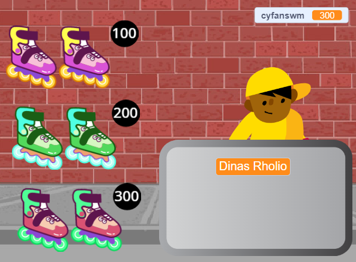
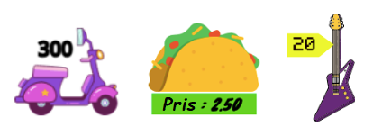

## Eitemau ar werth

<div style="display: flex; flex-wrap: wrap">
<div style="flex-basis: 200px; flex-grow: 1; margin-right: 15px;">
Mae angen eitemau ar werth ar dy siop. Bydd gan bob eitem bris a fydd yn cael ei ychwanegu at newidyn `cyfanswm`{:class="block3variables"}.
</div>
<div>
{:width="300px"}
</div>
</div>

Bydd angen i ti gadw golwg ar faint mae dy gwsmer yn ei wario.

--- task ---

Ychwanegu newidyn newydd o'r enw `cyfanswm`{:class="block3variables"} ar gyfer pob corlun.

Cliciwch ar dy gorlun **gwerthwr** ac ychwanegwch sgript i `osod`{:class="block3variables"} y `cyfanswm`{:class="block3variables"} i `0` pan fydd y prosiect yn dechrau.

[[[scratch3-create-set-variable]]]

--- /task ---

Pa **eitem** fydd dy gwsmer(iaid) yn ei brynu?
+ Rhyw fath o fwyd neu ddiod
+ Offer chwaraeon, teganau neu declynnau
+ Ffyn hud, diodydd hud, neu lyfrau swyn
+ Dillad neu eitemau ffasiwn eraill
+ Dy syniad di

--- task ---

Ychwanega gorlun ar gyfer yr **eitem** gyntaf rwyt ti'n mynd i'w gwerthu yn dy siop.

Os wyt ti'n dymuno, galli di ychwanegu pris at y wisg drwy ddefnyddio'r offeryn testun yn y Golygydd Paent. Neu ychwanega bris i'r gefnlen a gosod yr eitem wrth ei ymyl.



--- /task ---

--- task ---

Ychwanega sgript i `newid`{:class="block3variables"} y `cyfanswm`{:class="block3variables"} yn ôl pris dy eitem pan fydd y cwsmer yn clicio ar y corlun.

--- collapse ---
---
title: Clicio i ychwanegu eitem
---

```blocks3
when this sprite clicked
start sound (Coin v)
change [cyfanswm v] by [10]
```

--- /collapse ---

Mae hefyd yn syniad da `chwarae sain`{:class="block3sound"} i roi adborth i'r cwsmer eu bod wedi ychwanegu eitem.


[[[scratch3-add-sound]]]

--- /task ---

--- task ---

**Prawf:** Clicia ar dy eitem a gwneud yn siŵr fod gwerth y newidyn `cyfanswm`{:class="block3variables"} yn cynyddu yn ôl pris yr eitem, a dy fod yn clywed yr effaith sain. Clicia mwy o weithiau i weld y cyfanswm yn codi.

Clicia'r faner werdd i gychwyn dy brosiect a gwna'n siŵr bod y `cyfanswm`{:class="block3variables"} yn dechrau ar `0`.

--- /task ---

--- task ---

Ychwanega mwy o eitemau i dy siop.

Galli di naill ai:
+ Ddyblygu'r eitem gyntaf ac yna ychwanegu gwisg newydd yn y Golygydd Paent
+ Ychwanegu corlun ac yna llusgo'r sgript `pan fydd y faner wedi'i chlicio`{:class="block3events"} o'r eitem gyntaf i dy eitem newydd

Ychwanega label pris at y wisg neu'r gefnlen os wyt ti'n eu defnyddio.

--- /task ---

--- task ---

Cliciwch ar dy gorlun **Item** newydd yn y rhestr Corluniau ac yna clicia ar y tab **Cod**.

Newidia faint mae'r `cyfanswm`{:class="block3variables"} yn ei newid i bris dy eitem newydd.

--- /task ---

--- task ---

**Profi:** Clicia'r faner werdd i gychwyn dy brosiect a chlicio ar eitemau i'w hychwanegu. Gwna'n siŵr fod y cyfanswm yn cynyddu yn ôl y swm cywir bob tro y byddi di'n clicio ar eitem.

Os wyt ti'n ychwanegu labeli prisiau, gwna'n siŵr eu bod yn cyfateb i'r swm sy'n cael ei ychwanegu at y `cyfanswm`{:class="block3variables"}, neu bydd dy gwsmeriaid yn drysu!

--- /task ---

--- task ---

**Difa chwilod:** Efallai bydd angen i ti drwsio chwilod yn dy brosiect. Dyma rai chwilod cyffredin.

--- collapse ---
---
title: Dydy'r cyfanswm ddim yn mynd i 0 pan fydda i'n clicio ar y faner werdd
---

Gwna'n siŵr dy fod wedi gosod gwerth cychwynnol y newidyn `cyfanswm`{:class="block3variables"} yn y sgript `pan fydd y faner wedi'i chlicio`{:class="block3events"} ar dy gorlun **gwerthwr**.

--- /collapse ---

--- collapse ---
---
title: Dydy'r cyfanswm ddim yn cynyddu yn ôl y swm cywir pan fydda i'n clicio ar eitem
---

Gwna'n siŵr fod gan bob eitem sgript `pan gaiff y corlun hwn ei glicio`{:class="block3events"} sy'n newid y `cyfanswm`{:class="block3variables"} yn ôl y swm cywir ar gyfer yr eitem honno - efallai dy fod ti wedi newid y pris ar gyfer y corlun anghywir.

Gwna'n siŵr dy fod ti wedi defnyddio'r bloc `newid`{:class="block3variables"} ac nid y bloc `gosod`{:class="block3variables"} i newid y `cyfanswm`{:class="block3variables"}. Mae angen i ti ddefnyddio `newid`{:class="block3variables"} i ychwanegu'r pris at y cyfanswm, ond mae angen gosod y cyfanswm i bris yr eitem sydd newydd ei ychwanegu.

--- /collapse ---

--- /task ---

--- save ---
