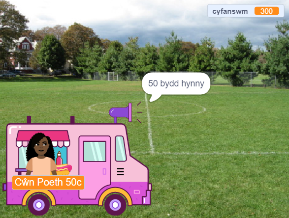

## Prynu

<div style="display: flex; flex-wrap: wrap">
<div style="flex-basis: 200px; flex-grow: 1; margin-right: 15px;">
Mae angen i'r corlun **gwerthwr**:
- ofyn a ydy'r cwsmer yn barod i dalu am yr eitemau
- cymryd taliad
- paratoi ar gyfer y cwsmer nesaf
</div>
<div>
{:width="300px"}
</div>
</div>

Pan fydd wedi gorffen dewis eitemau, bydd y cwsmer yn clicio ar y corlun **gwerthwr** i dalu.

--- task ---

 Dyweda wrth y cwsmer faint fydd ei eitemau yn costio.

```blocks3
when this sprite clicked
say (join [That will be ] (total)) for (2) seconds 
```

--- /task ---

--- task ---

Ychwanega sain talu at dy gorlun **gwerthwr** fel bod y cwsmer yn gwybod bod taliad yn digwydd.


[[[scratch3-add-sound]]]

Ychwanega floc `chwarae sain tan y diwedd`{:class="block3sound"} i dy sgript.

```blocks3
when this sprite clicked
say (join [That will be ] (total)) for (2) seconds
+ play sound [machine v] until done 
```

--- /task ---

--- task ---

Gorffena'r broses talu. Gosoda'r `cyfanswm`{:class="block3variables"} yn ôl i `0` ar ôl talu, `dweud`{:class="block3looks"} hwyl fawr a `darlledu`{:class="block3control"} `cwsmer nesaf`{:class="block3control"}.

```blocks3
when this sprite clicked
say (join [That will be ] (total)) for (2) seconds
play sound [machine v] until done 
+ set [total v] to (0)
+ say (join [Thanks for shopping at ] (name)) for (2) seconds
+ broadcast (next customer v)
```

--- /task ---

--- task ---

Efallai hoffet ti roi'r dewis i'r cwsmer ganslo'r broses siopa.

--- collapse ---
---
title: Gosod dewisiadau talu a chanslo
---

`Gofyn`{:class="block3sensing"} `Hoffech chi dalu neu ganslo?`. Ychwanega floc `Os`{:class="block3control"} ar gyfer `ateb`{:class="block3sensing"} `=`{:class="block3operators"} `talu` a rho dy flociau talu sy'n bodoli y tu mewn iddo.

```blocks3
when this sprite clicked
say (join [That will be ] (total)) for (2) seconds
+ ask [Would you like to pay or cancel?] and wait
+ if {(answer) = [pay]} then
play sound [machine v] until done 
set [total v] to (0)
say (join [Thanks for shopping at ] (name)) for (2) seconds
broadcast [next customer v]
end
```

Ychwanega ail floc `Os`{:class="block3control"} ar gyfer `ateb`{:class="block3sensing"} `=`{:class="block3operators"} `canslo` a rho god y tu mewn iddo i ganslo'r archeb.

```blocks3
when this sprite clicked
say (join [That will be ] (total)) for (2) seconds
ask [Would you like to pay or cancel?] and wait
if {(answer) = [pay]} then
play sound [machine v] until done 
set [total v] to (0)
say (join [Thanks for shopping at ] (name)) for (2) seconds
broadcast [next customer v]
end
+ if {(answer) = [cancel]} then
set [total v] to (0)
say [Ok. No problem] for (2) seconds
broadcast [next customer v]
end
```

--- /collapse ---

--- /task ---

--- task ---

Er mwyn sicrhau bod gan dy gwsmer eitemau yn ei fasged cyn talu, galli di fewnosod bloc `os...yna`{:class="block3control"}.

--- collapse ---
---
title: Gwirio'r cyfanswm
---

`If`{:class="block3control"} `cyfanswm`{:class="block3variables"} `>`{:class="block3operators"} `0` yna mewnosoda dy sgript sy'n bodoli.

`Fel arall`{:class="block3control"} `dweud`{:class="block3looks"} neges ddefnyddiol.

```blocks3
when this sprite clicked
+ if <(total) > [0]>then
say (join [That will be ] (total)) for (2) seconds
ask [Would you like to pay or cancel?] and wait
if {(answer) = [pay]} then
play sound [machine v] until done 
set [total v] to (0)
say (join [Thanks for shopping at ] (name)) for (2) seconds
broadcast [next customer v]
end
if {(answer) = [cancel]} then
set [total v] to (0)
say [Ok. No problem] for (2) seconds
broadcast [next customer v]
end
else
say [Click on the items you'd like] for (2) seconds
end
```

--- /collapse ---

--- /task ---

--- task ---

**Profi:** Profa dy brosiect a gwneud yn siŵr:
- Bod y cwsmer yn gallu talu gyda'r effeithiau sain cywir
- Bod y `cyfanswm`{:class="block3variables"} yn cael ei osod yn ôl i `0` ar ôl i gwsmer dalu neu ganslo.

--- /task ---


--- task ---

**Difa chwilod:** Efallai bydd angen i ti drwsio chwilod yn dy brosiect.

Dyma rai chwilod cyffredin:

--- collapse ---
---
title: Dydy'r gwerthwr ddim yn gwneud unrhyw beth pan dw i'n clicio arno
---

Mae gen ti gryn dipyn o gorluniau yn dy brosiect. Gwna'n siŵr fod y sgript `pan gaiff y corlun ei glicio`{:class="block3events"} ar dy gorlun **gwerthwr**.

**Awgrym:** Os wyt ti wedi ei ychwanegu at y corlun anghywir, galli di lusgo'r cod i'r corlun **gwerthwr**, yna ei ddileu o'r corlun arall.

--- /collapse ---

--- collapse ---
---
teitl: Mae'r gwerthwr yn dweud y gair 'cyfanswm' yn lle'r cyfanswm go iawn
---

Gwna'n siŵr fod gan dy floc `dweud`{:class="block3looks"} y bloc newidyn `cyfanswm`{:class="block3variables"}, a dim y gair `cyfanswm`.

```blocks3
 when this sprite clicked
 say {join [That will be ](total)} for (2) seconds 
 ```

--- /collapse ---

--- collapse ---
---
title: Mae'r geiriau yn y blociau dweud yn uno
---

Pan fyddi di'n `uno`{:class="block3operators"} dau ddarn at ei gilydd, mae angen ychwanegu bwlch ar ddiwedd dy ddarn cyntaf o destun neu ar ddechrau dy ail ddarn o destun.

Mae gan y rhain fwlch ar ddiwedd rhan gyntaf yr uniad:

```blocks3
say {join [That will be ](total)} for (2) seconds

say {join [Thanks for shopping at ](name)} for (2) seconds
```

--- /collapse ---

--- collapse ---
---
title: Dydy'r cyfanswm ddim yn ailosod ar ôl gwerthu
---

Gwna'n siŵr dy fod ti wedi defnyddio:

```blocks3
set [total v] to (0)
```

**nid**:

```blocks3
change [total v] by (0)
```

--- /collapse ---

--- collapse ---
---
teitl: Dydy'r gwerthwr ddim yn ymateb
---

Gwna'n siŵr mai'r `gweithredwr`{:class="block3operators"} yn yr amod `os`{:class="block3control"} yw'r symbol "mwy na" `>`{:class="block3operators"}.

```blocks3
if <(total) > [0]> then
```

--- /collapse ---

**Awgrym:** Cymhara dy god gyda'r enghreifftiau cod. Oes unrhyw wahaniaethau na ddylai fod yno?

--- /task ---

--- save ---
