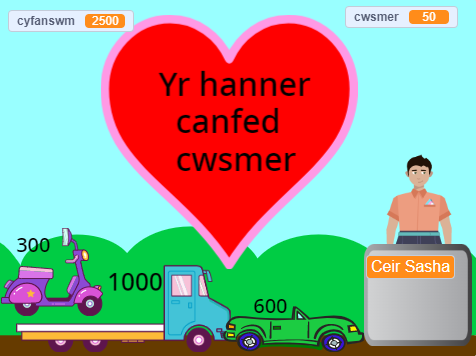

## Nodweddion ychwanegol

<div style="display: flex; flex-wrap: wrap">
<div style="flex-basis: 200px; flex-grow: 1; margin-right: 15px;">
Mae llawer o nodweddion y gallet ti eu hychwanegu i wella profiad siopa dy gwsmeriaid. Does dim angen i ti ychwanegu popeth. Dim ond y gwelliannau ti'n meddwl sy'n bwysig mae'n rhaid eu hychwanegu.

</div>
<div>
{:width="300px"}
</div>
</div>

Galli di 'Weld tu mewn' i brosiectau enghreifftiol i daro golwg ar sut maen nhw'n gweithio.

Prosiectau enghreifftiol: **Ffrwyth Gofod Ffres**: [Gweld tu mewn](https://scratch.mit.edu/projects/528696418/editor){:target="_blank"}
**Crysau Cŵl**: [Gweld tu mewn](https://scratch.mit.edu/projects/528697069/editor){:target="_blank"}
**Siop hufen iâ**: [Gweld tu mewn](https://scratch.mit.edu/projects/525972748/editor){:target="_blank"}
**Peiriant gwerthu**: [Gweld tu mewn](https://scratch.mit.edu/projects/526051796/editor){:target="_blank"}

**Awgrym:** Os wyt ti wedi mewngofnodi i gyfrif Scratch, galli di ddefnyddio'r **Pecyn Cefn** i gopïo sgriptiau neu gorluniau i dy brosiect.

[[[scratch-backpack]]]

--- task ---

Wyt ti'n meddwl y dylai'r person wrth y cownter (neu beiriant) ofyn mwy o gwestiynau?

Galli di ychwanegu flociau `gofyn`{:class="block3sensing"} i sgript `pan gaiff y corlun hwn ei glicio`{:class="block3events"} dy **werthwr** a `dweud`{:class="block3looks"} gwahanol bethau gan ddibynnu ar ymateb y cwsmer.

Fe allet ti ofyn os oedd y gwasanaeth yn dda neu beidio, neu ydyn nhw'n cael diwrnod braf. Neu rywbeth penodol i dy siop, fel "Beth wyt ti'n mynd i'w goginio?"

--- collapse ---

---

title: Gofyn ac ymateb i gwestiynau

---

```blocks3
ask [Ddes di o hyd i bob dim roeddet ti eisiau heddiw?] and wait
if <(answer) = [do]> then
say [Mae hynny'n wych!] for [2] seconds
else
say [Falle ddylwn i ychwanegu mwy o eitemau i fy siop] for [2] seconds
end
```

**Difa chwilod:** Gwna'n siŵr dy fod wedi sillafu'r opsiynau yn gywir yn dy god ac yn dy ateb. Mae'n iawn os wyt ti'n defnyddio priflythrennau, felly bydd "Do" a "DO" yn cyfateb i "do".

Ychwanega fwy nag un cwestiwn i greu bot sgwrsio neu gymeriad nad yw'n chwaraewr (NPC) y galli di siarad ag ef.

--- /collapse ---

--- /task ---

Wyt ti eisiau i rywbeth arall ddigwydd pan fyddi di'n ychwanegu eitem?

--- task ---

Mae gan y prosiect Crysau Cŵl grysau sy'n llithro i mewn i fag.

--- collapse ---

---

title: Gwneud i eitemau lithro i mewn i gynhwysydd

---

Ychwanega gorlun **Cynhwysydd**. Fe allet ti ddefnyddio corlun sy'n bodoli eisoes fel y corlun **Gift** neu **Take out**, neu beintio dy rai dy hun gyda siapiau syml.

Ychwanega sgript i wneud i'r **Cynhwysydd** ymddangos ar y blaen bob amser:

```blocks3
when flag clicked
forever
go to [front v] layer
end
```

Wedyn bydd angen i ti ychwanegu cod at bob **Eitem** sydd gen ti ar werth i wneud iddyn nhw lithro i'r cynhwysydd ar ôl iddyn nhw gael eu clicio:

```blocks3
when this sprite clicked
+go to [front v] layer
+glide [1] secs to (Bag v) // defnyddia enw dy gorlun Container
+hide
change [cyfanswm v] by [12]
+go to x: [-180] y: [68] // safle cychwyn
+show
```

Os nad wyt ti am i'r cynhwysydd fod yno drwy'r amser, galli di ychwanegu sgriptiau i wneud iddyn nhw ymddangos a chuddio ar yr amser cywir:

```blocks3
when I receive [cwsmer nesaf v]
hide // cwsmer blaenorol yn cymryd y bag
wait [1] seconds
show
```

**Profi:** Rho gynnig ar dy brosiect a gwa'n siŵr bod eitemau'n llithro i'r cynhwysydd ac yn cuddio.

**Difa chwilod:** Gwiria dy sgriptiau'n ofalus a gwna'n siŵr dy fod wedi diweddaru pob un o dy gorluniau **Eitem**. Galli di daro golwg ar [Crysau Cŵl](https://scratch.mit.edu/projects/528697069/editor){:target="_blank"} os oes angen i ti weld enghraifft weithredol.

--- /collapse ---

Mae'r prosiect Hufen iâ yn dangos yr hufen iâ wrth i'r cwsmer ddewis.

--- collapse ---

---

title: Addasu a dangos corlun

---

Mae angen i bob eitem `ddarlledu`{:class="block3events"} yn ei sgript `pan gaiff y corlun hwn ei glicio`{:class="block3events"}:

```blocks3
+broadcast (1 sgŵp v)
```

Wedyn mae angen i'r corlun rwyt ti am ei ddangos neu ei newid ymateb i'r neges honno:

```blocks3
when I receive [1 sgŵp v]
play sound (Chomp v) until done
switch costume to (1 sgŵp v)
```

Efallai y byddi di hefyd am newid neu guddio'r corlun ar gyfer cwsmer newydd:

```blocks3
when I receive [cwsmer nesaf v]
switch costume to (côn v)
```

Os oes gen ti sawl eitem, bydd angen i ti ychwanegu mwy o negeseuon a sgriptiau i'w derbyn.

--- /collapse ---

--- /task ---

Wyt ti wedi sylwi y gall dy gwsmer ychwanegu eitemau ar ôl iddyn nhw ddechrau talu?

--- task ---

Os wyt ti am rwystro'r cwsmer rhag ychwanegu eitemau pan fyddan nhw wrth y ddesg dalu, galli di ychwanegu newidyn `siop`{:class="block3variables"} a'i ddefnyddio i reoli pryd mae modd ychwanegu eitemau.

--- collapse ---

---
title: Caniatáu prynu dim ond pan dydy'r cwsmer ddim wrth y ddesg dalu

---

Ychwanega `newidyn`{:class="block3variables"} o'r enw `siop` ar gyfer pob corlun. Byddi di'n gosod hwn i `gwir` pan fydd y cwsmer yn y siop ac `anwir` pan fydd wrth y ddesg dalu.

Dewisa dy gorlun **gwerthwr**. Diweddara dy sgript `pan fo'r flag werdd yn cael ei glicio`{:class="block3events"} i ganiatáu siopa pan fydd dy brosiect yn dechrau:

```blocks3
+set [siop v] to [gwir]
```

Nawr ychwanega floc i newid y `siop`{:class="block3variables"} i `anwir` ar ddechrau sgript `pan gaiff y ciplun yma ei glicio`{:class="block3events"} dy **werthwr**:

```blocks3 
+set [siop v] to [anwir]
```

A bloc i osod y newidyn `siop`{:class="block3variables"} yn ôl i `gwir` ar ddiwedd yr un sgript:

```blocks3 
+set [siop v] to [gwir]
```

Nawr mae angen i ti ddiweddaru'r eitemau rwyt ti'n eu gwerthu i wirio'r newidyn `siop`{:class="block3variables"}:

```blocks3
when this sprite clicked
+if <(siop) = [gwir]> then
start sound (Coin v)
change [cyfanswm v] by [10]
end
```

Bydd angen gwneud hyn ar gyfer pob eitem rwyt ti'n ei werthu yn dy siop.

**Profi:** Clicia'r faner werdd ac wedyn rho gynnig ar siopa. Gwna'n siŵr y galli di ychwanegu eitemau a thalu o hyd, ond nad yw hi'n bosib ychwanegu eitemau ar ôl i ti ddechrau talu.

**Difa chwilod:** Cymer olwg ofalus dros dy god. Galli di edrych ar y prosiect [Ffrwyth o'r Gofod](https://scratch.mit.edu/projects/528696418/editor){:target="_blank"} os oes angen i ti weld enghraifft weithredol.

--- /collapse ---

--- /task ---

--- save ---

