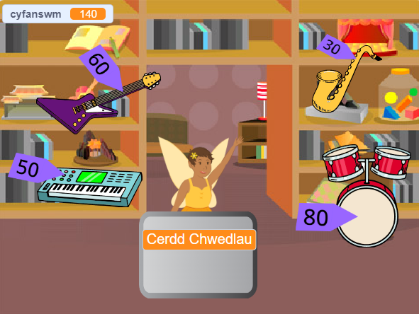

## Uwchraddio dy brosiect

Os oes gen ti amser, fe allet ti uwchraddio dy brosiect.

{:width="300px"}

Dyma rai syniadau gallet ti roi cynnig arnyn nhw:
- Ychwanegu mwy o eitemau i'w gwerthu
- Ychwanegu mwy o effeithiau graffeg a sain
- Paentio dy olygfeydd dy hun a gwisgoedd eraill
- Creu busnes arall a chaniatáu i chwaraewyr ymweld â'r ddau

Mae gan bob prosiect enghreifftiol yn [Cyflwyniad](.) ddolen Gweld tu mewn er mwyn i ti allu agor y prosiect ac edrych ar y cod i gael syniadau, a gweld sut maen nhw'n gweithio.

Cymer olwg ar ein stiwdio Scratch ['Marchnad siopa rhyngalaethol'](https://scratch.mit.edu/studios/29662180){:target="_blank"} i weld prosiectau a grëwyd gan aelodau'r gymuned.

--- save ---
