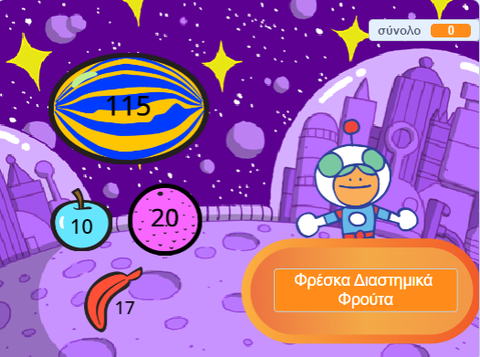
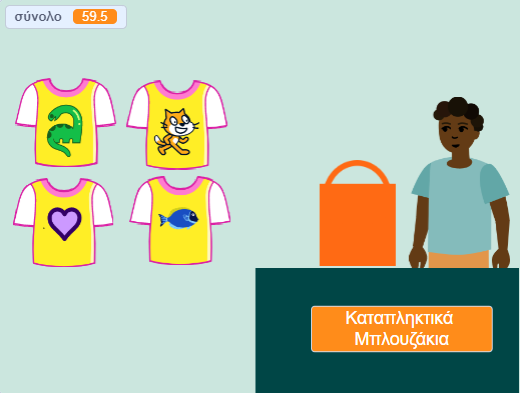
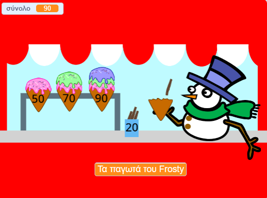
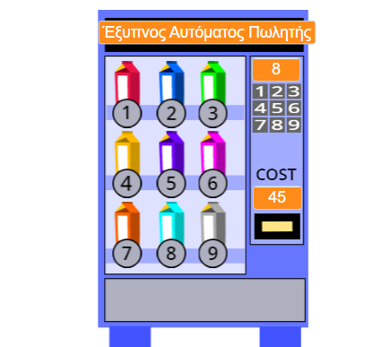

## What you will make

Δημιούργησε μια εφαρμογή καταστήματος όπου ο πελάτης μπορεί να αγοράσει προϊόντα από το κατάστημά σου. Το έργο θα είναι σε προβολή πρώτου προσώπου όπου ο παίκτης είναι πελάτης.

--- no-print ---

Click on Space Fruit to buy them and watch the total go up. Όταν είσαι έτοιμος/η, κάνε κλικ στο Kiran για να το πας στο ταμείο.

+ What happens if you try to checkout before you have chosen any fruit?
+ How do you think the project knows that you haven't added any fruit yet?

**Fresh Space Fruit**: [See inside](https://scratch.mit.edu/projects/528696418/editor){:target="_blank"}

  <iframe allowtransparency="true" width="485" height="402" src="https://scratch.mit.edu/projects/embed/528696418/?autostart=false" frameborder="0"></iframe>

### Get ideas 💭

Click on the **seller** sprites to buy items:

**Cool Shirts**: [See inside](https://scratch.mit.edu/projects/528697069/editor){:target="_blank"}

  <iframe allowtransparency="true" width="485" height="402" src="https://scratch.mit.edu/projects/embed/528697069/?autostart=false" frameborder="0"></iframe>

**Ice cream shop**: [See inside](https://scratch.mit.edu/projects/525972748/editor){:target="_blank"}

  <iframe allowtransparency="true" width="485" height="402" src="https://scratch.mit.edu/projects/embed/525972748/?autostart=false" frameborder="0"></iframe>

**⭐ Pride pins** (featured community project)

Click on the pride pin badges to add them to your shopping bag:

  <iframe allowtransparency="true" width="485" height="402" src="https://scratch.mit.edu/projects/embed/750787529/?autostart=false" frameborder="0"></iframe>

--- /no-print ---

--- print-only ---

### Get ideas 💭

You are going to make some design decisions to create your character. See inside example projects in the Scratch 2: Next customer please! Scratch studio at https://scratch.mit.edu/studios/29611454

   

--- /print-only ---

