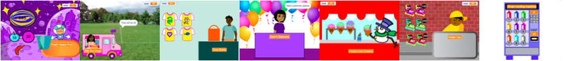

## You will make

Δημιούργησε μια εφαρμογή καταστήματος όπου ο πελάτης μπορεί να αγοράσει προϊόντα από το κατάστημά σου. Το έργο θα είναι σε προβολή πρώτου προσώπου όπου ο παίκτης είναι πελάτης.

**Προβολή πρώτου προσώπου** σημαίνει ότι δεν βλέπεις τον χαρακτήρα σου στην οθόνη, αντίθετα βλέπεις αυτό που βλέπει.

Θα χρειαστεί να:
+ Δημιουργήσεις μια εφαρμογή καταστήματος με προϊόντα προς αγορά και ένα ταμείο
+ Προγραμματίσεις το χρόνο σου για να αποκτήσεις γρήγορα μια απλή έκδοση
+ Δοκιμάσεις καταστήματα από άλλους και να μοιραστείς το κατάστημά σου, ώστε να το δοκιμάσουν και άλλοι

--- no-print ---

--- task ---

  

### Play ▶️ 

Click on Space Fruit to buy them and watch the total go up. Όταν είσαι έτοιμος/η, κάνε κλικ στο Kiran για να το πας στο ταμείο. 

+ Τι θα συμβεί αν προσπαθήσεις να πας στο ταμείο πριν επιλέξεις κάποιο φρούτο; 
+ Πώς πιστεύεις ότι το έργο γνωρίζει ότι δεν έχεις προσθέσει κανένα φρούτο ακόμα;

  <iframe allowtransparency="true" width="485" height="402" src="" frameborder="0"></iframe>

--- /task ---

### Get ideas 💭

Θα πάρεις κάποιες σχεδιαστικές αποφάσεις για να επιλέξεις ποια είδη θα προσφέρει η επιχείρησή σου και πώς θα πληρώσει ο πελάτης.

--- task ---

Explore these example shops to get more ideas.

⭐ Share your finished Next customer please project for a chance of it being featured here.

Which projects allow you to buy multiple items at once? Which allow you to buy items one at a time?

Click on the **seller** sprites to buy items:

  <iframe allowtransparency="true" width="485" height="402" src="" frameborder="0"></iframe>

  <iframe allowtransparency="true" width="485" height="402" src="" frameborder="0"></iframe>

**⭐ Pride pins** (featured community project)

Click on the pride pin badges to add them to your shopping bag:

  <iframe allowtransparency="true" width="485" height="402" src="https://scratch.mit.edu/projects/embed/750787529/?autostart=false" frameborder="0"></iframe>

--- /task ---

--- /no-print ---

--- print-only ---

### Get ideas 💭

You are going to make some design decisions to create your character. See inside example projects in [Scratch 2: Next customer please! - Examples](https://scratch.mit.edu/studios/29611454/){:target="_blank"} Scratch studio.

   

--- /print-only ---

