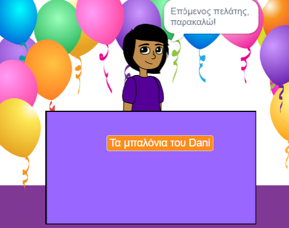

## Your shop

<div style="display: flex; flex-wrap: wrap">
<div style="flex-basis: 200px; flex-grow: 1; margin-right: 15px;">
What is your shop idea? Θα μπορούσε να είναι κάτι ρεαλιστικό, κάτι από βιβλίο ή ταινία που σου αρέσει ή κάτι εντελώς τρελό.
</div>
<div>
{:width="300px"}
</div>
</div>

--- task ---

Άνοιξε ένα [νέο έργο Scratch](http://rpf.io/scratch-new){:target="_ blank"} και δες την ποικιλία των αντικειμένων και υποβάθρων που μπορείς να χρησιμοποιήσεις. Spend some time thinking about your shop idea.

--- /task ---

--- task ---

**Choose a Backdrop** or paint your own backdrop.


+ A backdrop from the Scratch library, or a plain coloured backdrop

--- /task ---

--- task ---

**Choose a Sprite** and add or paint extra scenery sprites.


--- /task ---

--- task ---

Add more scenery.
+ A desk, counter, or window to sell from
+ Ένα ράφι ή βιβλιοθήκη για να τοποθετήσεις προϊόντα — μπορείς να το δημιουργήσεις με τη Ζωγραφική στο υπόβαθρο

--- /task ---

--- task ---

Πρόσθεσε ένα αντικείμενο που θα παίξει τον ρόλο του πωλητή.

You could choose:
+ A person or non-player character such as a shopkeeper, farmer, or librarian
+ A machine such as a vending machine, jukebox, or cash register


--- /task ---

### Welcome your first customer.

--- task ---

Κάνε κλικ στο αντικείμενο του **πωλητή** και πρόσθεσε ένα μπλοκ `μετάδωσε`{:class="block3control"}. Create a new message called `next customer`.

```blocks3
when flag clicked
+ broadcast (next customer v)
```

--- /task ---

--- task ---

Δημιούργησε ένα νέο script για τον **πωλητή** σου για να `πει`{:class="block3looks"} `Επόμενος πελάτης παρακαλώ` όταν λάβει την `μετάδοση`{:class="block3control"} `επόμενος πελάτης`{:class= "block3control"}.

```blocks3
when I receive [next customer v] 
say [Next customer please!] for (2) seconds
```

--- /task ---

--- save ---
