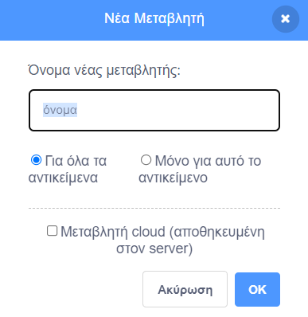
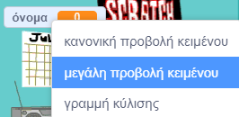

## Η επιχειρηματική σου ιδέα

<div style="display: flex; flex-wrap: wrap">
<div style="flex-basis: 200px; flex-grow: 1; margin-right: 15px;">
Ποια είναι η επιχειρηματική σου ιδέα; Θα μπορούσε να είναι κάτι ρεαλιστικό, κάτι από βιβλίο ή ταινία που σου αρέσει ή κάτι εντελώς τρελό.
</div>
<div>
{:width="300px"}
</div>
</div>

--- task ---

Άνοιξε ένα [νέο έργο Scratch](http://rpf.io/scratch-new){:target="_ blank"} και δες την ποικιλία των αντικειμένων και υποβάθρων που μπορείς να χρησιμοποιήσεις. Αφιέρωσε λίγο χρόνο για να σκεφτείς την επιχειρηματική σου ιδέα.

[[[working-offline]]]

--- /task ---

Τι υπόβαθρο και επιπλέον αντικείμενα για την σκηνή σου θα χρειαστείς;
+ Ένα υπόβαθρο από τη βιβλιοθήκη του Scratch ή ένα απλό έγχρωμο υπόβαθρο;
+ Ένα γραφείο, πάγκο ή παράθυρο για να εκθέσεις τα προϊόντα προς πώληση;
+ Ένα ράφι ή βιβλιοθήκη για να τοποθετήσεις προϊόντα — μπορείς να το δημιουργήσεις με τη Ζωγραφική στο υπόβαθρο

--- task ---

Κάνε κλικ στο **Επιλέξτε Υπόβαθρο** ή ζωγράφισε το δικό σου υπόβαθρο.


Κάνε κλικ στο **Επιλέξτε ένα Αντικείμενο** και πρόσθεσε ή ζωγράφισε επιπλέον αντικείμενα στο σκηνικό.


Μπορείς να προσθέσεις περισσότερα αντικείμενα στο σκηνικό αργότερα, εάν διαπιστώσεις ότι το χρειάζεσαι.

--- /task ---

Πώς θα μοιάζει το αντικείμενο του **πωλητή**;
+ Ένα άτομο ή NPC, όπως καταστηματάρχης, αγρότης ή βιβλιοθηκάριος;
+ Ένα μηχάνημα όπως αυτόματος πωλητής, jukebox ή ταμειακή μηχανή;

<p style="border-left: solid; border-width:10px; border-color: #0faeb0; background-color: aliceblue; padding: 10px;">
Ο <span style="color: #0faeb0">**NPC**</span> είναι ένας χαρακτήρας που δεν διαχειρίζεται ο παίκτης με τον οποίο μπορείς να αλληλεπιδράσεις σε ένα παιχνίδι ή διαδραστική ιστορία. Μπορείς να σκεφτείς παιχνίδια που έχεις παίξει και έχουν NPC; Την επόμενη φορά που θα παίξεις, σκέψου πως ήταν δουλειά κάποιου να φτιάξει αυτόν τον χαρακτήρα.
</p>

--- task ---

Πρόσθεσε ένα αντικείμενο που θα παίξει τον ρόλο του πωλητή.


--- /task ---

Ποιο είναι το όνομα της επιχείρησής σου;

--- task ---

Δημιούργησε μία `μεταβλητή`{:class="block3variables"} που να ονομάζεται `όνομα`:

--- collapse ---

---

title: Δημιουργία μεταβλητής

---

Από το μενού μπλοκ `Μεταβλητές`{:class="block3variables"} κάνε κλικ στο κουμπί **Δημιουργία μεταβλητής**.

Κάλεσε τη νέα σου μεταβλητή `όνομα`:



**Σημείωση:** Η νέα μεταβλητή `όνομα` εμφανίζεται στη Σκηνή και μπορεί πλέον να χρησιμοποιηθεί στα μπλοκ `Μεταβλητές`{:class="block3variables"}.

--- /collapse ---

Κάνε κλικ στο δικό σου αντικείμενο **πωλητή** και πρόσθεσε κώδικα για να ορίσεις τη μεταβλητή ως το όνομα της επιχείρησής σου:

```blocks3
when flag clicked
set [name v] to () //type the name of your business
```

Δημιούργησε μία πινακίδα στο Σκηνικό με τη μεταβλητή σου:

--- collapse ---

---

title: Άλλαξε την εμφάνιση και τη θέση των μεταβλητών

---

Κάνε δεξί κλικ ξανά στη `μεταβλητή`{:class="block3variables"} που εμφανίζεται στη Σκηνή και επίλεξε μεγάλη προβολή κειμένου:



Σύρε τη `μεταβλητή`{:class="block3variables"} για να την τοποθετήσεις ως μέρος του σκηνικού του καταστήματος.

--- /collapse ---

--- /task ---

--- task ---

**Δοκιμή:** Βεβαιώσου ότι μπορείς να δεις το όνομα της επιχείρησής σου ως την τιμή της μεταβλητής στο Σκηνικό.

--- /task ---

Ετοιμάσου να υποδεχτείς τον πρώτο σου πελάτη.

--- task ---

Κάνε κλικ στο αντικείμενο του **πωλητή** και πρόσθεσε ένα μπλοκ `μετάδωσε`{:class="block3control"}. Δημιούργησε ένα νέο μήνυμα που ονομάζεται `επόμενος πελάτης`.

```blocks3
when flag clicked
set [name v] to [my shop] // your business name
+ broadcast (next customer v)
```

--- /task ---

--- task ---

Δημιούργησε ένα νέο script για τον **πωλητή** σου για να `πει`{:class="block3looks"} `Επόμενος πελάτης παρακαλώ` όταν λάβει την `μετάδοση`{:class="block3control"} `επόμενος πελάτης`{:class= "block3control"}.

```blocks3
when I receive [next customer v] 
say [Next customer please!] for (2) seconds
```

--- /task ---

--- task ---

**Εντοπισμός σφαλμάτων:** Ενδέχεται να βρεις κάποια σφάλματα στο έργο σου που πρέπει να διορθώσεις. Εδώ είναι ένα συνηθισμένο σφάλμα.

--- collapse ---

---

title: Η μεταβλητή δείχνει `0`

---

Θα πρέπει να χρησιμοποιήσεις το μπλοκ `όρισε [όνομα v] σε ()`{:class="block3variables"} για να ορίσεις τη μεταβλητή σύμφωνα με το δικό σου όνομα. Εάν έχεις ήδη προσθέσει ένα script, έλεγξε ότι έχεις πληκτρολογήσει το όνομα της επιχείρησής σου στην τιμή και ότι έχεις κάνει κλικ στην πράσινη σημαία.

```blocks3
when flag clicked
set [name v] to [my shop] // your business name
```

--- /collapse ---

--- /task ---

--- save ---
