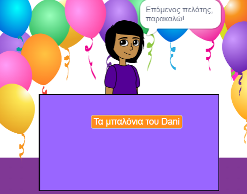

## Η επιχειρηματική σου ιδέα

<div style="display: flex; flex-wrap: wrap">
<div style="flex-basis: 200px; flex-grow: 1; margin-right: 15px;">
What is your shop idea? Θα μπορούσε να είναι κάτι ρεαλιστικό, κάτι από βιβλίο ή ταινία που σου αρέσει ή κάτι εντελώς τρελό.
</div>
<div>
{:width="300px"}
</div>
</div>

--- task ---

Άνοιξε ένα [νέο έργο Scratch](http://rpf.io/scratch-new){:target="_ blank"} και δες την ποικιλία των αντικειμένων και υποβάθρων που μπορείς να χρησιμοποιήσεις. Spend some time thinking about your shop idea.

--- /task ---

--- task ---

Τι υπόβαθρο και επιπλέον αντικείμενα για την σκηνή σου θα χρειαστείς;


+ Ένα υπόβαθρο από τη βιβλιοθήκη του Scratch ή ένα απλό έγχρωμο υπόβαθρο;

--- /task ---

--- task ---

Κάνε κλικ στο **Επιλέξτε ένα Αντικείμενο** και πρόσθεσε ή ζωγράφισε επιπλέον αντικείμενα στο σκηνικό.


--- /task ---

--- task ---

Πώς θα μοιάζει το αντικείμενο του **πωλητή**;
+ Ένα άτομο ή NPC, όπως καταστηματάρχης, αγρότης ή βιβλιοθηκάριος;
+ Ένα ράφι ή βιβλιοθήκη για να τοποθετήσεις προϊόντα — μπορείς να το δημιουργήσεις με τη Ζωγραφική στο υπόβαθρο

--- /task ---

--- task ---

Πρόσθεσε ένα αντικείμενο που θα παίξει τον ρόλο του πωλητή.

Θα μπορούσες να επιλέξεις:
+ A person or non-player character such as a shopkeeper, farmer, or librarian
+ A machine such as a vending machine, jukebox, or cash register


--- /task ---

### Welcome your first customer.

--- task ---

Click on your **seller** sprite and add a `broadcast`{:class="block3events"} block. Create a new message called `next customer`.

```blocks3
when flag clicked
set [όνομα v] to () //πληκτρολόγησε το όνομα της επιχείρησής σου
```

--- /task ---

--- task ---

Από το μενού μπλοκ `Μεταβλητές`{:class="block3variables"} κάνε κλικ στο κουμπί **Δημιουργία μεταβλητής**.

```blocks3
when I receive [next customer v] 
say [Next customer please!] for (2) seconds
```

--- /task ---

--- save ---
