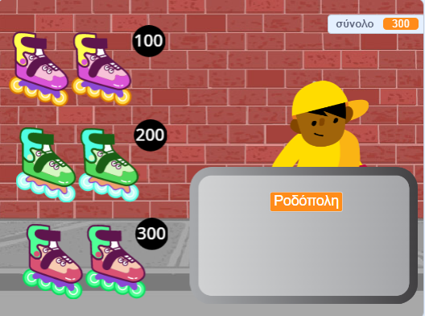
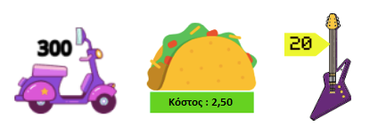

## Αντικείμενα προς πώληση

<div style="display: flex; flex-wrap: wrap">
<div style="flex-basis: 200px; flex-grow: 1; margin-right: 15px;">
Το κατάστημά σου χρειάζεται αντικείμενα προς πώληση. Κάθε αντικείμενο θα έχει μια τιμή που θα προστεθεί σε μια μεταβλητή `σύνολο`{:class="block3variables"}.
</div>
<div>
{:width="300px"}
</div>
</div>

Θα πρέπει να παρακολουθείς πόσα ξοδεύει ο πελάτης σου.

--- task ---

Πρόσθεσε μια νέα μεταβλητή με το όνομα `σύνολο`{:class="block3variables"} για όλα τα αντικείμενα.

Κάνε κλικ στο αντικείμενο **πωλητή** και πρόσθεσε ένα script για να `ορίσεις`{:class="block3variables"} το `σύνολο`{:class="block3variables"} σε `0` όταν ξεκινά το έργο.

[[[scratch3-create-set-variable]]]

--- /task ---

Ποια **αντικείμενα** θα αγοράσουν οι πελάτες σου;
+ Κάποιο είδος φαγητού ή ποτού
+ Αθλητικός εξοπλισμός, παιχνίδια ή gadget
+ Μαγικά ραβδιά, φίλτρα ή βιβλία με ξόρκια
+ Ρούχα ή άλλα είδη μόδας
+ Η ιδέα σου

--- task ---

Πρόσθεσε ένα αντικείμενο για το πρώτο **προϊόν ** που πρόκειται να πουλήσεις στο κατάστημά σου.

Εάν θέλεις, μπορείς να προσθέσεις μια τιμή στην ενδυμασία χρησιμοποιώντας το εργαλείο κειμένου στο πρόγραμμα επεξεργασίας Ζωγραφική. Ή να προσθέσεις μια τιμή στο υπόβαθρο και να τοποθετήσεις το αντικείμενο δίπλα της.



--- /task ---

--- task ---

Πρόσθεσε ένα script για να `αλλάξεις`{:class="block3variables"} το `σύνολο`{:class="block3variables"} με βάση την τιμή του προϊόντος σου όταν ο πελάτης κάνει κλικ στο αντικείμενο.

--- collapse ---
---
title: Κάνε κλικ για να προσθέσεις ένα αντικείμενο
---

```blocks3
when this sprite clicked
start sound (Coin v)
change [total v] by [10]
```

--- /collapse ---

Είναι επίσης καλή ιδέα να `παίξεις έναν ήχο`{:class="block3sound"} για να καταλάβει ο πελάτης ότι έχει προσθέσει ένα αντικείμενο.


[[[scratch3-add-sound]]]

--- /task ---

--- task ---

**Δοκιμή:** Κάνε κλικ στο προϊόν σου και έλεγξε ότι η τιμή της μεταβλητής `σύνολο`{:class="block3variables"} αυξάνεται κατά την τιμή του προϊόντος και ακούς το ηχητικό εφέ. Κάνε κλικ περισσότερες φορές για να δεις το σύνολο να αυξάνεται.

Κάνε κλικ στην πράσινη σημαία για να ξεκινήσεις το έργο σου και βεβαιώσου ότι το `σύνολο`{:class="block3variables"} ξεκινά από το `0`.

--- /task ---

--- task ---

Πρόσθεσε επιπλέον προϊόντα στο κατάστημά σου.

Μπορείς είτε:
+ Να διπλασιάσεις το πρώτο προϊόν και στη συνέχεια, να προσθέσεις μία νέα ενδυμασία στο πρόγραμμα επεξεργασίας Ζωγραφική
+ Να προσθέσεις ένα αντικείμενο και στη συνέχεια, να σύρεις το script του `όταν γίνει κλικ στη σημαία`{:class="block3events"} από το πρώτο προϊόν στο νέο σου προϊόν

Πρόσθεσε μια ετικέτα τιμής στην ενδυμασία ή στο σκηνικό εάν τα χρησιμοποιείς.

--- /task ---

--- task ---

Κάνε κλικ στο νέο σου αντικείμενο για το **Προϊόν** στη λίστα Αντικειμένων και στη συνέχεια, κάνε κλικ στην καρτέλα **Κώδικας**.

Άλλαξε το ποσό στο `σύνολο `{:class="block3variables"} κατά την τιμή του νέου σου προϊόντος.

--- /task ---

--- task ---

**Δοκιμή:** Κάνε κλικ στην πράσινη σημαία για να ξεκινήσεις το έργο σου και κάνε κλικ στα προϊόντα για να τα προσθέσεις. Έλεγξε ότι το σύνολο αυξάνεται κατά το σωστό ποσό κάθε φορά που κάνεις κλικ σε ένα προϊόν.

Εάν έχεις προσθέσει ετικέτες τιμών, βεβαιώσου ότι ταιριάζουν με το ποσό που προστίθεται στο `σύνολο`{:class="block3variables"}, διαφορετικά οι πελάτες σου θα μπερδευτούν!

--- /task ---

--- task ---

**Εντοπισμός σφαλμάτων:** Ενδέχεται να βρεις κάποια σφάλματα στο έργο σου που πρέπει να διορθώσεις. Εδώ είναι μερικά συνηθισμένα σφάλματα.

--- collapse ---
---
title: Το σύνολο δεν πηγαίνει στο 0 όταν κάνω κλικ στην πράσινη σημαία
---

Βεβαιώσου ότι έχεις ορίσει την τιμή έναρξης της μεταβλητής `σύνολο`{:class="block3variables"} στο script `όταν γίνει κλικ στη σημαία`{:class="block3events"} στο αντικείμενο του **πωλητή** σου.

--- /collapse ---

--- collapse ---
---
title: Το σύνολο δεν αυξάνεται κατά το σωστό ποσό όταν κάνω κλικ σε ένα προϊόν
---

Βεβαιώσου ότι κάθε προϊόν έχει ένα script `όταν γίνει κλικ σε αυτό το αντικείμενο`{:class="block3events"} που αλλάζει το `σύνολο`{:class="block3variables"} κατά το σωστό ποσό για αυτό το προϊόν— ίσως έχεις αλλάξει την τιμή για το λάθος αντικείμενο.

Έλεγξε ότι έχεις χρησιμοποιήσει το μπλοκ `άλλαξε`{:class="block3variables"} και όχι το μπλοκ `όρισε`{:class="block3variables"} για να αλλάξεις το `σύνολο`{:class="block3variables"}. Πρέπει να χρησιμοποιήσεις το `άλλαξε`{:class="block3variables"} για να προσθέσεις την τιμή στο σύνολο, δεν θέλεις να ορίσεις το σύνολο στην τιμή του προϊόντος που μόλις προστέθηκε.

--- /collapse ---

--- /task ---

--- save ---
