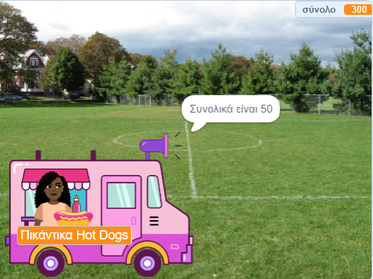

## Αγορές

<div style="display: flex; flex-wrap: wrap">
<div style="flex-basis: 200px; flex-grow: 1; margin-right: 15px;">

Το αντικείμενο **πωλητής** πρέπει:
- να ρωτήσει αν ο πελάτης είναι έτοιμος να πληρώσει για τα προϊόντα
- να λάβει την πληρωμή
- να ετοιμαστεί για τον επόμενο πελάτη
</div>
<div>
{:width="300px"}
</div>
</div>

Όταν ολοκληρώσει την επιλογή των προϊόντων, ο πελάτης θα κάνει κλικ στο αντικείμενο του **πωλητή** για να πληρώσει.

--- task ---

 Πες στον πελάτη πόσο θα κοστίσουν τα προϊόντα του.

```blocks3
when this sprite clicked
say (join [That will be ] (total)) for (2) seconds 
```

--- /task ---

--- task ---

Πρόσθεσε έναν ήχο πληρωμής στο αντικείμενο του **πωλητή** σου, ώστε ο πελάτης να γνωρίζει ότι η πληρωμή πραγματοποιείται.


[[[scratch3-add-sound]]]

Πρόσθεσε το μπλοκ `παίξε τον ήχο μέχρι τέλους`{:class="block3sound"} στο script σου.

```blocks3
when this sprite clicked
say (join [That will be ] (total)) for (2) seconds
+ play sound [machine v] until done 
```

--- /task ---

--- task ---

Ολοκλήρωσε την πώληση. Όρισε το `σύνολο`{:class="block3variables"} πάλι σε `0` μετά την πληρωμή, `πες`{:class="block3looks"} αντίο και `μετάδωσε`{:class="block3control"} `επόμενος πελάτης`{: class="block3control"}.

```blocks3
when this sprite clicked
say (join [That will be ] (total)) for (2) seconds
play sound [machine v] until done 
+ set [total v] to (0)
+ say (join [Thanks for shopping at ] (name)) for (2) seconds
+ broadcast (next customer v)
```

--- /task ---

--- task ---

**Δοκιμή:** Δοκίμασε το έργο σου και βεβαιώσου:
- Ο πελάτης μπορεί να πληρώσει με τα σωστά ηχητικά εφέ
- Το `σύνολο`{:class="block3variables"} επανέρχεται σε `0` αφού ένας πελάτης πληρώσει ή ακυρώσει.

--- /task ---


--- task ---

**Εντοπισμός σφαλμάτων:** Ενδέχεται να βρεις κάποια σφάλματα στο έργο σου που πρέπει να διορθώσεις.

Εδώ είναι μερικά συνηθισμένα σφάλματα:

--- collapse ---
---
title: Ο πωλητής δεν κάνει τίποτα όταν κάνω κλικ πάνω του
---

Έχεις πολλά αντικείμενα στο έργο σου. Βεβαιώσου ότι το script `όταν γίνει κλικ σε αυτό το αντικείμενο`{: class = "block3events"} βρίσκεται στο αντικείμενό σου **πωλητής**.

**Συμβουλή:** Εάν το έχεις προσθέσει σε λάθος αντικείμενο, μπορείς να σύρεις τον κώδικα στο αντικείμενο **πωλητής** και μετά να το διαγράψεις από το άλλο αντικείμενο.

--- /collapse ---

--- collapse ---
---
title: Οι λέξεις στα μπλοκ "πες" συγχωνεύονται μεταξύ τους
---

Όταν `ενώνεις`{:class="block3operators"} δύο κείμενα μαζί, πρέπει να προσθέτεις ένα κενό στο τέλος του πρώτου σου κειμένου ή στην αρχή του δεύτερου κειμένου.

Αυτά έχουν ένα κενό στο τέλος του πρώτου μέρους της ένωσης:

```blocks3
say {join [That will be ](total)} for (2) seconds

say {join [Thanks for shopping at ](name)} for (2) seconds
```

--- /collapse ---

--- collapse ---
---
title: Το σύνολο δεν επανέρχεται στην αρχική τιμή μετά την πώληση
---

Έλεγξε ότι έχεις χρησιμοποιήσει:

```blocks3
set [total v] to (0)
```

**όχι**:

```blocks3
change [total v] by (0)
```

--- /collapse ---

--- collapse ---
---
title: Ο πωλητής δεν ανταποκρίνεται
---

Βεβαιώσου ότι ο `τελεστής`{:class="block3operators"} στη συνθήκη `εάν`{:class="block3control"} είναι το σύμβολο μεγαλύτερο από `>`{:class="block3operators"}.

```blocks3
if <(total) > [0]> then
```

--- /collapse ---

**Συμβουλή:** Σύγκρινε τον κώδικά σου με τα παραδείγματα κώδικα. Υπάρχουν διαφορές που δεν θα έπρεπε να υπάρχουν;

--- /task ---

--- save ---
