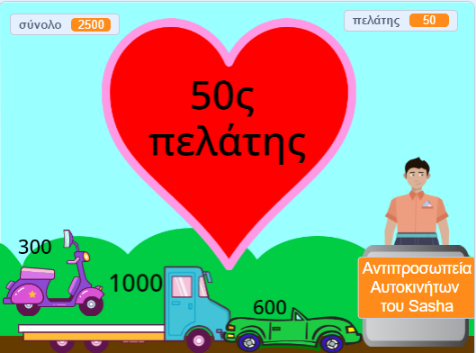

## Επιπρόσθετα χαρακτηριστικά

<div style="display: flex; flex-wrap: wrap">
<div style="flex-basis: 200px; flex-grow: 1; margin-right: 15px;">
Υπάρχουν πολλές δυνατότητες που θα μπορούσες να προσθέσεις για να βελτιώσεις την εμπειρία αγορών των πελατών σου. Δεν χρειάζεται να προσθέσεις τα πάντα. Απλώς πρόσθεσε βελτιώσεις που πιστεύεις ότι είναι σημαντικές.

</div>
<div>
{:width="300px"}
</div>
</div>

Μπορείς να πατήσεις το «Δες μέσα» στα παραδείγματα έργων για να δεις πώς λειτουργούν.

Παραδείγματα έργων: **Φρέσκα Διαστημικά Φρούτα**: [Δες μέσα](https://scratch.mit.edu/projects/707264633/editor){:target="_blank"}
**Καταπληκτικά μπλουζάκια**: [Δες μέσα](https://scratch.mit.edu/projects/707261374/editor){:target="_blank"}
**Κατάστημα Παγωτού**: [Δες μέσα](https://scratch.mit.edu/projects/707265403/editor){:target="_blank"}
**Αυτόματος πωλητής**: [Δες μέσα](https://scratch.mit.edu/projects/707265597/editor){:target="_blank"}

**Συμβουλή:** Εάν είσαι συνδεδεμένος/η σε λογαριασμό Scratch, τότε μπορείς να χρησιμοποιήσεις το **Σακίδιο** για να αντιγράψεις scripts ή αντικείμενα στο έργο σου.

[[[scratch-backpack]]]

--- task ---

Πιστεύεις ότι το άτομο (ή το μηχάνημα) που έχεις στο ταμείο θα πρέπει να κάνει περισσότερες ερωτήσεις;

Μπορείς να προσθέσεις μπλοκ `ρώτησε`{:class="block3sensing"} στο script `όταν γίνει κλικ σε αυτό το αντικείμενο`{:class="block3events"} του **πωλητή** και να `λέει`{:class="block3looks"} διαφορετικά πράγματα ανάλογα με την ανταπόκριση του πελάτη.

Θα μπορούσες να ρωτήσεις αν η εξυπηρέτηση ήταν καλή ή αν είχαν μια καλή ημέρα. Ή κάτι συγκεκριμένο για το μαγαζί σου, όπως "Τι θα μαγειρέψετε;"

--- collapse ---

---

title: Ρώτησε και απάντησε σε ερωτήσεις

---

```blocks3
ask [Βρήκες όλα όσα ήθελες σήμερα;] and wait
if <(answer) = [ναι]> then
say [Αυτό είναι φανταστικό!] for [2] seconds
else
say [Ίσως θα έπρεπε να προσθέσω περισσότερα προϊ'όντα στο κατάστημά μου] for [2] seconds
end
```

**Εντοπισμός σφαλμάτων:** Έλεγξε ότι έχεις γράψει σωστά τις επιλογές στον κώδικά σου και στην απάντησή σου. Δεν πειράζει αν χρησιμοποίησες κεφαλαία γράμματα, οπότε το "Ναι" και το "ΝΑΙ" θα ταιριάζουν με το "ναι".

Πρόσθεσε πολλές ερωτήσεις για να δημιουργήσεις έναν χαρακτήρα chatbot ή NPC με τον οποίο μπορείς να μιλήσεις.

--- /collapse ---

--- /task ---

Θέλεις να συμβεί κάτι άλλο όταν προσθέτεις ένα αντικείμενο;

--- task ---

Το έργο Καταπληκτικά Μπλουζάκια έχει μπλουζάκια που γλιστρούν σε μια τσάντα.

--- collapse ---

---

title: Κάνε τα προϊόντα να γλιστρούν μέσα σε ένα δοχείο

---

Πρόσθεσε ένα αντικείμενο για το **Δοχείο**. Θα μπορούσες να χρησιμοποιήσεις ένα υπάρχον αντικείμενο όπως το **Gift** ή το **Take out** ή να ζωγραφίσεις το δικό σου με απλά σχήματα.

Πρόσθεσε ένα script για να κάνεις το **Δοχείο** να εμφανίζεται πάντα στο προσκήνιο:

```blocks3
when flag clicked
forever
go to [front v] layer
end
```

Στη συνέχεια, θα χρειαστεί να προσθέσεις κώδικα σε κάθε **Προϊόν** που διαθέτεις προς πώληση για να τα κάνεις να γλιστρήσουν στο δοχείο όταν κάνεις κλικ σε αυτά:

```blocks3
when this sprite clicked
+go to [front v] layer
+glide [1] secs to (Τσάντα v) // χρησιμοποίησε το όνομα του αντικειμένου σου για το Δοχείο
+hide
change [σύνολο v] by [12]
+go to x: [-180] y: [68] // αρχική θέση
+show
```

Εάν δεν θέλεις το δοχείο να εμφανίζεται συνέχεια, μπορείς να προσθέσεις scripts για να εμφανίζεται και να εξαφανίζεται την κατάλληλη στιγμή:

```blocks3
when I receive [επόμενος πελάτης v]
hide // ο προηγούμενος πελάτης παίρνει την τσάντα
wait [1] seconds
show
```

**Δοκιμή:** Δοκίμασε το έργο σου και βεβαιώσου ότι τα προϊόντα γλιστρούν στο δοχείο και εξαφανίζονται.

**Εντοπισμός σφαλμάτων:** Έλεγξε προσεκτικά τα σενάρια και βεβαιώσου ότι έχεις ενημερώσει και όλα τα Αντικείμενα για τα**Προϊόντα** σου. Μπορείς να δεις το έργο [Καταπληκτικά Μπλουζάκια](https://scratch.mit.edu/projects/707261374/editor){:target="_blank"} εάν θέλεις να δεις ένα λειτουργικό παράδειγμα.

--- /collapse ---

Το έργο Παγωτό δείχνει το παγωτό καθώς ο πελάτης κάνει τις επιλογές του.

--- collapse ---

---

title: Προσάρμοσε κι εμφάνισε ένα αντικείμενο

---

Κάθε αντικείμενο χρειάζεται να `μεταδίδει`{:class="block3events"} στα script του `όταν γίνει κλικ σε αυτό το αντικείμενο`{:class="block3events"}:

```blocks3
+broadcast (1 μεζούρα v)
```

Στη συνέχεια, το αντικείμενο που θέλεις να εμφανίσεις ή να αλλάξεις πρέπει να ανταποκριθεί σε αυτό το μήνυμα:

```blocks3
when I receive [1 μεζούρα v]
play sound (Chomp v) until done
switch costume to (1 μεζούρα v)
```

Μπορεί επίσης να θέλεις να αλλάξεις ή να εξαφανίσεις το αντικείμενο για έναν νέο πελάτη:

```blocks3
when I receive [επόμενος πελάτης v]
switch costume to (κώνος v)
```

Εάν έχεις πολλά προϊόντα, τότε θα χρειαστεί να προσθέσεις περισσότερα μηνύματα και scripts.

--- /collapse ---

--- /task ---

Έχεις παρατηρήσει ότι ο πελάτης σου μπορεί να προσθέσει προϊόντα αφού έχει αρχίσει τη διαδικασία πληρωμής;

--- task ---

Εάν θέλεις να σταματήσεις τον πελάτη να προσθέτει προϊόντα όταν είναι στο ταμείο, μπορείς να προσθέσεις μια μεταβλητή `αγορά`{:class="block3variables"} και να τη χρησιμοποιήσεις για να ελέγξεις πότε μπορούν να προστεθούν προϊόντα.

--- collapse ---

---
title: Επιτρέπονται οι αγορές μόνο όταν ο πελάτης δεν είναι στο ταμείο

---

Πρόσθεσε μία `μεταβλητή`{:class="block3variables"} που ονομάζεται `αγορά`. Θα την ορίσεις σε `αληθές` όταν ο πελάτης είναι στο κατάστημα και `ψευδές` όταν είναι στο ταμείο.

Επίλεξε το αντικείμενο **πωλητή**. Ενημέρωσε το script `όταν γίνει κλικ στη σημαία`{:class="block3events"} για να επιτρέψεις τις αγορές κατά την έναρξη του έργου σου:

```blocks3
+set [κατάστημα v] to [αληθής]
```

Τώρα πρόσθεσε ένα μπλοκ για να αλλάξεις την `αγορά`{:class="block3variables"} σε `ψευδές` στην αρχή του script `όταν γίνει κλικ σε αυτό το αντικείμενο`{:class="block3events"} του **πωλητή**:

```blocks3 
+set [κατάστημα v] to [ψευδές]
```

Και ένα μπλοκ για να επαναφέρεις τη μεταβλητή `αγορά`{:class="block3variables"} σε `αληθές` στο τέλος του ίδιου σεναρίου:

```blocks3 
+set [κατάστημα v] to [αληθής]
```

Τώρα πρέπει να ενημερώσεις τα προϊόντα που πουλάς για να ελέγχουν τη μεταβλητή `αγορά`{:class="block3variables"}:

```blocks3
when this sprite clicked
+if <(κατάστημα) = [αληθής]> then
start sound (Coin v)
change [σύνολο v] by [10]
end
```

Θα χρειαστεί να το κάνεις αυτό για κάθε προϊόν που πουλάς στο κατάστημά σου.

**Δοκιμή:** Κάνε κλικ στην πράσινη σημαία και δοκίμασε να αγοράσεις. Βεβαιώσου ότι μπορείς ακόμα να προσθέσεις αντικείμενα και να κάνεις ολοκλήρωση αγοράς, αλλά δεν μπορείς να προσθέσεις αντικείμενα αφού ξεκινήσεις την ολοκλήρωση της αγοράς.

**Εντοπισμός σφαλμάτων:** Έλεγξε τον κώδικά σου πολύ προσεκτικά. Μπορείς να δεις το έργο [Διαστημικά Φρούτα](https://scratch.mit.edu/projects/707264633/editor){:target="_blank"} εάν θέλεις να δεις ένα λειτουργικό παράδειγμα.

--- /collapse ---

--- /task ---

--- save ---

