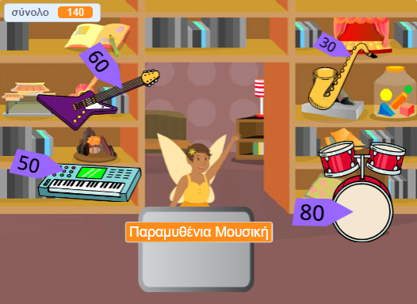

## Αναβάθμισε το έργο σου

Εάν έχεις χρόνο, μπορείς να αναβαθμίσεις το έργο σου.

{:width="300px"}

Εδώ είναι μερικές ιδέες που μπορείς να δοκιμάσεις:
- Πρόσθεσε επιπλέον προϊόντα για να πουλήσεις
- Πρόσθεσε περισσότερα γραφικά και ηχητικά εφέ
- Ζωγράφισε τα δικά σου σκηνικά και άλλες ενδυμασίες
- Δημιούργησε άλλη μία επιχείρηση και προσκάλεσε παίκτες να επισκεφτούν και τις δύο

Κάθε παράδειγμα έργου στην [Εισαγωγή](.) έχει έναν σύνδεσμο 'Δες μέσα' για να ανοίξεις το έργο στο Scratch και να δεις τον κώδικα για να πάρεις ιδέες και να δεις πώς λειτουργούν.

Ρίξε μια ματιά στο Scratch studio ['Διαγαλαξιακή αγορά'](https://scratch.mit.edu/studios/29662180){:target="_blank"} για να δεις έργα που δημιουργούνται από μέλη της κοινότητας.

--- save ---
