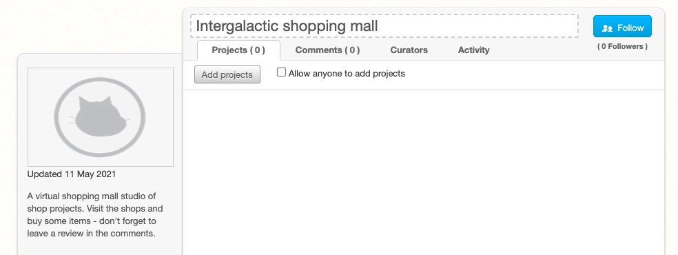
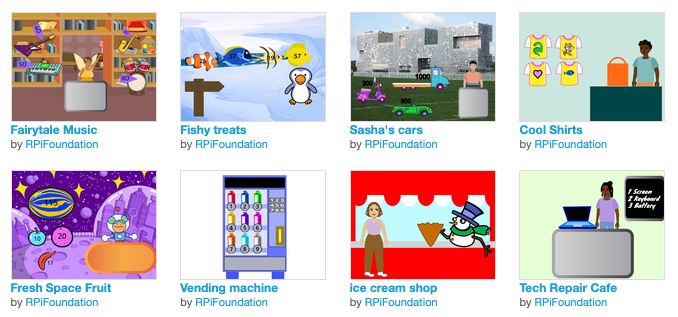

## Κοινοποίηση

Εάν είσαι σε μια λέσχη, γιατί να μην μοιραστείς το έργο σου με φίλους;

Εάν είσαι συνδεδεμένος/η στο Scratch, μπορείς να δημιουργήσεις μία συλλογή και να προσθέσεις το έργο **Επόμενος πελάτης παρακαλώ**. Μπορείς επίσης να προσθέσεις τα έργα των φίλων σου **επόμενος πελάτης παρακαλώ** για να δημιουργήσετε ένα εμπορικό κέντρο με διαφορετικά καταστήματα και επιχειρήσεις.

--- collapse ---

---

title: Δημιούργησε ένα εμπορικό κέντρο

---

Αποθήκευσε το έργο σου και, στη συνέχεια, κάνε κλικ στο όνομα χρήστη και επίλεξε **Τα πράγματά μου**.

Από τη σελίδα **Τα πράγματά μου**, κάνε κλικ στο κουμπί **+ Νέα Συλλογή**.

Δώσε στη νέα σου συλλογή ένα όνομα και μια περιγραφή.

Κάνε κλικ στο κουμπί **Προσθήκη έργων**. Μπορείς να προσθέσεις το δικό σου έργο επιλέγοντάς το από τη λίστα στο κάτω μέρος της σελίδας.

Μπορείς επίσης να προσθέσεις έργα που έχουν δημιουργήσει οι φίλοι σου. Ζήτησέ τους να μοιραστούν το έργο τους και να σου δώσουν τον σύνδεσμο. Πληκτρολόγησε ή επικόλλησε το σύνδεσμο στο πλαίσιο url και, στη συνέχεια, κάνε κλικ στο κουμπί **Add by url**.

--- /collapse ---

Μοιράσου το έργο σου και στείλε έναν σύνδεσμο σε άτομα που γνωρίζεις. Ολόκληρη η κοινότητα του Scratch θα μπορεί επίσης να βρει το έργο σου και να το δοκιμάσει.

[[[share-scratch]]]

Γιατί να μην καλέσεις τους φίλους σου να δημιουργήσουν ένα έργο; Πες τους πως ήταν διασκεδαστικό.

Εάν έχεις λογαριασμό Scratch και έχεις μοιραστεί το έργο σου **Επόμενος πελάτης παρακαλώ**, πρόσεξε τα σχόλια που μπορεί να κάνουν άλλοι σχετικά με τη δημιουργία σου. Η ανατροφοδότηση είναι ένας πολύ καλός τρόπος για να αναστοχαστείς πάνω στη δουλειά σου. Αγνόησε οποιαδήποτε σχόλια δεν σε βοηθούν ή είναι άσχετα.

[[[comments-feedback-scratch]]]

--- task ---

Δώσε έμπνευση στην κοινότητα του Ιδρύματος Raspberry Pi με το έργο σου!

Για να υποβάλεις το έργο σου στη δική μας συλλογή ['Διαγαλαξιακή αγορά'](https://scratch.mit.edu/studios/29662180){:target="_blank"} για να το δουν κι άλλα άτομα, συμπλήρωσε [αυτήν τη φόρμα](https://form.raspberrypi.org/f/community-project-submissions){:target="_blank"}.

--- /task ---
