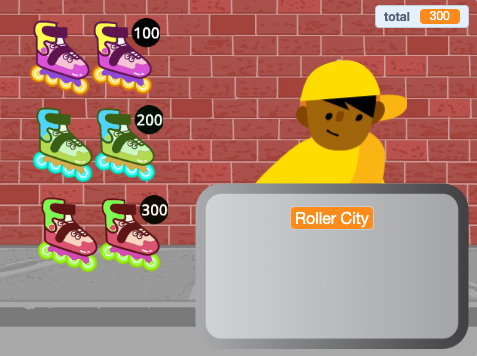

## Items for sale

<div style="display: flex; flex-wrap: wrap">
<div style="flex-basis: 200px; flex-grow: 1; margin-right: 15px;">
Your shop needs items for sale. Each item will have a price that will be added to a `total`{:class="block3variables"} variable.
</div>
<div>
{:width="300px"}
</div>
</div>

You will need to keep track of how much your customer is spending.

--- task ---

Add a new variable called `total`{:class="block3variables"} for all sprites.

Click on your **seller** sprite and add a script to `set`{:class="block3variables"} the `total`{:class="block3variables"} to `0` when the project starts.

[[[scratch3-create-set-variable]]]

--- /task ---

What **items** will your customer(s) be buying?
+ Some kind of food or drink
+ Sports equipment, toys, or gadgets
+ Magic wands, potions, or spell books
+ Clothing or other fashion items
+ Your idea

--- task ---

Add a sprite for the first **item** you're going to sell in your shop.

If you like, you can add a price to the costume using the text tool in the Paint editor. Or add a price to the backdrop and position the item next to it.


--- /task ---

--- task ---

Add a script to `change`{:class="block3variables"} the `total`{:class="block3variables"} by the price of your item when the customer clicks on the sprite.

--- collapse ---
---
title: Click to add an item
---

```blocks3
when this sprite clicked
start sound (Coin v)
change [total v] by [10]
```

--- /collapse ---

It's also a good idea to `play a sound`{:class="block3sound"} to give the customer feedback that they have added an item.


[[[scratch3-add-sound]]]

--- /task ---

--- task ---

**Test:** Click on your item and check that the value of the `total`{:class="block3variables"} variable increases by the price of the item, and you hear the sound effect. Click more times to see the total go up.

Click the green flag to start your project and make sure that the `total`{:class="block3variables"} starts at `0`.

--- /task ---

--- task ---

Add more items to your shop.

You can either:
+ Duplicate the first item and then add a new costume in the Paint editor
+ Add a sprite and then drag the `when flag clicked`{:class="block3events"} script from the first item to your new item

Add a price label to the costume or backdrop if you are using them.

--- /task ---

--- task ---

Click on your new **Item** sprite in the Sprite list then click on the **Code** tab.

Change the amount the `total`{:class="block3variables"} changes by to the price of your new item.

--- /task ---

--- task ---

**Test:** Click the green flag to start your project and click on items to add them. Check that the total increases by the correct amount each time you click on an item.

If you have added price labels, make sure they match the amount that gets added to the `total`{:class="block3variables"}, or your customers will be confused!

--- /task ---

--- task ---

**Debug:** You might find some bugs in your project that you need to fix. Here are some common bugs.

--- collapse ---
---
title: The total doesn't go to 0 when I click the green flag
---

Check that you have set the start value of the `total`{:class="block3variables"} variable in the `when flag clicked`{:class="block3events"} script on your **seller** sprite.

--- /collapse ---

--- collapse ---
---
title: The total doesn't increase by the correct amount when I click on an item
---

Check that each item has a `when this sprite clicked`{:class="block3events"} script that changes the `total`{:class="block3variables"} by the correct amount for that item — you might have changed the price for the wrong sprite.

Check that you have used the `change`{:class="block3variables"} block and not the `set`{:class="block3variables"} block to change the `total`{:class="block3variables"}. You need to use `change`{:class="block3variables"} to add the price to the total, you don't want to set the total to the price of the item that was just added.

--- /collapse ---

--- /task ---

--- save ---
