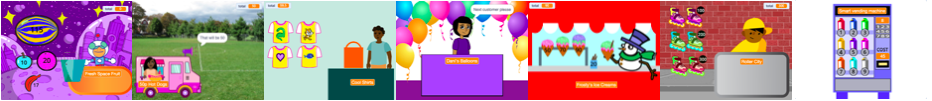
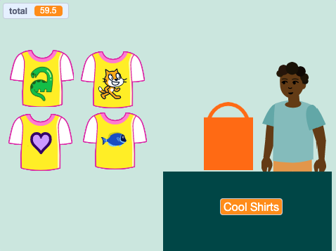
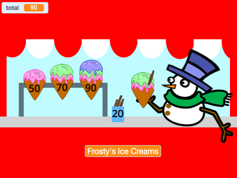
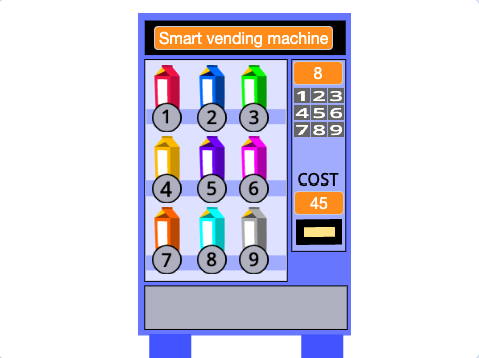

## Introduction

You will make a shop simulation project, the customer will be able to buy items from your shop. The project will be in first-person view where the player is a customer. 

**First-person view** means that you don't see your character on the screen, instead you see what they see.

You will:
+ Create a shop simulation with items to buy and a checkout,
+ Try shops made by others and share your shop so others can try it,
+ Plan your time to get a simple version working quickly.

--- no-print ---

--- task ---

  

### Try it 

Click on Space Fruit to buy them and watch the total go up. When you're ready, click on Kiran to checkout. 

What happens if you try to checkout before you have chosen any fruit? How do you think the project knows that you haven't added any fruit yet?

**Fresh Space Fruit**: [See inside](https://scratch.mit.edu/projects/528696418/editor){:target="_blank"}

  <iframe allowtransparency="true" width="485" height="402" src="https://scratch.mit.edu/projects/embed/528696418/?autostart=false" frameborder="0"></iframe>

--- /task ---

### Get inspiration 

You are going to make some design decisions to choose what your business will offer and whether customers will need currency to pay. 

--- task ---

Explore these example business projects to get more ideas. Which projects allow you to buy multiple items at once? Which allow you to buy items one at a time?

Click on the seller sprites to buy items:

**Cool Shirts**: [See inside](https://scratch.mit.edu/projects/528697069/editor){:target="_blank"}

  <iframe allowtransparency="true" width="485" height="402" src="https://scratch.mit.edu/projects/embed/528697069/?autostart=false" frameborder="0"></iframe>

**Ice cream shop**: [See inside](https://scratch.mit.edu/projects/525972748/editor){:target="_blank"}

  <iframe allowtransparency="true" width="485" height="402" src="https://scratch.mit.edu/projects/embed/525972748/?autostart=false" frameborder="0"></iframe>

**Vending machine**: [See inside](https://scratch.mit.edu/projects/526051796/editor){:target="_blank"}

  <iframe allowtransparency="true" width="485" height="402" src="https://scratch.mit.edu/projects/embed/526051796/?autostart=false" frameborder="0"></iframe>

--- /task ---

--- /no-print ---

--- print-only ---

### Get inspiration 

You are going to make some design decisions to create your character. See inside example projects in [Scratch 2: Next customer please! - Examples](https://scratch.mit.edu/studios/29611454/){:target="_blank"} Scratch studio.

--- /print-only ---

