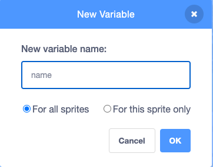

## Your business idea

<div style="display: flex; flex-wrap: wrap">
<div style="flex-basis: 200px; flex-grow: 1; margin-right: 15px;">
What is your business idea? It could be something realistic, something that you might find in a game, or something completely silly.</div>
<div>
Image, gif or video showing what they will achieve by the end of the step. {:width="300px"}
</div>
</div>

--- task ---

Open a [new Scratch project](http://rpf.io/scratch-new){:target="_blank"} and look at the range of sprites and backdrops that you can use. Spend some time thinking about your business idea.

--- /task ---

What backdrop and extra scenery sprites will you need?
+ A desk, counter, or window to sell from.
+ An opening hours sign, chalkboard menu, or item list.

--- task ---

Click **Choose a Backdrop** or paint your own backdrop.


Click **Choose a Sprite** and add or paint extra scenery sprites.


You can always add more scenery later if you find that you need it.

--- /task ---

What will the **seller** sprite look like?
+ A person or non-player character such as a shopkeeper, farmer, or librarian.
+ A machine such as a vending machine, jukebox, or parcel locker.

<p style="border-left: solid; border-width:10px; border-color: #0faeb0; background-color: aliceblue; padding: 10px;">
An <span style="color: #0faeb0">**NPC**</span> is a non-player character that you can interact with in a game or interactive story. Some people's jobs involved developing NPCs so that they have interesting personalities and behaviours. Can you think of games you have played that have NPCs? Next time you play, think about how it was someone's job to make that character.
</p>

--- task ---

Add a sprite to represent the seller. 

--- /task ---

What **items** will your customer(s) be buying? 
+ An object such as food, a toy, or a magic wand.
+ A service such as fixing a laptop, going on a go-kart, or getting a car wash. 

You might add sprites to represent the items for sale like the Wand in the NPC Trader example and the drinks in the Vending machine.

Or, you might add one sprite and change it for each customer like the Laptop or the ice-cream. Or may-be a go-cart that you get a short ride on, or a car to be washed.

--- task ---

Add the sprite or sprites that will be for sale, or get fixed or used in your business.

--- /task ---

--- task ---

**Choose:** Add a customer sprite to appear on the screen as a buyer or will your game be in first-person view?

--- /task ---

<p style="border-left: solid; border-width:10px; border-color: #0faeb0; background-color: aliceblue; padding: 10px;">
<span style="color: #0faeb0">**First-person view**</span> means that you don't see your character on the screen, instead you see what they see.
</p>

--- task ---

Create a `variable`{:class="block3variables"} called `name`:

--- collapse ---
---
title: Create a variable
---

From the `Variables`{:class="block3variables"} blocks menu click the **Make a Variable** button.

Call your new variable `name`:



**Notice:** The new `name` variable appears on the Stage and can now be used in the `Variable`{:class="block3variables"} blocks.

--- /collapse ---

Set the variable to the name of your business:

```blocks3
when flag clicked
set [name v] to ()
```

Change the appearance and position of the `variable`{:class="block3variables"} on the Stage to use it on a sign or machine in your business:

--- collapse ---

---
title: Change the appearance and postition of variables
---

Right-click on the `variable`{:class="block3variables"} on the Stage and choose large readout:


Drag your `variable`{:class="block3variables"} to position it on the Stage.

--- /collapse ---

--- /task ---

--- task ---

**Test:** Make sure you can see your business name as the value of the variable on the Stage.

--- /task ---

--- task ---

**Debug:** You might find some bugs in your project that you need to fix. Here are some common bugs.

--- collapse ---

---
title: Variable shows `0`
---

You should use the `set [name v] to ()`{:class="block3variables"} block to set the variable to your name. If you have already added a script check that you have typed your business name into the value. 

```blocks3
when flag clicked
set [name v] to [my shop] // your business name
```

--- /collapse ---

--- /task ---

--- save ---