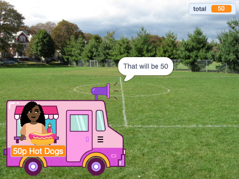

## Paying

<div style="display: flex; flex-wrap: wrap">
<div style="flex-basis: 200px; flex-grow: 1; margin-right: 15px;">
The **Seller** sprite needs to ask if the customer is ready to pay for the items, take payment, then get ready for the next customer.
</div>
<div>
{:width="300px"}
</div>
</div>

When they have finished choosing items the customer will click on the **Seller** sprite to pay.

--- task ---

 Tell the customer how much their items will cost.

```blocks3
when this sprite clicked
say (join [That will be ] (total)) for (2) seconds 
```

--- /task ---

--- task ---

Add a payment sound to your **Seller** sprite so the customer knows that payment is taking place. 


[[[scratch3-add-sound]]]

Add the `play sound until done`{:class="block3sound"} block to your script.

```blocks3
when this sprite clicked
say (join [That will be ] (total)) for (2) seconds
+ play sound [machine v] until done 
```

--- /task ---

--- task ---

Finish the sale. Set `total`{:class="block3variables"} back to `0` after payment, `say`{:class="block3looks"} goodbye and `broadcast`{:class="block3control"} `next customer`{:class="block3control"}.

```blocks3
when this sprite clicked
say (join [That will be ] (total)) for (2) seconds
play sound [machine v] until done 
+ set [total v] to (0)
+ say (join [Thanks for shopping at ] (name)) for (2) seconds
+ broadcast (next customer v)
```

--- /task ---

--- task ---

You might want to give the customer the option to cancel their shopping.

--- collapse ---

---

title: Set up pay and cancel options 

---

`Ask`{:class="block3sensing"} `Would you like to pay or cancel?`. Add an `If`{:class="block3control"} block for `answer`{:class="block3sensing"} `=`{:class="block3operators"} `pay` and inside it put your existing payment blocks.

```blocks3
when this sprite clicked
say (join [That will be ] (total)) for (2) seconds
+ ask [Would you like to pay or cancel?] and wait
+ if {(answer) = [pay]} then
play sound [machine v] until done 
set [total v] to (0)
say (join [Thanks for shopping at ] (name)) for (2) seconds
broadcast [next customer v]
end
```

Add a second `If`{:class="block3control"} block for `answer`{:class="block3sensing"} `=`{:class="block3operators"} `cancel` and inside it add code to cancel the order.

```blocks3
when this sprite clicked
say (join [That will be ] (total)) for (2) seconds
ask [Would you like to pay or cancel?] and wait
if {(answer) = [pay]} then
play sound [machine v] until done 
set [total v] to (0)
say (join [Thanks for shopping at ] (name)) for (2) seconds
broadcast [next customer v]
end
+ if {(answer) = [cancel]} then
set [total v] to (0)
say [Ok. No problem] for (2) seconds
broadcast [next customer v]
end
```

--- /collapse ---

--- /task ---

--- task ---

To make sure your customer has items in their basket before paying, you can insert an `if...else`{:class="block3control"} block.

--- collapse ---

---

title: Check total amount

---

`If`{:class="block3control"} `total`{:class="block3variables"} `>`{:class="block3operators"} `0` then insert your existing script.

`Else`{:class="block3control"} `say`{:class="block3looks"} a helpful message.

```blocks3
when this sprite clicked
+ if <(total) > [0]>then
say (join [That will be ] (total)) for (2) seconds
ask [Would you like to pay or cancel?] and wait
if {(answer) = [pay]} then
play sound [machine v] until done 
set [total v] to (0)
say (join [Thanks for shopping at ] (name)) for (2) seconds
broadcast [next customer v]
end
if {(answer) = [cancel]} then
set [total v] to (0)
say [Ok. No problem] for (2) seconds
broadcast [next customer v]
end
else
say [Click on the items you'd like] for (2) seconds
end
```

--- /collapse ---

--- /task ---


--- task ---

**Debug:** You might find some bugs in your project that you need to fix. Here are some common bugs.

--- collapse ---

---

title: The seller doesn't do anything when I click on them

---

You have quite a lot of sprites in your project. Make sure the `when this sprite clicked`{:class="block3events"} script is on your **Seller** sprite. 

**Tip:** If you have added it to the wrong sprite you can drag the code to the **Seller** sprite then delete it from the other sprite.

--- /collapse ---

--- collapse ---

---

title: The seller says 'total' not the total amount

---

Make sure your `say`{:class="block3looks"} block has the `total`{:class="block3variables"} variable not the word `total`

```blocks3
 when this sprite clicked
 say {join [That will be ](total)} for (2) seconds 
 ```

--- /collapse ---

--- collapse ---

---

title: The words in the say blocks merge together.

---

When you use a `join`{:class="block3operators"} block to join two pieces together you need to add a space at the end of your first piece of text or at the beginning of your second piece of text. 

Both of these have a space at the end of the first part of the join:

```blocks3
say {join [That will be ](total)} for (2) seconds

say {join [Thanks for shopping at ](name)} for (2) seconds
```

--- /collapse ---

--- collapse ---

---

title: The total doesn't reset after a sale

---

Check that you have used:

```blocks3
set [total v] to (0)
```

**not**: 

```blocks3
change [total v] by (0)
```

If it is still not working, look carefully over the example code in the instructions to make sure the block is in the correct place. 

--- /collapse ---

--- collapse ---

---

title: The seller isn't responding

---

Make sure the `operator`{:class="block3operators"} in the `if`{:class="block3control"} condition is the greater than symbol `>`{:class="block3operators"}.

```blocks3
if <(total) > [0]> then
```

If it is still not working, look carefully over the example code in the instructions to make sure the block is in the correct place. 

--- /collapse ---

--- /task ---

--- save ---