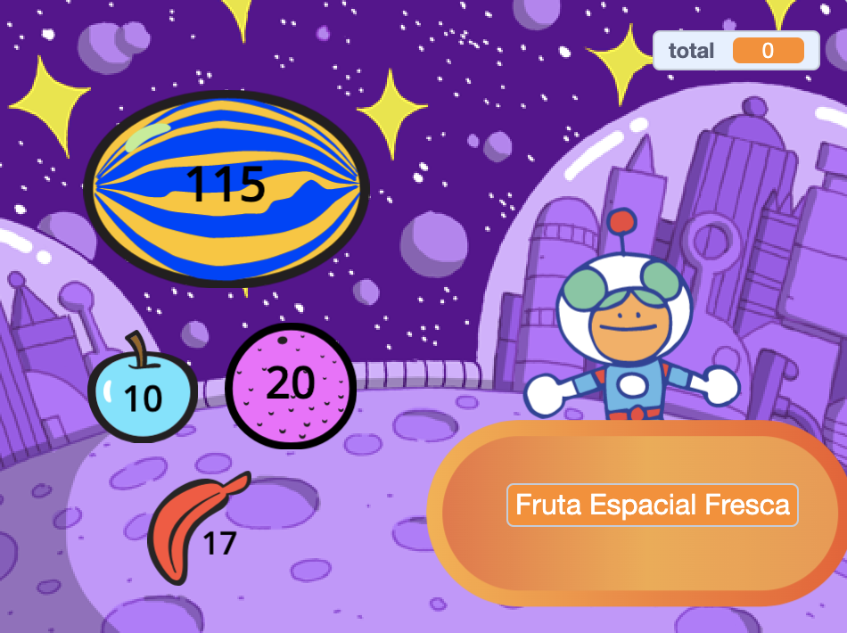
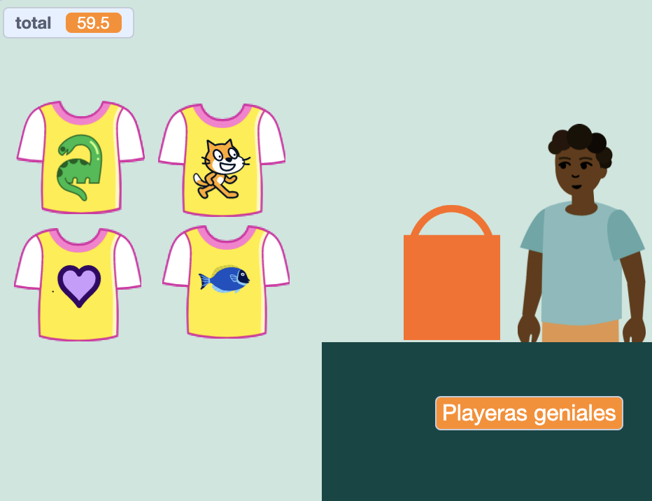
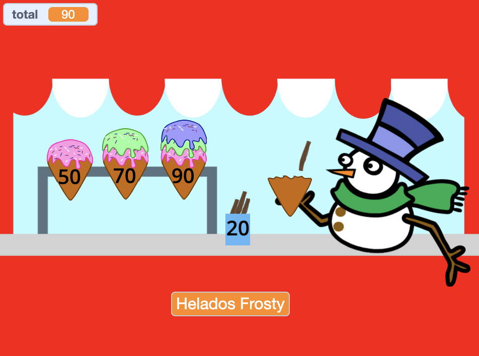
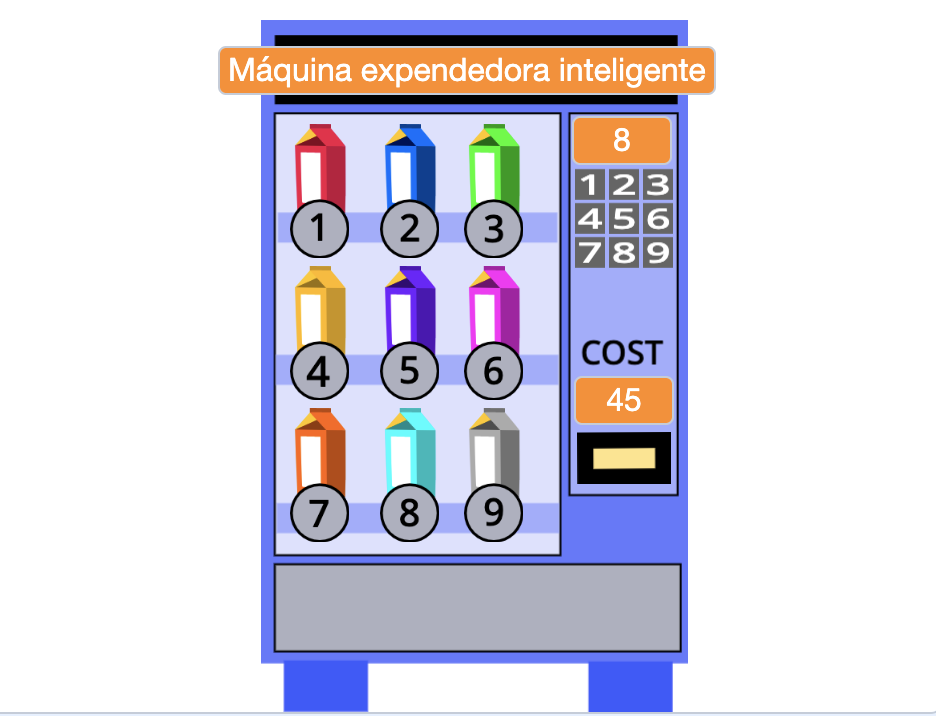

## Lo que harás

Crea una aplicación para tiendas donde el cliente pueda comprar artículos de tu tienda. El proyecto estará en primera persona donde el jugador es un cliente.

**Vista en primera persona** significa que no ves a tu personaje en la pantalla, sino que ves lo que él ve.

Vas a:
+ Crear una aplicación para tiendas con artículos para comprar y una caja
+ Planificar tu tiempo para que una versión simple funcione rápidamente
+ Probar tiendas hechas por otros y compartir tu tienda para que otros puedan probarla

--- no-print ---

--- task ---

  

### Reproducir ▶️

Haz clic en Space Fruit para comprarlos y ver cómo sube el total. Cuando estés listo, haz clic en Kiran para pagar. 

+ ¿Qué pasa si intentas pagar antes de haber elegido alguna fruta? 
+ ¿Cómo crees que el proyecto sabe que aún no has agregado ninguna fruta?

**Fruta espacial fresca**: [Ver interior](https://scratch.mit.edu/projects/528696418/editor){:target="_blank"}

  <iframe allowtransparency="true" width="485" height="402" src="https://scratch.mit.edu/projects/embed/528696418/?autostart=false" frameborder="0"></iframe>

--- /task ---

### Obtén ideas 💭

Vas a tomar algunas decisiones de diseño para elegir qué artículos ofrecerá tu tienda y cómo pagará el cliente.

--- task ---

Explora estas tiendas de ejemplo para obtener más ideas. ¿Qué proyectos te permiten comprar varios artículos a la vez? ¿Cuáles te permiten comprar artículos de uno en uno?

Haz clic en los sprites de **vendedor** para comprar artículos:

**Playeras geniales**: [Ver el interior](https://scratch.mit.edu/projects/528697069/editor){:target="_blank"}

  <iframe allowtransparency="true" width="485" height="402" src="https://scratch.mit.edu/projects/embed/528697069/?autostart=false" frameborder="0"></iframe>

**Heladería**: [Ver interior](https://scratch.mit.edu/projects/525972748/editor){:target="_blank"}

  <iframe allowtransparency="true" width="485" height="402" src="https://scratch.mit.edu/projects/embed/525972748/?autostart=false" frameborder="0"></iframe>

**Máquina expendedora**: [Ver interior](https://scratch.mit.edu/projects/526051796/editor){:target="_blank"}

  <iframe allowtransparency="true" width="485" height="402" src="https://scratch.mit.edu/projects/embed/526051796/?autostart=false" frameborder="0"></iframe>

--- /task ---

--- /no-print ---

--- print-only ---

### Obtén ideas 💭

Vas a tomar algunas decisiones de diseño para crear tu personaje. Ve los proyectos de ejemplo en [Scratch 2: ¡Siguiente cliente, por favor! - Ejemplos](https://scratch.mit.edu/studios/29611454/){:target="_blank"} Estudio Scratch.

   

--- /print-only ---

