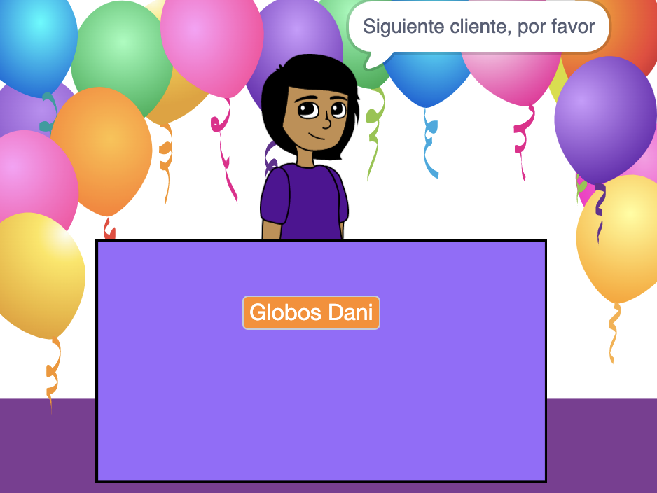
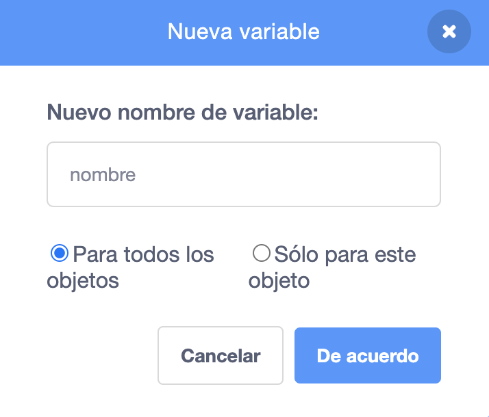
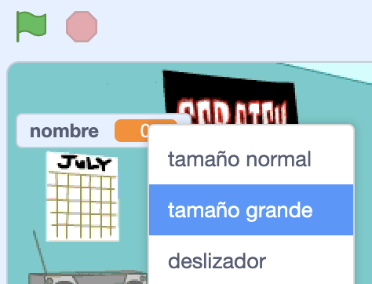

## Tu idea de negocio

<div style="display: flex; flex-wrap: wrap">
<div style="flex-basis: 200px; flex-grow: 1; margin-right: 15px;">
¿Cuál es tu idea de negocio? Podría ser algo realista, algo de un libro o una película que te guste, o algo completamente absurdo.
</div>
<div>
{:width="300px"}
</div>
</div>

--- task ---

Abre un [nuevo proyecto de Scratch](http://rpf.io/scratch-new){:target="_blank"} y observa la variedad de objetos y fondos que puedes usar. Dedica algo de tiempo a pensar en tu idea de negocio.

[[[working-offline]]]

--- /task ---

¿Qué fondo y objetos de escenario necesitarás?
+ ¿Un fondo de la biblioteca de Scratch o un fondo de color liso?
+ ¿Un escritorio, mostrador o ventana desde donde vender?
+ Un estante o una librería para poner artículos; podrías pintar esto en el fondo

--- task ---

Haz clic en **Elegir un fondo** o pinta tu propio fondo.


Haz clic en **Elejir un Objeto** y agrega o pinta objetos de escenario adicionales.


Puedes agregar escenarios más adelante si consideras que lo necesitas.

--- /task ---

¿Cómo se verá el objeto **vendedor**?
+ ¿Una persona o un personaje que no sea jugador, como un comerciante, un granjero o un bibliotecario?
+ ¿Una máquina, como una máquina expendedora, una máquina de discos o una caja registradora?

<p style="border-left: solid; border-width:10px; border-color: #0faeb0; background-color: aliceblue; padding: 10px;">
Un <span style="color: #0faeb0">**NPC**</span> es un personaje que no es jugador con el que puedes interactuar en un juego o una historia interactiva. ¿Puedes pensar en juegos que hayas jugado que tengan NPC? La próxima vez que juegues, piensa en cómo fue el trabajo de alguien para hacer ese personaje.
</p>

--- task ---

Agrega un objeto para representar al vendedor.


--- /task ---

¿Cual es el nombre de tu negocio?

--- task ---

Crea una variable ``{:class="block3variables"} llamada `nombre`:

--- collapse ---

---

title: Crear una variable

---

En el menú de bloques `Variables`{:class="block3variables"}, haz clic en el botón **Hacer una variable**.

Nombra a tu nueva variable `nombre`:



**Aviso:** La nueva variable `nombre` aparece en el escenario y ahora se puede usar en los bloques `Variable`{:class="block3variables"}.

--- /collapse ---

Haz clic en tu objeto **vendedor** y agrega el código para establecer la variable en el nombre de tu negocio:

```blocks3
when flag clicked
set [name v] to () //type the name of your business
```

Crea un letrero en el escenario con tu variable:

--- collapse ---

---

title: Cambiar la apariencia y posición de las variables

---

Haz clic con el botón derecho en la `variable`{:class="block3variables"} en el escenario y elige un tamaño grande:



Arrastra tu `variable`{:class="block3variables"} para colocarla en el escenario como parte del escenario de la tienda.

--- /collapse ---

--- /task ---

--- task ---

**Prueba:** Asegúrate de que puedas ver el nombre de tu negocio como el valor de la variable en el escenario.

--- /task ---

Prepárate para recibir a tu primer cliente.

--- task ---

Haz clic en tu objeto **vendedor** y agrega un bloque `broadcast`{:class="block3control"}. Crea un nuevo mensaje llamado `próximo cliente`.

```blocks3
when flag clicked
set [name v] to [my shop] // your business name
+ broadcast (next customer v)
```

--- /task ---

--- task ---

Crea un nuevo script para tu objeto **vendedor** para `decir`{:class="block3looks"} `Siguiente cliente, por favor` cuando reciba la `transmisión`{:class="block3control"} `siguiente cliente`{:class= "bloque3control"}.

```blocks3
when I receive [next customer v] 
say [Next customer please!] for (2) seconds
```

--- /task ---

--- task ---

**Depuración:** Es posible que encuentres algunos errores en tu proyecto que tendrás que corregir. Aquí hay un error común.

--- collapse ---

---

title: La variable muestra `0`

---

Debes usar el bloque `set [name v] to ()`{:class="block3variables"} para establecer la variable a tu nombre. Si ya agregaste un script, verifica que hayas ingresado el nombre de tu negocio en el valor y hayas dado clic en la bandera verde.

```blocks3
when flag clicked
set [name v] to [my shop] // your business name
```

--- /collapse ---

--- /task ---

--- save ---
