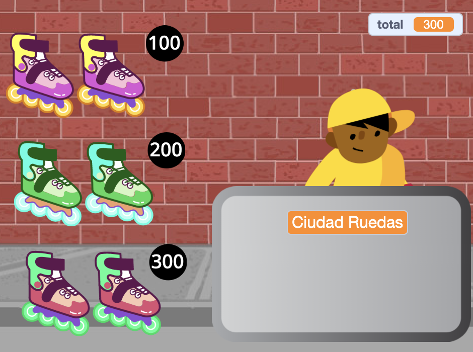

## Productos en venta

<div style="display: flex; flex-wrap: wrap">
<div style="flex-basis: 200px; flex-grow: 1; margin-right: 15px;">
Tu tienda necesita artículos para vender. Cada artículo tendrá un precio que se agregará a una variable `total`{:class="block3variables"}.
</div>
<div>
{:width="300px"}
</div>
</div>

Deberás realizar un seguimiento de cuánto gasta tu cliente.

--- task ---

Agrega una nueva variable llamada `total`{:class="block3variables"} para todos los objetos.

Haz clic en tu objeto **vendedor** y agrega un script para `establecer`{:class="block3variables"} los `totales`{:class="block3variables"} a `0` cuando comience el proyecto.

[[[scratch3-create-set-variable]]]

--- /task ---

¿Qué **artículos** comprarán tus clientes?
+ Algún tipo de comida o bebida
+ Equipo deportivo, juguetes o aparatos
+ Varitas mágicas, pociones o libros de hechizos
+ Ropa u otros artículos de moda
+ Tu idea

--- task ---

Agrega un objeto para los primeros **artículos** que vas a vender en tu tienda.

Si quieres puedes agregar un precio al disfraz usando la herramienta de texto en el editor de Paint. O agrega un precio al fondo y coloca el artículo junto a él.


--- /task ---

--- task ---

Agrega un script a `cambiar`{:class="block3variables"} el `total`{:class="block3variables"} por el precio de tu artículo cuando el cliente hace clic en el objeto.

--- collapse ---
---
title: Haz clic para agregar un elemento
---

```blocks3
when this sprite clicked
start sound (Coin v)
change [total v] by [10]
```

--- /collapse ---

También es una buena idea `reproducir un sonido`{:class="block3sound"} para informar al cliente de que ha agregado un artículo.


[[[scratch3-add-sound]]]

--- /task ---

--- task ---

**Prueba:** Haz clic en tu artículo y comprueba que el valor de la variable `total`{:class="block3variables"} aumenta según el precio del artículo, y que escuchas el efecto de sonido. Haz clic más veces para ver cómo sube el total.

Haz clic en la bandera verde para iniciar tu proyecto y asegúrate de que el `total`{:class="block3variables"} comience en `0`.

--- /task ---

--- task ---

Añade más artículos a tu tienda.

También puedes:
+ Duplica el primer elemento y luego agrega un nuevo disfraz en el editor de Paint
+ Agrega un objeto y luego arrastra el `cuando la bandera haga clic en` {:class="block3events"} el script desde el primer artículo hasta tu nuevo elemento

Agrega una etiqueta de precio al disfraz o al telón de fondo, si los estás usando.

--- /task ---

--- task ---

Haz clic en su nuevo articulo **artículo** en la lista de Sprites y luego haz clic en la pestaña **Code**.

Cambia la cantidad que cambia el `total`{:class="block3variables"} por el precio de tu nuevo artículo.

--- /task ---

--- task ---

**Prueba:** Haz clic en la bandera verde para iniciar tu proyecto y haz clic en los elementos para agregarlos. Comprueba que el total aumenta en la cantidad correcta cada vez que haces clic en un elemento.

Si agregaste etiquetas de precios, asegúrate de que coincidan con la cantidad que se agrega al `total`{:class="block3variables"}, o tus clientes se confundirán.

--- /task ---

--- task ---

**Depuración:** Es posible que encuentres algunos errores en tu proyecto que necesite corregir. Aquí hay algunos errores comunes.

--- collapse ---
---
title: El total no llega a 0 cuando hago clic en la bandera verde
---

Comprueba que hayas establecido el valor inicial de la variable `total`{:class="block3variables"} en el script `al presionar Bandera verde`{:class="block3events"} en tu objeto **vendedor**.

--- /collapse ---

--- collapse ---
---
title: El total no aumenta en la cantidad correcta cuando hago clic en un elemento
---

Verifica que cada `al hacer clic en este objeto`{:class="block3events"} tenga una secuencia de comandos que cambia el total de `0`{:class="block3variables"} por la cantidad correcta para ese elemento; es posible que hayas cambiado el precio del objeto equivocado.

Comprueba que hayas utilizado el bloque `cambiar`{:class="block3variables"} y no el bloque `establecer`{:class="block3variables"} para cambiar el `total`{:class="block3variables"}. Debes usar `cambiar`{:class="block3variables"} para agregar el precio al total, no quieres establecer el total en el precio del artículo que se acaba de agregar.

--- /collapse ---

--- /task ---

--- save ---
