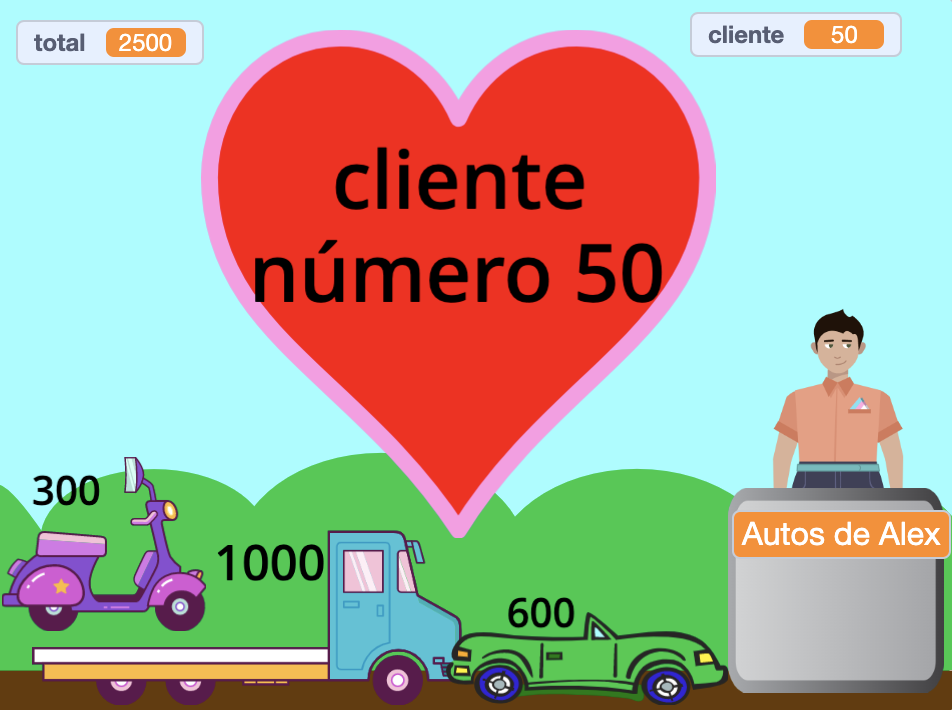

## Características adicionales

<div style="display: flex; flex-wrap: wrap">
<div style="flex-basis: 200px; flex-grow: 1; margin-right: 15px;">
Hay muchas funciones que podrías agregar para mejorar la experiencia de compra de tus clientes. No es necesario agregar todo. Simplemente agrega las mejoras que creas que son importantes.

</div>
<div>
{:width="300px"}
</div>
</div>

Puedes 'Ver el interior' de los proyectos de ejemplo para ver cómo funcionan.

Proyectos de ejemplo: **Fruta espacial fresca**: [Ver el interior](https://scratch.mit.edu/projects/528696418/editor){:target="_blank"}
**Playeras geniales**: [Ver el interior](https://scratch.mit.edu/projects/528697069/editor){:target="_blank"}
**Heladería**: [Ver el interior](https://scratch.mit.edu/projects/525972748/editor){:target="_blank"}
**Máquina expendedora**: [Ver interior](https://scratch.mit.edu/projects/526051796/editor){:target="_blank"}

**Sugerencia:** Si has iniciado sesión en una cuenta de Scratch, puedes usar **Mochila** para copiar guiones o sprites en tu proyecto.

[[[scratch-backpack]]]

--- task ---

¿Crees que tu persona (o máquina) debería hacer más preguntas?

Puedes agregar bloques `preguntar`{:class="block3sensing"} a tus scripts `al hacer clic en este objeo`{:class="block3events"} de tus **vendedores** y `decir`{:class="block3looks"} diferentes cosas dependiendo de la respuesta del cliente.

Puedes preguntar si el servicio fue bueno o si están teniendo un buen día. O algo específico de tu tienda, como "¿Qué vas a cocinar?"

--- collapse ---

---

title: Preguntar y responder preguntas

---

```blocks3
ask [Did you find everything you wanted today?] and wait
if <(answer) = [yes]> then
say [That's fantastic!] for [2] seconds
else
say [Maybe I should add more items to my shop] for [2] seconds
end
```

**Depuración:** Verifica que hayas escrito correctamente las opciones en tu código y en tu respuesta. Está bien si usas letras mayúsculas, así que "Sí" y "SÍ" coincidirán con "sí".

Agrega varias preguntas para crear un chatbot o un personaje que no sea jugador con el que puedas hablar.

--- /collapse ---

--- /task ---

¿Quieres que suceda algo más cuando agregas un artículo?

--- task ---

El proyecto Playeras geniales tiene playeras que se deslizan dentro de una bolsa.

--- collapse ---

---

title: Hacer que los artículos se deslicen a un contenedor

---

Agrega un objeto **Contenedor**. Puedes usar un objeto existente como el objeto **Gift** o **Take out**, o pintar uno propio con formas simples.

Agrega un script para que el **Contenedor** siempre aparezca al frente:

```blocks3
when flag clicked
forever
go to [front v] layer
end
```

Luego, deberás agregar un código a cada **Artículo** que tengas a la venta para que se deslicen hacia el contenedor cuando se haga clic en ellos:

```blocks3
when this sprite clicked
+go to [front v] layer
+glide [1] secs to (Bag v) // use the name of your Container sprite
+hide
change [total v] by [12]
+go to x: [-180] y: [68] // start position
+show
```

Si no quieres que el contenedor esté ahí todo el tiempo, puedes agregar scripts para que se muestre y se oculte en el momento adecuado:

```blocks3
when I receive [next customer v]
hide // previous customer takes the bag
wait [1] seconds
show
```

**Prueba:** Prueba tu proyecto y asegúrate de que los elementos se deslicen hacia el contenedor y se escondan.

**Depuración:** Verifica tus scripts cuidadosamente y asegúrate de haber actualizado todos tus objetos **Item**. Puedes mirar [Playeras geniales](https://scratch.mit.edu/projects/528697069/editor){:target="_blank"} si necesitas ver un ejemplo que funciona.

--- /collapse ---

El proyecto Helado muestra el helado mientras el cliente elige sus opciones.

--- collapse ---

---

title: Personaliza y muestra un objeto

---

Cada elemento necesita `transmitir`{:class="block3events"} en su script `al hacer clic en este objeto`{:class="block3events"}:

```blocks3
+broadcast (1 scoop v)
```

Luego, el sprite que quieras mostrar o cambiar debe responder a ese mensaje:

```blocks3
when I receive [1 scoop v]
play sound (Chomp v) until done
switch costume to (1 scoop v)
```

También puedes cambiar u ocultar el sprite para un nuevo cliente:

```blocks3
when I receive [next customer v]
switch costume to (cone v)
```

Si tienes varios elementos, deberá agregar más mensajes y scripts para recibirlos.

--- /collapse ---

--- /task ---

¿Has notado que tu cliente puede agregar artículos después de haber comenzado a pagar?

--- task ---

Si deseas que el cliente deje de agregar artículos cuando esté pagando, puedes agregar una variable `comprando`{:class="block3variables"} y usarla para controlar cuándo se pueden agregar artículos.

--- collapse ---

---
title: Solo permitir compras cuando el cliente no está pagando

---

Agrega una `variable `{:class="block3variables"} llamada `comprando` para todos los sprites. Establecerás esto en `verdadero` cuando el cliente esté en la tienda y `falso` cuando esté en la caja.

Selecciona tu objeto **vendedor**. Actualiza el script `al presionar bandera verde`{:class="block3events"} para permitir las compras cuando comience tu proyecto:

```blocks3
+set [shop v] to [true]
```

Ahora agrega un bloque para cambiar `comprando`{:class="block3variables"} a `falso` al comienzo del script `al hacer clic en este objeto`{:class="block3events"} de tu **vendedor**:

```blocks3 
+set [shop v] to [false]
```

Y un bloque para establecer la variable `comprando`{:class="block3variables"} de nuevo en `verdadero` al final del mismo script:

```blocks3 
+set [shop v] to [true]
```

Ahora necesitas actualizar los artículos que vendes para verificar la variable `comprando`{:class="block3variables"}:

```blocks3
when this sprite clicked
+if <(shop) = [true]> then
start sound (Coin v)
change [total v] by [10]
end
```

Deberás hacer esto para cada artículo que vendas en tu tienda.

**Prueba:** Haz clic en la bandera verde y luego intenta comprar. Verifica que todavía puedes agregar artículos y pagar, pero no puedes agregar artículos una vez que hayas comenzado a pagar.

**Depuración:** Revisa tu código con mucho cuidado. Puede ver el proyecto [Fruta espacial](https://scratch.mit.edu/projects/528696418/editor){:target="_blank"} si necesitas ver un ejemplo que funciona.

--- /collapse ---

--- /task ---

--- save ---

