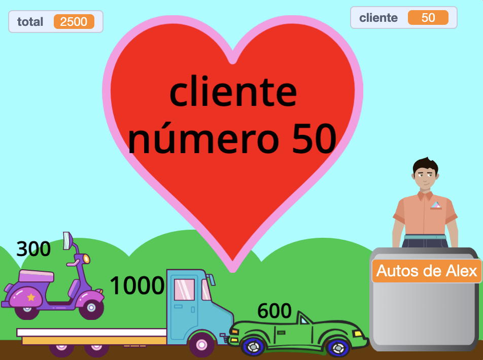

## Challenge

<div style="display: flex; flex-wrap: wrap">
<div style="flex-basis: 200px; flex-grow: 1; margin-right: 15px;">
There are lots of features you could add to improve your customers' shopping experience. You don't need to add everything. Just add improvements that you think are important.
</div>
<div>
{:width="300px"}
</div>
</div>

--- task ---

Add more items to sell.

--- /task ---

--- task ---

Add more graphic and sound effects.

--- /task ---

--- task ---

Paint your own scenery and other costumes.

--- /task ---

--- task ---

Make another business and allow players to visit them both.

--- /task ---

Each example project in the [Introduction](.) has a ‘See Inside’ link for you to open the project in Scratch, and look at the code to get ideas and see how they work. You can 'See inside' the example projects to look at how they work.

Example projects: **Fresh Space Fruit**: [See inside](https://scratch.mit.edu/projects/528696418/editor){:target="_blank"}
**Cool Shirts**: [See inside](https://scratch.mit.edu/projects/528697069/editor){:target="_blank"}
**Ice cream shop**: [See inside](https://scratch.mit.edu/projects/525972748/editor){:target="_blank"}
**Vending machine**: [See inside](https://scratch.mit.edu/projects/526051796/editor){:target="_blank"}

**Tip:** If you are logged in to a Scratch account, then you can use the **Backpack** to copy scripts or sprites to your project.

[[[scratch-backpack]]]

### Chatty checkout!

Your checkout person (or machine) could ask whether the service was good, or if the customer is having a nice day.

--- task ---

Add `ask`{:class="block3sensing"} blocks to your **seller**'s `when this sprite clicked`{:class="block3events"} script and `say`{:class="block3looks"} different things depending on the customer's response.

--- collapse ---

---

title: Ask and respond to questions

---

```blocks3
ask [Did you find everything you wanted today?] and wait
if <(answer) = [yes]> then
say [That's fantastic!] for [2] seconds
else
say [Maybe I should add more items to my shop] for [2] seconds
end
```

**Debug:** Check that you have spelled the options correctly in your code and in your answer. It's OK if you use capital letters, so "Yes" and "YES" will match "yes".

Add multiple questions to create a chatbot or non-player character that you can talk to.

--- /collapse ---

--- /task ---

### Bag the items

--- task ---

The Cool Shirts project has shirts that glide into a bag.

--- collapse ---

---

title: Make items glide into a container

---

Add a **Container** sprite. You could use an existing sprite like the **Gift** or **Take out** sprite, or paint your own with simple shapes.

Add a script to make the **Container** always appear at the front:

```blocks3
when flag clicked
forever
go to [front v] layer
end
```

Then you'll need to add code to each **Item** you have for sale to make them glide to the container when they are clicked:

```blocks3
when this sprite clicked
+go to [front v] layer
+glide [1] secs to (Bag v) // use the name of your Container sprite
+hide
change [total v] by [12]
+go to x: [-180] y: [68] // start position
+show
```

If you don't want the container there all the time, you can add scripts to make it show and hide at the right time:

```blocks3
when I receive [next customer v]
hide // previous customer takes the bag
wait [1] seconds
show
```

**Test:** Try your project and make sure items glide to the container and hide.

**Debug:** Check your scripts carefully and make sure you have updated all of your **Item** sprites. You can look at [Cool Shirts](https://scratch.mit.edu/projects/528697069/editor){:target="_blank"} if you need to see a working example.

--- /collapse ---

--- /task ---

###  Stop adding items when the customer is at the checkout

--- task ---

Add a `shop`{:class="block3variables"} variable and use it to control when items can be added.

--- collapse ---

---
title: Stop purchases when the customer is at the checkout

---

Add a `variable`{:class="block3variables"} called `shop` for all sprites. You will set this to `true` when the customer is in the shop and `false` when they are at the checkout.

Select your **seller** sprite. Update the `when flag clicked`{:class="block3events"} script to allow shopping when your project starts:

```blocks3
+set [shop v] to [true]
```

Now add a block to change the `shop`{:class="block3variables"} to `false` at the beginning of your **seller**'s `when this sprite clicked`{:class="block3events"} script:

```blocks3 
+set [shop v] to [false]
```

And a block to set the `shop`{:class="block3variables"} variable back to `true` at the end of the same script:

```blocks3 
+set [shop v] to [true]
```

Now you need to update the items you sell to check the `shop`{:class="block3variables"} variable:

```blocks3
when this sprite clicked
+if <(shop) = [true]> then
start sound (Coin v)
change [total v] by [10]
end
```
You will need to do this for every item you sell in your shop.

**Test:** Click the green flag then try shopping. Check that you can still add items and checkout, but you can't add items once you have started checking out.

**Debug:** Check your code really carefully. You can look at the [Space Fruit](https://scratch.mit.edu/projects/528696418/editor){:target="_blank"} project if you need to see a working example.

--- /collapse ---

--- /task ---

--- task ---

### Give the customer the option to cancel their shopping.

--- collapse ---
---
title: Set up pay and cancel options
---

`Ask`{:class="block3sensing"} `Would you like to pay or cancel?`. Add an `If`{:class="block3control"} block for `answer`{:class="block3sensing"} `=`{:class="block3operators"} `pay` and inside it put your existing payment blocks.

```blocks3
when this sprite clicked
say (join [That will be ] (total)) for (2) seconds
+ ask [Would you like to pay or cancel?] and wait
+ if {(answer) = [pay]} then
play sound [machine v] until done 
set [total v] to (0)
say (join [Thanks for shopping at ] (name)) for (2) seconds
broadcast [next customer v]
end
```

Add a second `If`{:class="block3control"} block for `answer`{:class="block3sensing"} `=`{:class="block3operators"} `cancel` and inside it add code to cancel the order.

```blocks3
when this sprite clicked
say (join [That will be ] (total)) for (2) seconds
ask [Would you like to pay or cancel?] and wait
if {(answer) = [pay]} then
play sound [machine v] until done 
set [total v] to (0)
say (join [Thanks for shopping at ] (name)) for (2) seconds
broadcast [next customer v]
end
+ if {(answer) = [cancel]} then
set [total v] to (0)
say [Ok. No problem] for (2) seconds
broadcast [next customer v]
end
```

--- /collapse ---

--- /task ---

Take a look at our ['Intergalactic shopping market'](https://scratch.mit.edu/studios/29662180){:target="_blank"} Scratch studio to see projects created by community members.

--- save ---
