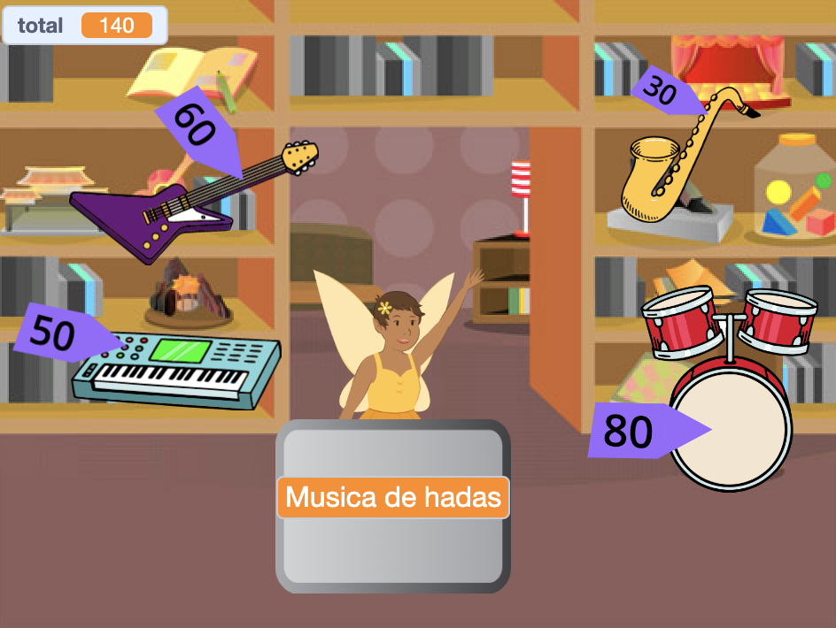

## Mejora tu proyecto

Si tienes tiempo, puedes mejorar tu proyecto.

{:width="300px"}

Aquí hay algunas ideas que puedes probar:
- Agrega más artículos para vender
- Añade más gráficos y efectos de sonido
- Pinta tu propia escenografía y otros disfraces
- Haz otro negocio y permite que los jugadores los visiten a ambos

Cada proyecto de ejemplo en la [Introducción](.) tiene un enlace 'Ver adentro' para que puedas abrir el proyecto en Scratch y mirar el código para obtener ideas y ver cómo funcionan.

Echa un vistazo a nuestro ['Mercado de compras intergaláctico'](https://scratch.mit.edu/studios/29662180){:target="_blank"} Estudio Scratch para ver proyectos creados por miembros de la comunidad.

--- save ---
