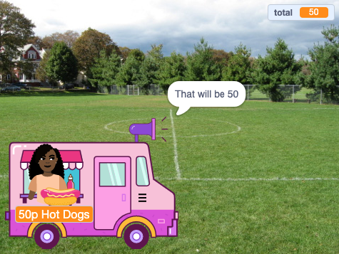

## Compras

<div style="display: flex; flex-wrap: wrap">
<div style="flex-basis: 200px; flex-grow: 1; margin-right: 15px;">
El objeto **vendedor** necesita:
- preguntar si el cliente está listo para pagar los artículos
- aceptar el pago
- prepararse para el próximo cliente
</div>
<div>
{:width="300px"}
</div>
</div>

Cuando hayas terminado de elegir artículos, el cliente hará clic en el sprite **vendedor** para pagar.

--- task ---

 Dile al cliente cuánto costarán sus artículos.

```blocks3
when this sprite clicked
say (join [Son ] (total)) for (2) seconds 
```

--- /task ---

--- task ---

Agrega un sonido de pago a su sprite **vendedor** para que el cliente sepa que se está realizando el pago.


[[[scratch3-add-sound]]]

Agrega el sonido de reproducción `hasta que termine el bloque`{:class="block3sound"} a su script.

```blocks3
when this sprite clicked
say (join [Son ] (total)) for (2) seconds
+ play sound [machine v] until done 
```

--- /task ---

--- task ---

Termina la venta. Establece `total`{:class="block3variables"} volver a `0` después del pago, `decir`{:class="block3looks"} adiós y `transmitir`{:class="block3control"} `próximo cliente`{:clase="bloque3control"}.

```blocks3
when this sprite clicked
say (join [Son ] (total)) for (2) seconds
play sound [machine v] until done 
+ set [total v] to (0)
+ say (join [Gracias por comprar en ] (nombre)) for (2) seconds
+ broadcast (siguiente cliente v)
```

--- /task ---

--- task ---

Es posible que desee dar al cliente la opción de cancelar sus compras.

--- collapse ---
---
title: Configurar opciones de pago y cancelación
---

`Pregunta`{:class="block3sensing"} `¿Le gustaría pagar o cancelar?`. Agrega un bloque `Si`{:class="block3control"} para `respuesta`{:class="block3sensing"} `=`{:class="block3operators"} `pagar` y dentro coloque sus bloques de pago existentes.

```blocks3
when this sprite clicked
say (join [Son ] (total)) for (2) seconds
+ ask [¿Quieres pagar o cancelar?] and wait
+ if {(answer) = [pagar]} then
play sound [machine v] until done 
set [total v] to (0)
say (join [Gracias por comprar en ] (nombre)) for (2) seconds
broadcast [siguiente cliente v]
end
```

Agrega un segundo `Si`{:class="block3control"} bloque para `respuesta`{:class="block3sensing"} `=`{:class="block3operators"} `cancel` y dentro agrega código para cancelar el pedido.

```blocks3
when this sprite clicked
say (join [Son ] (total)) for (2) seconds
ask [¿Quieres pagar o cancelar?] and wait
if {(answer) = [pagar]} then
play sound [machine v] until done 
set [total v] to (0)
say (join [Gracias por comprar en ] (nombre)) for (2) seconds
broadcast [siguiente cliente v]
end
+ if {(answer) = [cancelar]} then
set [total v] to (0)
say [Está bien. No hay problema] for (2) seconds
broadcast [siguiente cliente v]
end
```

--- /collapse ---

--- /task ---

--- task ---

Para asegurarte de que tu cliente tenga artículos en su cesta antes de pagar, puedes insertar un bloque `si... más`{:class="block3control"}.

--- collapse ---
---
title: Consultar el importe total
---

`Si`{:class="block3control"} `total`{:class="block3variables"} `>`{:class="block3operators"} `0` entonces insera tu script existente.

`Else`{:class="block3control"} `diga`{:class="block3looks"} un mensaje útil.

```blocks3
when this sprite clicked
+ if <(total) > [0]>then
say (join [Son ] (total)) for (2) seconds
ask [¿Quieres pagar o cancelar?] and wait
if {(answer) = [pagar]} then
play sound [machine v] until done 
set [total v] to (0)
say (join [Gracias por comprar en ] (nombre)) for (2) seconds
broadcast [siguiente cliente v]
end
if {(answer) = [cancelar]} then
set [total v] to (0)
say [Está bien. No hay problema] for (2) seconds
broadcast [siguiente cliente v]
end
else
say [Haz clic en los elementos que quieras] for (2) seconds
end
```

--- /collapse ---

--- /task ---

--- task ---

**Prueba:** Prueba tu proyecto y asegúrate de: lo siguiente:
- El cliente puede pagar con los efectos de sonido correctos
- El `total`{:class="block3variables"} se regresa a `0` después de que un cliente paga o cancela.

--- /task ---


--- task ---

**Depuración:** Es posible que encuentres algunos errores en tu proyecto que necesites corregir.

Estos son algunos errores comunes:

--- collapse ---
---
title: El vendedor no hace nada cuando hago clic en él
---

Tienes bastantes objetos en tu proyecto. Asegúrate de que el script `al hacer clic en este objeto`{:class="block3events"} esté en tu objeto **vendedor**.

**Sugerencia:** Si lo agregaste al objeto incorrecto, puedes arrastrar el código al objeto **vendedor** y luego eliminarlo del otro objeto.

--- /collapse ---

--- collapse ---
---
title: El vendedor dice 'total', no el monto total
---

Asegúrate de que tu bloque `decir`{:class="block3looks"} tenga el bloque variable `total`{:class="block3variables"}, no la palabra `total`.

```blocks3
 when this sprite clicked
 say {join [Son ](total)} for (2) seconds 
 ```

--- /collapse ---

--- collapse ---
---
title: Las palabras en los bloques de hablar se fusionan
---

Cuando `unes`{:class="block3operators"} dos piezas, debes agregar un espacio al final de tu primera pieza de texto o al comienzo de tu segunda pieza de texto.

Estos tienen un espacio al final de la primera parte de la unión:

```blocks3
say {join [Son ](total)} for (2) seconds

say {join [Gracias por comprar en ](nombre)} for (2) seconds
```

--- /collapse ---

--- collapse ---
---
title: El total no se reinicia después de una venta
---

Comprueba que has utilizado:

```blocks3
set [total v] to (0)
```

**no**:

```blocks3
change [total v] by (0)
```

--- /collapse ---

--- collapse ---
---
title: El vendedor no responde
---

Asegúrate de que el `operador`{:class="block3operators"} en la condición `if`{:class="block3control"} sea el símbolo mayor que `>`{:class="block3operators"}.

```blocks3
if <(total) > [0]> then
```

--- /collapse ---

**Sugerencia:** Compara tu código con los ejemplos de código. ¿Hay alguna diferencia que no debería estar ahí?

--- /task ---

--- save ---
