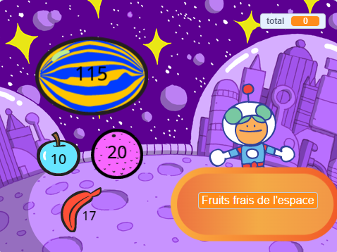
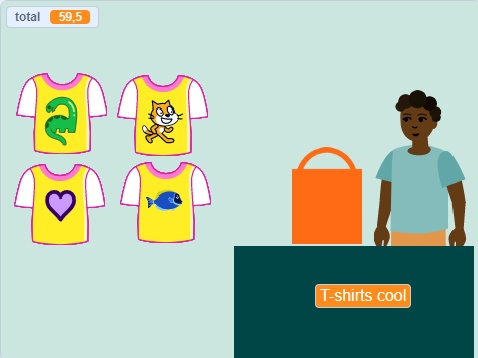
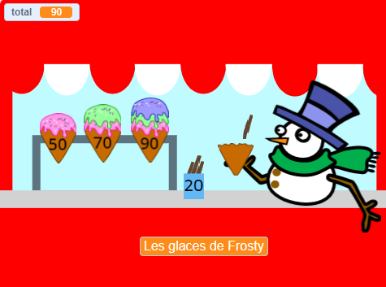
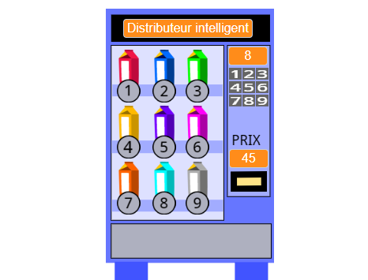

## Ce que tu vas faire

Crée une application de boutique où le client peut acheter des articles dans ta boutique. Le projet sera en vue à la première personne où le joueur est un client.

**Vue à la première personne** signifie que tu ne vois pas ton personnage à l'écran, mais que tu vois ce qu'il voit.

Tu vas :
+ Créer une application de boutique avec des articles à acheter et une caisse
+ Planifier ton temps pour obtenir une version simple qui fonctionne rapidement
+ Essayer des boutiques créées par d'autres et partager ta boutique pour que d'autres puissent l'essayer

--- no-print ---

--- task ---

  

### Joue ▶️ 

Clique sur Fruits de l'espace pour les acheter et regarde le total augmenter. Lorsque tu es prêt, clique sur Kiran pour passer à la caisse. 

+ Que se passe-t-il si tu essaies de payer avant d'avoir choisi un fruit ? 
+ Comment penses-tu que le projet sait que tu n'as pas encore ajouté de fruits ?

  <iframe allowtransparency="true" width="485" height="402" src="" frameborder="0"></iframe>

--- /task ---

### Trouve l'inspiration

Tu vas prendre des décisions de conception pour choisir les articles que ton commerce proposera et comment le client passera à la caisse.

--- task ---

Explore ces exemples de boutiques pour trouver d'autres idées.

⭐ Partage ton projet Client suivant s'il vous plaît terminé pour avoir une chance qu'il soit présenté ici.

Quels projets te permettent d'acheter plusieurs articles à la fois ? Lesquels te permettent d'acheter des articles un par un ?

Clique sur le sprite **vendeur** pour acheter des articles :

  <iframe allowtransparency="true" width="485" height="402" src="" frameborder="0"></iframe>

  <iframe allowtransparency="true" width="485" height="402" src="" frameborder="0"></iframe>

**⭐ Badges de fierté** (projet communauté en vedette)

Clique sur les badges de la fierté pour les ajouter à ton panier :

  <iframe allowtransparency="true" width="485" height="402" src="https://scratch.mit.edu/projects/embed/750787529/?autostart=false" frameborder="0"></iframe>

--- /task ---

--- /no-print ---

--- print-only ---

### Trouve l'inspiration

Tu vas prendre des décisions de conception pour créer ton personnage. Voir à l'intérieur des exemples de projets dans [Scratch 2 : Client suivant, s'il vous plaît ! - Exemples](https://scratch.mit.edu/studios/29611454/){:target="_blank"} de studio Scratch.

   

--- /print-only ---

