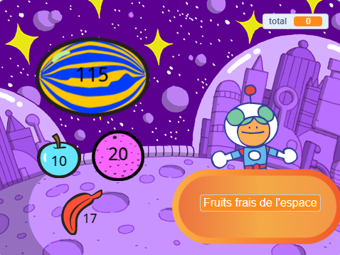
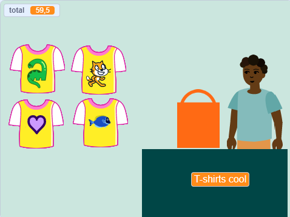
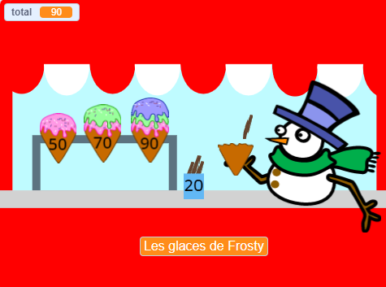

## Ce que tu vas faire

Crée une application de boutique où le/la client·e peut acheter des articles dans ta boutique. Le projet sera en vue à la première personne où le joueur est un·e client·e.

--- no-print ---

Clique sur Fruits de l'espace pour les acheter et regarde le total augmenter. Lorsque tu es prêt, clique sur Kiran pour passer à la caisse.

+ Que se passe-t-il si tu essaies de payer avant d'avoir choisi un fruit ?
+ Comment penses-tu que le projet sait que tu n'as pas encore ajouté de fruits ?

**Fruits frais de l'espace** : [voir à l'intérieur](https://scratch.mit.edu/projects/707260567/editor){:target="_blank"}

  <iframe allowtransparency="true" width="485" height="402" src="https://scratch.mit.edu/projects/embed/707260567/?autostart=false" frameborder="0"></iframe>

### Trouve l'inspiration

Clique sur le sprite **vendeur·euse** pour acheter des articles :

**T-shirts cool** : [voir à l'intérieur](https://scratch.mit.edu/projects/707260366/editor){:target="_blank"}

  <iframe allowtransparency="true" width="485" height="402" src="https://scratch.mit.edu/projects/embed/707260366/?autostart=false" frameborder="0"></iframe>

**Glacier** : [voir à l'intérieur](https://scratch.mit.edu/projects/707260702/editor){:target="_blank"}

  <iframe allowtransparency="true" width="485" height="402" src="https://scratch.mit.edu/projects/embed/707260702/?autostart=false" frameborder="0"></iframe>

**⭐ Badges de fierté** (projet communauté en vedette)

Clique sur les badges de la fierté pour les ajouter à ton panier :

  <iframe allowtransparency="true" width="485" height="402" src="https://scratch.mit.edu/projects/embed/750787529/?autostart=false" frameborder="0"></iframe>

--- /no-print ---

--- print-only ---

### Trouve l'inspiration

Tu vas prendre des décisions de conception pour créer ton personnage. Voir à l'intérieur des exemples de projets dans Scratch 2 : Client suivant, s'il vous plaît ! Studio Scratch sur https://scratch.mit.edu/studios/29611454

 
 
 

--- /print-only ---

