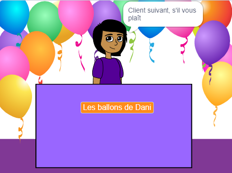
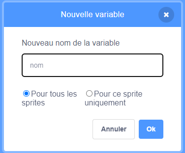
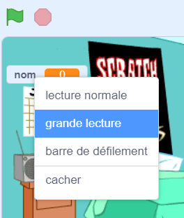

## Ton idée commerciale

<div style="display: flex; flex-wrap: wrap">
<div style="flex-basis: 200px; flex-grow: 1; margin-right: 15px;">
Quelle est ton idée commerciale ? Il peut s'agir de quelque chose de réaliste, de quelque chose tiré d'un livre ou d'un film que tu aimes, ou de quelque chose de complètement loufoque.
</div>
<div>
{:width="300px"}
</div>
</div>

--- task ---

Ouvre un [nouveau projet Scratch](http://rpf.io/scratch-new){:target="_blank"} et examine la collection de sprites et d'arrière-plans que tu peux utiliser. Passe du temps à réfléchir à ton idée commerciale.

[[[working-offline]]]

--- /task ---

De quel arrière-plan et de quels sprites de décors supplémentaires auras-tu besoin ?
+ Un arrière-plan de la bibliothèque Scratch, ou un arrière-plan de couleur unie ?
+ Un bureau, un comptoir ou une vitrine pour vendre ?
+ Une étagère ou une bibliothèque pour mettre des articles, tu peux peindre ceci sur l'arrière-plan

--- task ---

Clique sur **Choisir un arrière-plan** ou peins ton arrière-plan.


Clique sur **Choisir un sprite** et ajoute ou peins des sprites de décor supplémentaires.


Tu peux toujours ajouter plus de décors plus tard si tu en as besoin.

--- /task ---

À quoi ressemblera le sprite **vendeur** ?
+ Une personne ou un personnage non-joueur tel qu'un commerçant, un fermier ou un bibliothécaire ?
+ Une machine telle qu'un distributeur automatique, un juke-box ou une caisse enregistreuse ?

<p style="border-left: solid; border-width:10px; border-color: #0faeb0; background-color: aliceblue; padding: 10px;">
Un <span style="color: #0faeb0">**PNJ**</span> est un personnage non-joueur avec lequel tu peux interagir dans un jeu ou une histoire interactive. Peux-tu penser à des jeux auxquels tu as joué qui ont des PNJ ? La prochaine fois que tu joueras, pense qu'il y avait quelqu'un qui a travaillé pour créer ce personnage.
</p>

--- task ---

Ajoute un sprite pour représenter le vendeur.


--- /task ---

Quel est le nom de ton commerce ?

--- task ---

Crée une `variable`{:class="block3variables"} appelée `nom` :

--- collapse ---

---

title: Créer une variable

---

Dans le menu des blocs `Variables`{:class="block3variables"}, clique sur le bouton **Créer une variable**.

Appelle ta nouvelle variable `nom` :



**Remarque :** la nouvelle variable `nom` apparaît sur la scène et peut désormais être utilisée dans les blocs `Variable`{:class="block3variables"}.

--- /collapse ---

Clique sur ton sprite **vendeur** et ajoute du code pour définir la variable sur le nom de ton commerce :

```blocks3
when flag clicked
set [nom v] to () //tape le nom de ton commerce
```

Crée une enseigne sur la scène avec ta variable :

--- collapse ---

---

title: Modifier l'apparence et la position des variables

---

Fais un clic droit sur la `variable`{:class="block3variables"} sur la scène et choisis grande lecture :



Fais glisser ta `variable`{:class="block3variables"} pour la positionner en haut à droite de la scène.

--- /collapse ---

--- /task ---

--- task ---

**Test :** Assure-toi que tu peux voir le nom de ton commerce comme valeur de la variable sur la scène.

--- /task ---

Prépare-toi à accueillir ton premier client.

--- task ---

Clique sur ton sprite **vendeur** et ajoute un bloc `envoyer à tous`{:class="block3control"}. Crée un nouveau message appelé `client suivant`.

```blocks3
when flag clicked
set [nom v] to [ma boutique] // le nom de ton commerce
+ broadcast (client suivant v)
```

--- /task ---

--- task ---

Crée un nouveau script pour ton sprite **vendeur** pour `dire`{:class="block3looks"} `Client suivant, s'il vous plaît` lorsqu'il reçoit `envoyer à tous`{:class="block3control"} `client suivant`{:class="block3control"}.

```blocks3
when I receive [client suivant v] 
say [Client suivant, s'il vous plaît !] for (2) seconds
```

--- /task ---

--- task ---

**Débogage :** Il est possible que tu trouves des bogues dans ton projet que tu dois corriger. Voici un bogue courant.

--- collapse ---

---

title: La variable affiche `0`

---

Tu dois utiliser le bloc `mettre [nom v] à ()`{:class="block3variables"} pour définir la variable à ton nom. Si tu as déjà ajouté un script, vérifie que tu as saisi le nom de ton commerce dans la valeur et cliqué sur le drapeau vert.

```blocks3
when flag clicked
set [nom v] to [ma boutique] // le nom de ton commerce
```

--- /collapse ---

--- /task ---

--- save ---
