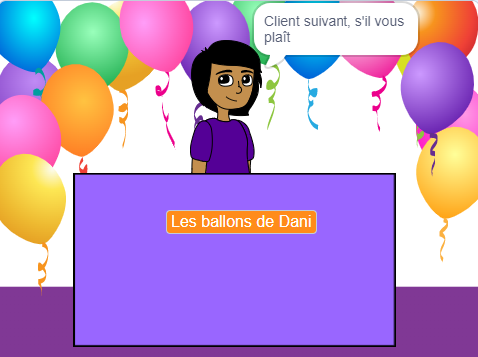

## Ta boutique

<div style="display: flex; flex-wrap: wrap">
<div style="flex-basis: 200px; flex-grow: 1; margin-right: 15px;">
Quelle est ton idée de boutique ? Il peut s'agir de quelque chose de réaliste, de quelque chose tiré d'un livre ou d'un film que tu aimes, ou de quelque chose de complètement loufoque.
</div>
<div>
{:width="300px"}
</div>
</div>

--- task ---

Ouvre un [nouveau projet Scratch](http://rpf.io/scratch-new){:target="_blank"} et examine la collection de sprites et d'arrière-plans que tu peux utiliser. Passe du temps à réfléchir à ton idée de boutique.

--- /task ---

--- task ---

**Choisis un arrière-plan** ou peins-le.


+ Un arrière-plan de la bibliothèque Scratch, ou un arrière-plan de couleur unie ?

--- /task ---

--- task ---

**Choisis un sprite** et ajoute ou peins des sprites de décor supplémentaires.


--- /task ---

--- task ---

Ajoute plus de décor.
+ Un bureau, un comptoir ou une vitrine pour vendre
+ Une étagère ou une bibliothèque pour mettre des articles, tu peux peindre ceci sur l'arrière-plan

--- /task ---

--- task ---

Ajoute un sprite pour représenter le/la vendeur·euse.

Tu pourrais choisir :
+ Une personne ou un personnage non-joueur tel qu'un commerçant, un fermier ou un bibliothécaire
+ Une machine telle qu'un distributeur automatique, un juke-box ou une caisse enregistreuse


--- /task ---

### Accueille ton premier client ou ta première cliente.

--- task ---

Clique sur ton sprite **vendeur·euse** et ajoute un bloc `envoyer à tous`{:class="block3control"}. Crée un nouveau message appelé `client suivant`.

```blocks3
when flag clicked
+ broadcast (client suivant v)
```

--- /task ---

--- task ---

Crée un nouveau script pour ton sprite **vendeur·euse** pour `dire`{:class="block3looks"} `Client suivant, s'il vous plaît` quand il reçoit `envoyer à tous`{:class="block3control"} `client suivant`{:class="block3control"}.

```blocks3
when I receive [client suivant v] 
say [Client suivant, s'il vous plaît !] for (2) seconds
```

--- /task ---

--- save ---
