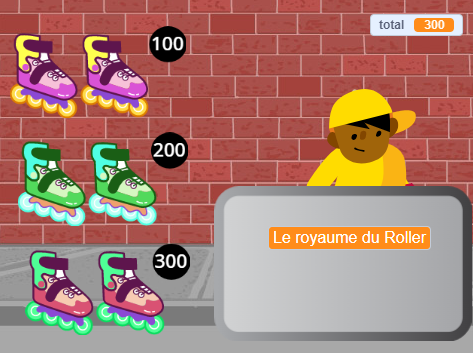
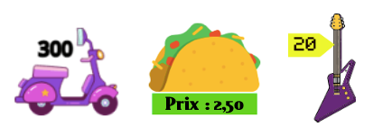

## Articles en vente

<div style="display: flex; flex-wrap: wrap">
<div style="flex-basis: 200px; flex-grow: 1; margin-right: 15px;">
Ta boutique a besoin d'articles à vendre. Chaque article aura un prix qui sera ajouté à une variable « total »{:class="block3variables"}.
</div>
<div>
{:width="300px"}
</div>
</div>

Tu devrais garder une trace de ce que ton client dépense.

--- task ---

Ajoute une nouvelle variable appelée `total`{:class="block3variables"} pour tous les sprites.

Clique sur ton sprite **vendeur** et ajoute un script à `mettre`{:class="block3variables"} le `total`{:class="block3variables"} à `0` lorsque le projet démarre.

[[[scratch3-create-set-variable]]]

--- /task ---

Quels **articles** tes clients vont-ils acheter ?
+ Un aliment ou une boisson
+ Équipement de sport, jouets ou gadgets
+ Baguettes magiques, potions ou livres de sorts
+ Vêtements ou autres articles de mode
+ Ton idée

--- task ---

Ajoute un sprite pour le premier **article** que tu vas vendre dans ta boutique.

Si tu veux, tu peux ajouter un prix au costume à l'aide de l'outil de texte dans l'éditeur de peinture. Ou ajoute un prix à l'arrière-plan et placer l'article à côté.



--- /task ---

--- task ---

Ajoute un script pour `ajouter`{:class="block3variables"} le `total`{:class="block3variables"} au prix de ton article lorsque le client clique sur le sprite.

--- collapse ---
---
title: Clique pour ajouter un article
---

```blocks3
when this sprite clicked
start sound (Coin v)
change [total v] by [10]
```

--- /collapse ---

C'est aussi une bonne idée de `jouer un son`{:class="block3sound"} pour indiquer au client qu'il a ajouté un article.


[[[scratch3-add-sound]]]

--- /task ---

--- task ---

**Test :** Clique sur ton article et vérifie que la valeur de la variable `total`{:class="block3variables"} augmente du prix de l'article, et que tu entends l'effet sonore. Clique plusieurs fois pour voir le total augmenter.

Clique sur le drapeau vert pour démarrer ton projet et assure-toi que le `total`{:class="block3variables"} commence à `0`.

--- /task ---

--- task ---

Ajoute plus d'articles à ta boutique.

Tu peux soit :
+ Dupliquer le premier article, puis ajouter un nouveau costume dans l'éditeur de peinture
+ Ajouter un sprite, puis faire glisser le script `quand le drapeau est cliqué`{:class="block3events"} du premier article vers ton nouvel article

Ajouter une étiquette de prix au costume ou à l'arrière-plan si tu les utilises.

--- /task ---

--- task ---

Clique sur ton nouveau sprite **Article** dans la liste Sprite puis clique sur l'onglet **Code**.

Modifie le montant dont le `total`{:class="block3variables"} change en fonction du prix de ton nouvel article.

--- /task ---

--- task ---

**Test :** Clique sur le drapeau vert pour démarrer ton projet et clique sur les articles pour les ajouter. Vérifie que le total augmente du montant correct chaque fois que tu cliques sur un article.

Si tu as ajouté des étiquettes de prix, assure-toi qu'elles correspondent au montant ajouté au `total`{:class="block3variables"}, sinon tes clients seront confus !

--- /task ---

--- task ---

**Débogage :** Il est possible que tu trouves des bogues dans ton projet que tu dois corriger. Voici quelques bogues assez courants.

--- collapse ---
---
title: Le total ne va pas à 0 lorsque je clique sur le drapeau vert
---

Vérifie que tu as défini la valeur de départ de la variable `total`{:class="block3variables"} dans le script `quand le drapeau est cliqué`{:class="block3events"} sur ton sprite **vendeur**.

--- /collapse ---

--- collapse ---
---
title: Le total n'augmente pas du montant correct lorsque je clique sur un article
---

Vérifie que chaque article a un script `quand ce sprite est cliqué`{:class="block3events"} qui modifie le `total`{:class="block3variables"} du montant correct pour cet article, tu as peut-être modifié le prix du mauvais sprite.

Vérifie que tu as bien utilisé le bloc `ajouter`{:class="block3variables"} et non le bloc `mettre`{:class="block3variables"} pour modifier le `total`{:class="block3variables"}. Tu dois utiliser `ajouter`{:class="block3variables"} pour ajouter le prix au total, tu ne veux pas mettre le total sur le prix de l'article qui vient d'être ajouté.

--- /collapse ---

--- /task ---

--- save ---
