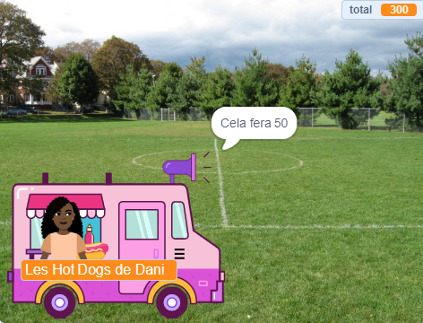

## Achats

<div style="display: flex; flex-wrap: wrap">
<div style="flex-basis: 200px; flex-grow: 1; margin-right: 15px;">
Le sprite **vendeur** doit :
- demander si le client est prêt à payer les articles
- accepter le paiement
- se préparer pour le client suivant
</div>
<div>
{:width="300px"}
</div>
</div>

Lorsqu'il aura fini de choisir les articles, le client cliquera sur le sprite **vendeur** pour payer.

--- task ---

 Dis au client combien coûteront ses articles.

```blocks3
when this sprite clicked
say (join [Cela fera ] (total)) for (2) seconds 
```

--- /task ---

--- task ---

Ajoute un son de paiement à ton sprite **vendeur** pour que le client sache que le paiement est en cours.


[[[scratch3-add-sound]]]

Ajoute le bloc `jouer le son jusqu'au bout`{:class="block3sound"} à ton script.

```blocks3
when this sprite clicked
say (join [Cela fera ] (total)) for (2) seconds
+ play sound [machine v] until done 
```

--- /task ---

--- task ---

Termine la vente. Mets `total`{:class="block3variables"} à `0` après le paiement, `dire`{:class="block3looks"} au revoir et `envoyer à tous`{:class="block3control"} `client suivant`{:class="block3control"}.

```blocks3
when this sprite clicked
say (join [Cela fera ] (total)) for (2) seconds
play sound [machine v] until done 
+ set [total v] to (0)
+ say (join [Merci d'avoir acheté chez ] (nom)) for (2) seconds
+ broadcast (client suivant v)
```

--- /task ---

--- task ---

Tu veux peut-être donner au client la possibilité d'annuler ses achats.

--- collapse ---
---
title: Configurer les options de paiement et dannulation
---

`Demander`{:class="block3sensing"} `Voulez-vous payer ou annuler ?`. Ajoute un bloc `si`{:class="block3control"} pour `réponse`{:class="block3sensing"} `=`{:class="block3operators"} `payer` et mets-y tes blocs de paiement existants.

```blocks3
when this sprite clicked
say (join [Cela fera ] (total)) for (2) seconds
+ ask [Voulez-vous payer ou annuler ?] and wait
+ if {(answer) = [payer]} then
play sound [machine v] until done
set [total v] to (0)
say (join [Merci d'avoir acheté chez ] (nom)) for (2) seconds
broadcast [client suivant v]
end
```

Ajoute un deuxième bloc `si`{:class="block3control"} pour `réponse`{:class="block3sensing"} `=`{:class="block3operators"} `annuler` et ajoute à l'intérieur le code pour annuler la commande.

```blocks3
when this sprite clicked
say (join [Cela fera ] (total)) for (2) seconds
ask [Voulez-vous payer ou annuler ?] and wait
if {(answer) = [payer]} then
play sound [machine v] until done 
set [total v] to (0)
say (join [Merci d'avoir acheté chez ] (nom)) for (2) seconds
broadcast [client suivant v]
end
+ if {(answer) = [annuler]} then
set [total v] to (0)
say [D'accord. Pas de problème] for (2) seconds
broadcast [client suivant v]
end
```

--- /collapse ---

--- /task ---

--- task ---

Pour t'assurer que ton client a des articles dans son panier avant de payer, tu peux insérer un bloc `si...sinon`{:class="block3control"}.

--- collapse ---
---
title: Vérifier le montant total
---

`si`{:class="block3control"} `total`{:class="block3variables"} `>`{:class="block3operators"} `0` puis insère ton script existant.

`sinon`{:class="block3control"} `dire`{:class="block3looks"} un message utile.

```blocks3
when this sprite clicked
+ if <(total) > [0]>then
say (join [Cela fera ] (total)) for (2) seconds
ask [Voulez-vous payer ou annuler ?] and wait
if {(answer) = [payer]} then
play sound [machine v] until done 
set [total v] to (0)
say (join [Merci d'avoir acheté chez ] (nom)) for (2) seconds
broadcast [client suivant v]
end
if {(answer) = [annuler]} then
set [total v] to (0)
say [D'accord. Pas de problème] for (2) seconds
broadcast [client suivant v]
end
else
say [Cliquez sur les articles que vous souhaitez] for (2) seconds
end
```

--- /collapse ---

--- /task ---

--- task ---

**Test :** teste ton projet et assure-toi que :
- Le client peut acheter avec les effets sonores corrects
- Le `total`{:class="block3variables"} est remis à `0` après qu'un client a payé ou annulé.

--- /task ---


--- task ---

**Débogage :** Il est possible que tu trouves des bogues dans ton projet que tu dois corriger.

Voici quelques bogues assez courants :

--- collapse ---
---
title: Le vendeur ne fait rien lorsque je clique dessus
---

Tu as pas mal de sprites dans ton projet. Assure-toi que le script `quand ce sprite est cliqué`{:class="block3events"} est sur ton sprite **vendeur**.

**Astuce :** Si tu l'as ajouté au mauvais sprite, tu peux faire glisser le code vers le sprite **vendeur**, puis le supprimer de l'autre sprite.

--- /collapse ---

--- collapse ---
---
title: Le vendeur dit "total" et non le montant total
---

Assure-toi que ton bloc `dire`{:class="block3looks"} contient le bloc variable `total`{:class="block3variables"}, et non le mot `total`.

```blocks3
 when this sprite clicked
 say {join [Cela fera ](total)} for (2) seconds 
 ```

--- /collapse ---

--- collapse ---
---
title: Les mots des blocs de mots fusionnent
---

Lorsque tu `joins`{:class="block3operators"} deux morceaux ensemble, tu dois ajouter un espace à la fin de ton premier morceau de texte ou au début du deuxième.

Ceux-ci ont un espace à la fin de la première partie de la jointure :

```blocks3
say {join [Cela fera ](total)} for (2) seconds

say {join [Merci d'avoir acheté chez ](nom)} for (2) seconds
```

--- /collapse ---

--- collapse ---
---
title: Le total ne se réinitialise pas après une vente
---

Vérifie que tu as utilisé :

```blocks3
set [total v] to (0)
```

**et pas** :

```blocks3
change [total v] by (0)
```

--- /collapse ---

--- collapse ---
---
title: Le vendeur ne répond pas
---

Assure-toi que l'`opérateur`{:class="block3operators"} dans la condition `si`{:class="block3control"} est supérieur au symbole `>`{:class="block3operators"}.

```blocks3
if <(total) > [0]> then
```

--- /collapse ---

**Astuce :** Compare ton code avec les exemples de code. Y a-t-il des différences qui ne devraient pas exister ?

--- /task ---

--- save ---
