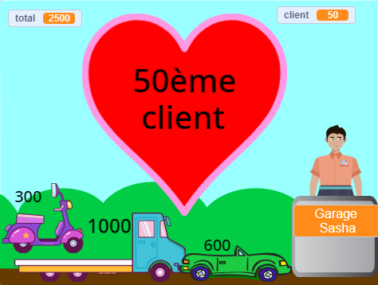

## Fonctionnalités supplémentaires

<div style="display: flex; flex-wrap: wrap">
<div style="flex-basis: 200px; flex-grow: 1; margin-right: 15px;">
Tu peux ajouter de nombreuses fonctionnalités pour améliorer l'expérience d'achat de tes clients. Tu n'as pas besoin de tout ajouter. Ajoute simplement les améliorations que tu juges importantes.

</div>
<div>
{:width="300px"}
</div>
</div>

Tu peux « Voir à l'intérieur » des exemples de projets pour voir comment ils fonctionnent.

Exemples de projets : **Fruits frais de l'espace** : [Voir à l'intérieur](https://scratch.mit.edu/projects/707260567/editor){:target="_blank"}
**T-shirts cool** : [Voir à l'intérieur](https://scratch.mit.edu/projects/707260366/editor){:target="_blank"}
**Glacier** : [Voir à l'intérieur](https://scratch.mit.edu/projects/707260702/editor){:target="_blank"}
**Distributeur automatique** : [Voir à l'intérieur](https://scratch.mit.edu/projects/707260825/editor){:target="_blank"}

**Astuce :** Si tu es connecté à un compte Scratch, tu peux utiliser le **Sac à dos** pour copier des scripts ou des sprites dans ton projet.

[[[scratch-backpack]]]

--- task ---

Pense-tu que ton caissier (ou machine) devrait poser plus de questions ?

Tu peux ajouter les blocs `demander`{:class="block3sensing"} au script de ton **vendeur** `quand ce sprite est cliqué`{:class="block3events"} et `dire`{:class="block3looks"} différentes choses en fonction de la réponse du client.

Tu peux demander si le service était bon, ou s'ils passent une bonne journée. Ou quelque chose de spécifique à ta boutique, comme « Qu'allez-vous cuisiner ? »

--- collapse ---

---

title: Poser des questions et y répondre

---

```blocks3
ask [Avez-vous trouvé tout ce que vous vouliez aujourd'hui ?] and wait
if <(answer) = [oui]> then
say [C'est fantastique !] for [2] seconds
else
say [Peut-être que je devrais ajouter plus d'articles à ma boutique] for [2] seconds
end
```

**Debogage :** Vérifie que tu as correctement orthographié les options dans ton code et dans ta réponse. Ce n'est pas grave si tu utilises des majuscules, donc « Oui » et « OUI » correspondront à « oui ».

Ajoute plusieurs questions pour créer un chatbot ou un personnage non joueur avec qui tu peux parler.

--- /collapse ---

--- /task ---

Veux-tu que quelque chose d'autre se produise lorsque tu ajoutes un article ?

--- task ---

Le projet T-shirts cool propose des t-shirts qui se glissent dans un sac.

--- collapse ---

---

title: Fais glisser les articles dans un conteneur

---

Ajoute un sprite **Conteneur**. Tu peux utiliser un sprite existant comme le sprite **Cadeau** ou **À emporter**, ou peindre le tien avec des formes simples.

Ajoute un script pour que le **Conteneur** apparaisse toujours à l'avant plan :

```blocks3
when flag clicked
forever
go to [front v] layer
end
```

Ensuite, tu devras ajouter un code à chaque **article** en vente pour les faire glisser vers le conteneur lorsqu'ils sont cliqués :

```blocks3
when this sprite clicked
+go to [front v] layer
+glide [1] secs to (Sac v) // utiliser le nom du sprite du conteneur
+hide
change [total v] by [12]
+go to x: [-180] y: [68] // position de départ
+show
```

Si tu ne veux pas que le conteneur soit présent en permanence, tu peux ajouter des scripts pour qu'il s'affiche et se cache au bon moment :

```blocks3
when I receive [client suivant v]
hide // le client précédent prend le sac
wait [1] seconds
show
```

**Test :** Essaie ton projet et assure-toi que les articles glissent vers le conteneur et se cachent.

**Debogage :** Vérifie soigneusement tes scripts et assure-toi d'avoir mis à jour tous tes sprites **article**. Tu peux consulter le projet [T-shirts cool](https://scratch.mit.edu/projects/707260366/editor){:target="_blank"} si tu as besoin de voir un exemple fonctionnel.

--- /collapse ---

Le projet Glacier montre la crème glacée au fur et à mesure que le client choisit ses options.

--- collapse ---

---

title: Personnaliser et afficher un sprite

---

Chaque article doit `envoyer à tous`{:class="block3events"} dans son script `quand ce sprite est cliqué`{:class="block3events"} :

```blocks3
+broadcast (1 boule v)
```

Ensuite, le sprite que tu souhaites afficher ou modifier doit répondre à ce message :

```blocks3
when I receive [1 boule v]
play sound (Chomp v) until done
switch costume to (1 boule v)
```

Tu peux également modifier ou cacher le sprite pour un nouveau client :

```blocks3
when I receive [client suivant v]
switch costume to (cône v)
```

Si tu as plusieurs articles, tu devras ajouter plus de messages et de scripts pour les recevoir.

--- /collapse ---

--- /task ---

As-tu remarqué que ton client peut ajouter des articles après avoir commencé à payer ?

--- task ---

Si tu souhaites empêcher le client d'ajouter des articles lorsqu'il est à la caisse, tu peux ajouter une variable `boutique`{:class="block3variables"} et l'utiliser pour contrôler quand des articles peuvent être ajoutés.

--- collapse ---

---
title: Autoriser les achats uniquement lorsque le client n'est pas à la caisse

---

Ajoute une `variable`{:class="block3variables"} appelée `boutique` pour tous les sprites. Tu la mettras sur `vrai` lorsque le client est dans la boutique et `faux` lorsqu'il est à la caisse.

Sélectionne ton sprite **vendeur**. Mets à jour le script `quand le drapeau est cliqué`{:class="block3events"} pour autoriser les achats au démarrage de ton projet :

```blocks3
+set [boutique v] to [vrai]
```

Ajoute maintenant un bloc pour changer la `boutique`{:class="block3variables"} sur `faux` au début du script de ton **vendeur** `quand ce sprite est cliqué`{:class="block3events"} :

```blocks3 
+set [boutique v] to [faux]
```

Et un bloc pour remettre la variable `boutique`{:class="block3variables"} sur `vrai` à la fin du même script :

```blocks3 
+set [boutique v] to [vrai]
```

Tu dois maintenant mettre à jour les articles que tu vends pour vérifier la variable `boutique`{:class="block3variables"} :

```blocks3
when this sprite clicked
+if <(boutique) = [vrai]> then
start sound (Coin v)
change [total v] by [10]
end
```

Tu devras le faire pour chaque article que tu vends dans ta boutique.

**Test :** clique sur le drapeau vert puis essaie de faire des achats. Vérifie que tu peux toujours ajouter des articles et payer, mais tu ne peux pas ajouter d'articles une fois que tu as commencé à payer.

**Débogage :** Si tu obtiens une erreur, vérifie ton code très attentivement. Tu peux consulter le projet [Fruits de l'espace](https://scratch.mit.edu/projects/707260567/editor){:target="_blank"} si tu as besoin de voir un exemple fonctionnel.

--- /collapse ---

--- /task ---

--- save ---

