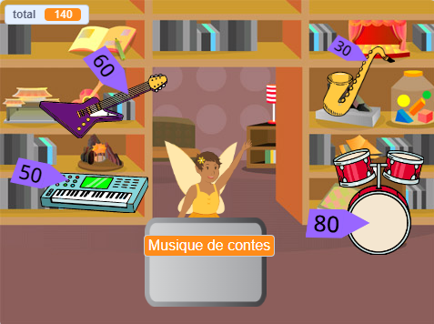

## Améliorer ton projet

Si tu as le temps, tu peux perfectionner ton projet.

{:width="300px"}

Voici quelques idées que tu peux essayer :
- Ajoute plus d'articles à vendre
- Ajoute plus d'effets graphiques et sonores
- Peins tes propres décors et autres costumes
- Crée un autre commerce et autorise les joueurs à les visiter tous les deux

Chaque exemple de projet dans l'[introduction](.) a un lien « Voir à l'intérieur » pour que tu puisses ouvrir le projet dans Scratch et regarder le code pour avoir des idées et voir comment ils fonctionnent.

Jette un œil à notre studio Scratch [« Intergalactic shopping market »](https://scratch.mit.edu/studios/29662180){:target="_blank"} pour voir les projets créés par les membres de la communauté.

--- save ---
