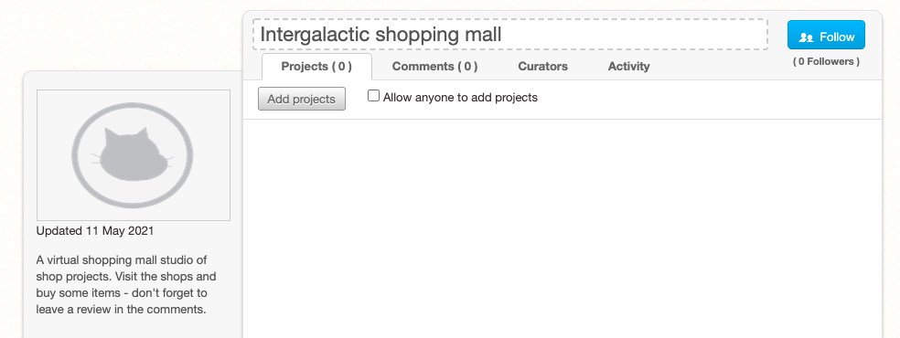
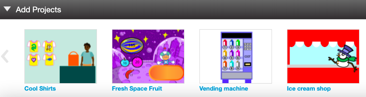
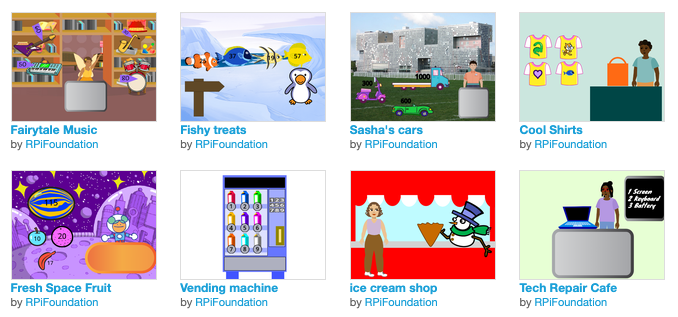

## Partager

Si tu es dans un club, pourquoi ne pas partager ton projet avec des amis ?

Si tu es connecté à Scratch, tu peux créer un studio et ajouter ton projet **Client suivant, s'il vous plaît**. Tu peux également ajouter les projets **Client suivant, s'il vous plaît** de tes amis pour créer un centre commercial de différentes boutiques et de commerces.

--- collapse ---

---

title: Créer un marché commercial

---

Enregistre ton projet, puis clique sur ton nom d'utilisateur et sélectionne **Mes projets**.

Depuis ta page **Mes projets**, clique sur le bouton **+ Nouveau Studio**.

Donne un nom et une description à ton nouveau studio.

Clique sur le bouton **Ajouter un nouveau projet**. Tu peux ajouter ton propre projet en le sélectionnant dans la liste en bas de la page.

Tu peux également ajouter des projets créés par tes amis. Demande-leur de partager leur projet et de te donner le lien. Tape ou colle le lien dans la zone URL, puis clique sur le bouton **Ajouter par URL**.

--- /collapse ---

Partage ton projet et envoie un lien aux personnes que tu connais. Toute la communauté Scratch pourra également trouver ton projet et l'essayer.

[[[share-scratch]]]

Pourquoi ne pas inviter tes amis à créer un projet ? Fais-leur savoir que tu t'es amusé(e).

Si tu as un compte Scratch et que tu as partagé ton projet **Client suivant, s'il vous plaît**, garde un œil sur les commentaires que d'autres pourraient faire sur ta création. Les réactions et commentaires te donnent un excellent moyen de réfléchir à ton travail. Ignore les commentaires inutiles ou non pertinents.

[[[comments-feedback-scratch]]]

--- task ---

Inspire la communauté Raspberry Pi Foundation avec ton projet !

Pour soumettre ton projet à notre studio Scratch [« Intergalactic shopping market »](https://scratch.mit.edu/studios/29662180){:target="_blank"}, il te suffit de remplir [ce formulaire](https://form.raspberrypi.org/f/community-project-submissions){:target="_blank"}.

--- /task ---
